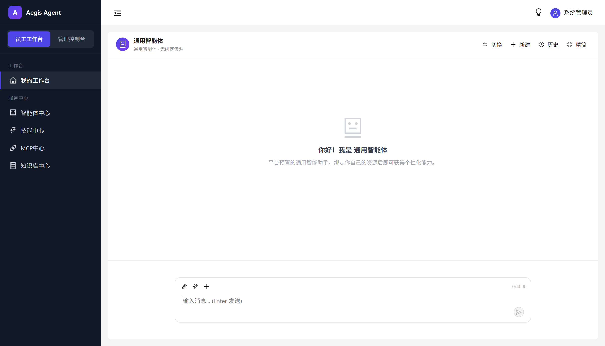
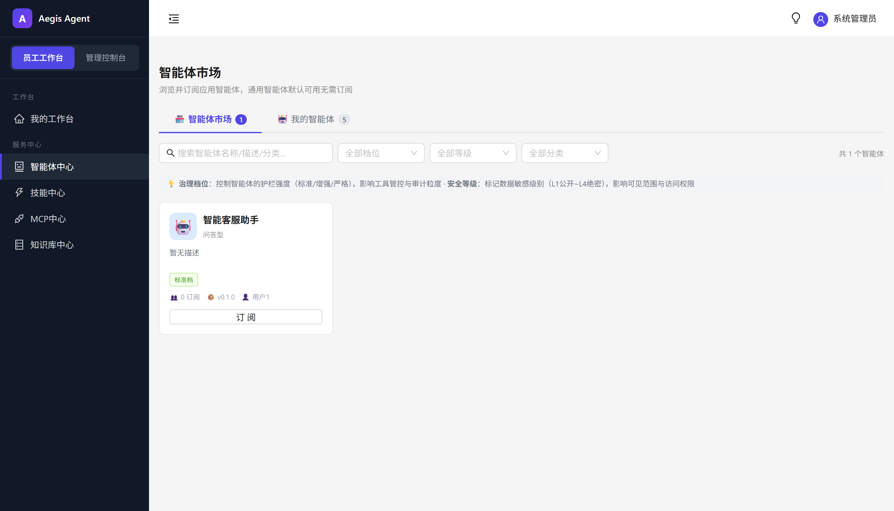
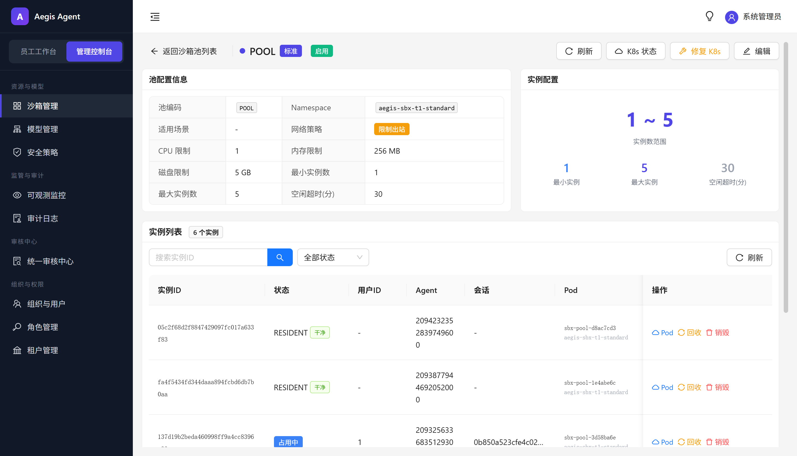
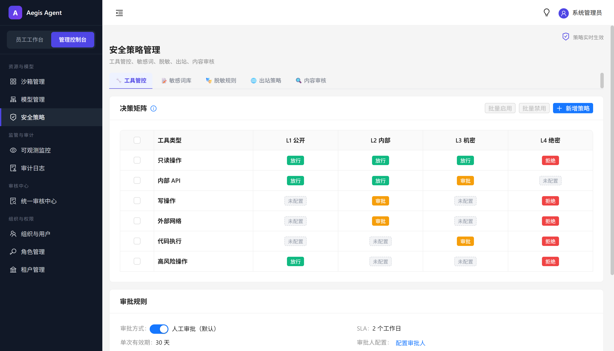
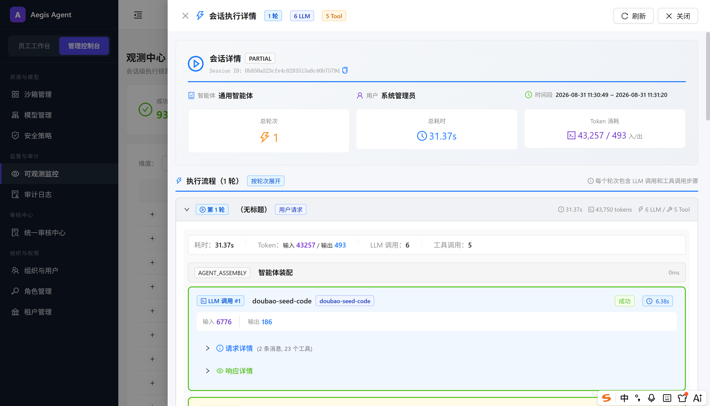

# Aegis

[](LICENSE)
[](https://github.com/agentscope-ai/agentscope-java)

企业级多租户 AI Agent 平台。

---

## 产品概览







---

## 快速开始

**最快的体验方式**——仅需 Docker Desktop，一键拉起全栈：

```powershell
.\quickstart.ps1 all
# 执行步骤：
#   1. 启动 6 个基础设施容器（MySQL/Redis/Nacos/MinIO/etcd/Milvus）
#   2. 容器内 Maven 编译后端三服务（阿里云镜像加速，无需本地 JDK/Maven）
#   3. 容器内 npm build 前端 + 构建为 nginx 镜像
#   4. 启动 4 个应用容器（gateway/admin/runtime/web）
# 首次约 8~15 分钟（拉依赖），后续增量约 2~3 分钟
```

启动完成后访问 http://localhost ，初始账号 `DEFAULT / admin / aegis@123`。

---

需要更快迭代或断点调试时，可切换到开发模式。两种模式对比：

| 模式 | 启动脚本 | 依赖环境 | 核心参数 | 适用场景 |
|------|---------|---------|---------|---------|
| **演示模式**<br>全栈容器化 | `.\quickstart.ps1` | Docker Desktop + Compose v2 | `all` 全栈构建启动　`infra` 仅基础设施　`app` 仅应用(复用已起 infra)　`appdown` 停应用留 infra　`down` 停全部　`logs` 跟踪日志 | 社区体验、演示交付、验收测试；容器内构建，无需本地 JDK/Maven |
| **开发模式**<br>基础设施容器 + 应用本机进程 | `.\aegis-service.ps1` | Docker + JDK 21 + Maven 3.9 + Node 20 | `start` 起基础设施 + 本机应用　`stop` 停全部　`appstop` 停应用留 infra　`status` 查看状态　`build` 构建 JAR　`restart` 重建并重启 | 日常开发；IDE 断点、DevTools 热重载、vite HMR |

> 两模式共用同一套 `infra/docker-compose.yml`，切换时基础设施不重建、不丢数据，仅应用层切换。

**模式间无缝切换**：

```powershell
# 演示模式 → 开发模式
.\quickstart.ps1 appdown        # 停应用容器，保留基础设施
.\aegis-service.ps1 start       # 复用基础设施，本机起 Java + vite

# 开发模式 → 演示模式
.\aegis-service.ps1 appstop     # 停本机进程，保留基础设施
.\quickstart.ps1 app            # 复用基础设施，起应用容器
```

**访问入口**：

| 入口 | 地址 |
|------|------|
| 前端工作台 | http://localhost |
| 网关 | http://localhost:8080 |
| 管理后台 | http://localhost:8082 |
| 运行时 | http://localhost:8081 |

**初始账号**：租户 `DEFAULT` / 用户名 `admin` / 密码 `aegis@123`（首次登录请修改）

---

## 定位

面向企业 AI Agent 落地，解决三个实际问题：智能体分类治理、工具/技能安全可控、运行时可追溯。

### 智能体双维度模型

Aegis 用两个正交字段描述智能体，二者各司其职：

| 维度 | 字段 | 取值 | 决定什么 |
|------|------|------|----------|
| **智能体类型**（agent_type） | agent_type | UNIVERSAL / APPLICATION / SYSTEM | 资源装载轨道（开放订阅 vs 封闭绑定）、实例池粒度、沙箱池路由 |
| **治理档位**（governance_tier） | governance_tier | STANDARD / ENHANCED / STRICT | 沙箱隔离强度、模型路由策略、系统提示词安全指令注入 |

#### 三类智能体（按 agent_type 划分）

| 类型 | 创建者 | 面向 | 运行时资源装载逻辑 |
|------|--------|------|---------------------|
| **通用智能体** (UNIVERSAL) | 系统内置 | 所有用户 | 开放轨道：平台内置能力 + **用户主动订阅和创建的**（技能/MCP/知识库，含草稿） |
| **应用智能体** (APPLICATION) | 业务人员 | 租户内业务团队 | 封闭轨道：仅限智能体显式绑定的资源，严格控制不越权 |
| **系统智能体** (SYSTEM) | 技术人员 | 系统集成方 | 严格封闭：仅限绑定的高安全等级资源，对外暴露 API 供自动化调用 |

#### 治理档位（按 governance_tier 划分）

| 档位 | 隔离强度 | 模型路由策略 |
|------|----------|--------------|
| **STANDARD** | 默认共享沙箱 | 普通模型（如 doubao-lite） |
| **ENHANCED** | 独立沙箱命名空间 | 增强模型（如 doubao-pro） |
| **STRICT** | 独立沙箱 + 网络隔离 | 严格模型（如加密推理），L4 工具必须本地加密模型 |

---

## 架构

```
┌─────────────────────────────────────────────────────────────────────┐
│                     React 18 SPA · Workbench + Admin                 │
└───────────────────────────┬─────────────────────────────────────────┘
                            │ HTTP / SSE
                            ▼
┌─────────────────────────────────────────────────────────────────────┐
│  Spring Cloud Gateway :8080                                          │  │   TraceId → Auth → Session粘性 → 租户解析 → 路由（无 Redis 依赖）      │
└───────────────┬──────────────────────┬──────────────────────────────┘
                │ WebClient             │
        ┌───────▼───────┐        ┌─────▼───────┐
        │ Runtime :8081 │        │ Admin :8082  │
        │ 运行时引擎     │        │ 管理后台      │
        └───────┬───────┘        └─────┬───────┘
                │                      │
        ┌───────▼──────────────────────▼───────┐
        │         AgentScope 2.0.2 内核          │
        │  ┌─────────────────────────────────┐  │
        │  │   洋葱链中间件（11 层）                │  │
        │  │ Trace → Security → Tenant        │  │
        │  │   → BindingSync → Intent → RAG   │  │
        │  │   → ContentFilter → Audit        │  │
        │  │   → SandboxHeartbeat → Memory    │  │
        │  │   → Mask                         │  │
        │  └─────────────────────────────────┘  │
        │  HarnessAgent · RuntimeContext SPI    │
        └───┬──────────┬──────────┬────────────┘
            │          │          │
        ┌───▼───┐ ┌───▼───┐ ┌───▼────┐
        │ MySQL │ │ Redis │ │ Milvus │  MinIO
        └───────┘ └───────┘ └────────┘
```

### 技术栈

| 层           | 选型                                                                          | 为什么                                                                 |
| ----------- | --------------------------------------------------------------------------- | ------------------------------------------------------------------- |
| AI Agent 内核 | [AgentScope 2.0.2 (Java)](https://github.com/agentscope-ai/agentscope-java) | 阿里巴巴开源 JVM 原生 Agent 框架，HarnessAgent + ReAct 循环 + 中间件扩展点天然适配企业安全拦截需求 |
| 后端          | Spring Boot 4 / WebFlux / MyBatis-Plus                                      | WebFlux 响应式适配 SSE 流式输出，多租户插件自动追加 tenant_id                          |
| 前端          | React 18 / Zustand / Ant Design 5                                           | Zustand 轻量状态管理，Ant Design 提供企业级表单表格组件                               |
| 中间件         | MySQL 8 / Redis 7 / Nacos 3 / Milvus 2.5 / MinIO                            | MySQL 58 表主存储，Redis 会话态+分布式锁，Nacos 服务发现（配置中心预留未启用），Milvus 分租户向量索引，MinIO 对象存储  |
| 可观测         | OTel Collector / Prometheus / Grafana                                       | TraceId 贯穿全链路，TraceStore 落 MySQL 支持会话级聚合查询                          |
| 部署          | Docker Compose / Maven 3.9 / Node 20                                        | compose 分基础设施和应用两个文件，restart: unless-stopped 自愈首启依赖                 |

---

## 工程结构

### 模块依赖

```
aegis-core-domain   ←  所有模块依赖，零外部依赖
      ↑
aegis-core-spi      ←  SPI 接口 + 安全核心组件
      ↑
aegis-core-infra    ←  自动配置 + 通用组件
      ↑
aegis-dal           ←  MyBatis-Plus Mapper + TraceStore 实现
      ↑
┌─────┴─────┐
aegis-admin  aegis-runtime    （runtime 额外依赖 AgentScope 2.0.2）
```

### 模块职责

| 模块                | 做什么                                                             | 不做什么                     |
| ----------------- | --------------------------------------------------------------- | ------------------------ |
| aegis-core-domain | 纯 POJO + 枚举 + DTO，所有模块共享                                        | 不引入 Spring / MyBatis     |
| aegis-core-spi    | SPI 接口定义 + SkillContentScanner（技能八大维度安全扫描）                      | 不做数据库访问                  |
| aegis-core-infra  | 自动配置、Result 封装、租户上下文、安全策略二级缓存                                   | 不做业务逻辑                   |
| aegis-dal         | MyBatis-Plus Mapper + MysqlTraceStore + SkillSecurityScanner 门面 | 不包含业务 Service            |
| aegis-gateway     | JWT 鉴权、TraceId 生成、租户解析、SSE 路由、Fallback                          | 不调用 admin/runtime 内部 API |
| aegis-admin       | 管理端 CRUD、审核流程、启动注入 universal 智能体                                | 不承载对话执行                  |
| aegis-runtime     | AgentScope 内核装配、洋葱链中间件、沙箱管理、会话执行                                | 不承载管理端 CRUD              |

### 目录

```
aegis/
├── aegis-platform-backend/         Spring Boot 多模块 (Maven)
│   ├── aegis-gateway/              网关 · :8080
│   ├── aegis-admin/                管理后台 · :8082
│   ├── aegis-runtime/              运行时引擎 · :8081
│   ├── aegis-core/                 domain / spi / infra
│   ├── aegis-dal/                  MyBatis-Plus Mapper + TraceStore
│   └── aegis-mcp-demo/             MCP 协议示例
│
├── aegis-platform-web/             React 18 + Ant Design 5
│   ├── pages/workbench/            对话工作台
│   ├── pages/admin/                管理后台
│   ├── pages/resource/             资源治理（技能/工具/知识库/MCP）
│   └── pages/security/             安全治理
│
├── infra/                          基础设施
│   ├── docker-compose.yml          MySQL/Redis/Nacos/Milvus/MinIO
│   ├── docker-compose.app.yml      gateway/admin/runtime/web
│   ├── ddl/                        01_schema_init.sql + 02_seed_data.sql
│   └── init/docker/                OTel / Prometheus / Nginx 配置
│
├── docs/                           文档
├── quickstart.sh / .ps1            Docker 全栈一键启动（用户体验）
├── aegis-service.ps1               本地开发便捷启动（Maven + Node 热更新）
└── README.md
```

---

## 文档

| 文档模块   | 文档                                                                                                                                                                                                      |
| ------ | ------------------------------------------------------------------------------------------------------------------------------------------------------------------------------------------------------- |
| 产品功能说明 | [product.md](docs/product.md)                                                                                                                                                                           |
| 系统部署文档 | [deployment.md](docs/deployment.md)                                                                                                                                                                     |
| 技术架构说明 | [architecture.md](docs/architecture.md)                                                                                                                                                                 |
| 核心数据模型 | [data-model.md](docs/data-model.md)                                                                                                                                                                     |
| 核心流程剖析 | [runtime-execution-flow.md](docs/runtime-execution-flow.md)<br>[sandbox-allocation-and-recycling.md](docs/sandbox-allocation-and-recycling.md)<br>[resource-management.md](docs/resource-management.md) |

---

## 版本状态

alpha 阶段，核心链路（对话执行 / 沙箱分配回收 / 安全策略引擎）已完成并通过集成测试。产品功能和企业特性（RBAC / 审核流程 / 可观测面板）持续迭代中。

---

## License

MIT — 见 [LICENSE](LICENSE)
