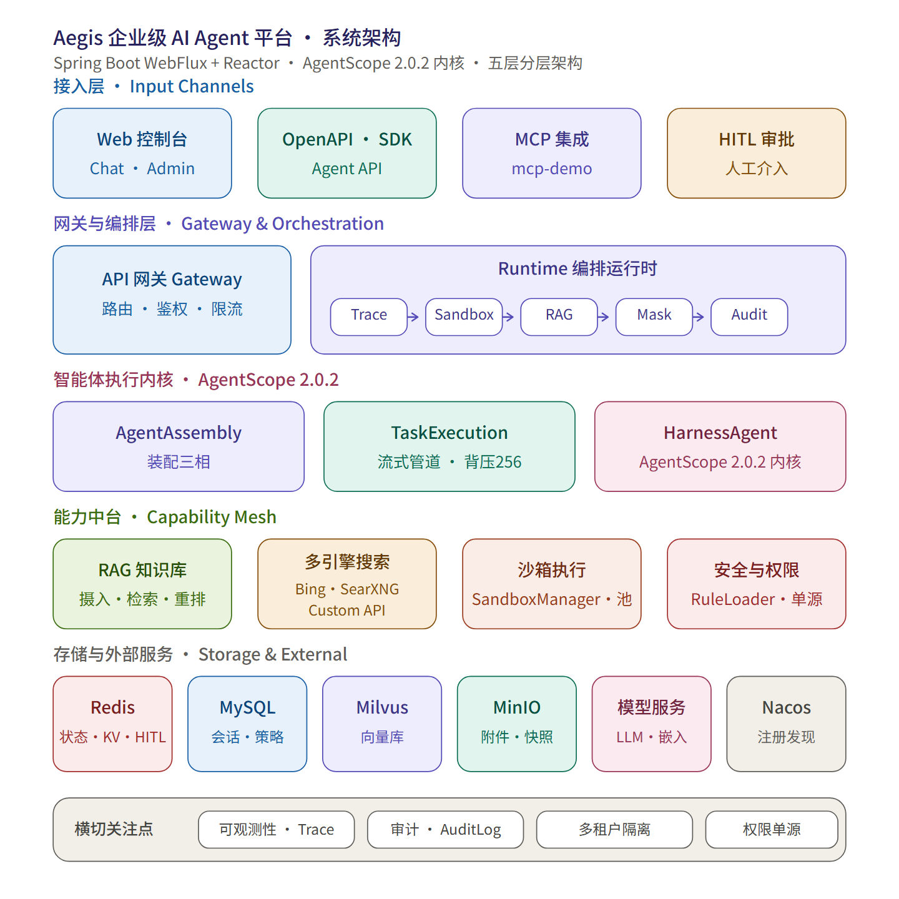

# Aegis


企业级多租户 AI Agent 平台。执行内核为 AgentScope 2.0.2 `HarnessAgent`，上层叠加多租户隔离、工具安全策略、沙箱执行与全链路追踪。


---

## 快速开始

### 前置依赖

脚本自动探测（Docker → JDK → Maven → Node）。探测失败时在根目录 `aegis.conf` 覆盖，优先级：**脚本默认值 < 环境变量 < `aegis.conf`**。

| 依赖                  | 版本   | 探测方式                      | 覆盖配置                       |
| ------------------- | ---- | ------------------------- | -------------------------- |
| Docker + Compose v2 | 24+  | `docker info`             | —                          |
| JDK                 | 21+  | `JAVA_HOME` 或 PATH `java` | `aegis.conf` → `JAVA_HOME` |
| Maven               | 3.9+ | `MVN_CMD` 或 PATH `mvn`    | `aegis.conf` → `MVN_CMD`   |
| Node.js             | 18+  | PATH `node` / `npm`       | —                          |


> Windows 下 Git Bash 无法调用 `mvn` 启动器，用 `aegis.ps1`（PowerShell）。

### 一键启动

```powershell
.\aegis.ps1 start              # Windows
./aegis.sh start               # macOS / Linux
```

脚本执行顺序：

1. 探测依赖，缺失即报错退出
2. `docker compose up -d` 起 6 个核心容器：mysql / redis / nacos / minio / etcd / milvus
3. MySQL 数据卷为空时自动执行 `infra/ddl/01_schema_init.sql` + `02_seed_data.sql`（后续重启跳过）
4. `mvn clean package -DskipTests` 构建后端（**`start` 与 `restart` 都走 clean 构建，无增量**）
5. 本机启动 gateway / admin / runtime / mcp-demo，均带 `--spring.profiles.active=local`
6. 启动前端（默认 `vite dev`，前端依赖缺失时自动 `npm install`）
7. mcp-demo 启动后自动向 admin 注册自身，数据库无需预置 MCP 种子数据

首次全量构建约 2–5 分钟。

### 命令

| 命令                                 | 说明                                       |
| ---------------------------------- | ---------------------------------------- |
| `.\aegis.ps1 start`                | 全栈启动（clean 构建 + 前端 dev）                  |
| `.\aegis.ps1 start -Frontend prod` | 前端 `vite build` + `serve`（:80，占用则 :8088） |
| `.\aegis.ps1 stop`                 | 停全部（本机应用 + 基础设施容器）                       |
| `.\aegis.ps1 appstop`              | 仅停本机应用，保留容器                              |
| `.\aegis.ps1 restart`              | appstop → clean 构建 → 启动                  |
| `.\aegis.ps1 build`                | 仅构建后端 JAR + 前端 dist                      |
| `.\aegis.ps1 status`               | 查看容器与进程状态                                |
| `.\aegis.ps1 infra`                | 仅操作基础设施                                  |
| `.\aegis.ps1 help`                 | 打印帮助                                     |

### 访问入口

| 入口                         | 地址                                                      |
| -------------------------- | ------------------------------------------------------- |
| 前端工作台                      | <http://localhost:5173> （prod 模式 <http://localhost:80）> |
| 网关                         | <http://localhost:8080>                                 |
| 管理后台                       | <http://localhost:8082>                                 |
| 运行时                        | <http://localhost:8081>                                 |
| MCP-Demo                   | <http://localhost:8084/sse>                             |
| Nacos 控制台                  | <http://localhost:8083>                                 |
| MinIO 控制台                  | <http://localhost:9001>                                 |
| MySQL                      | localhost:3306                                          |
| Milvus                     | localhost:19530                                         |
| SearXNG（`web_search` 工具依赖） | <http://localhost:8888>                                 |

可选 profile：`docker compose --profile observability up -d`（Prometheus :9090 / Grafana :3000 / OTel :4317,:4318）。OCR 已内置为 ONNX Runtime Java 进程内推理（零外部服务依赖），无需单独启服务；历史 `--profile ocr`（`paddleocr` Docker 服务）已废弃，请勿使用。

**初始账号**：租户 `DEFAULT` / 用户名 `admin` / 密码 `aegis@123`。登录后必须先配置模型 Provider，否则对话不可用。

---

## 架构



### 运行时中间件

6 个中间件实现 `MiddlewareBase`，经 Spring 注入 `List<MiddlewareBase>` 按 `order()` 降序装配到 `HarnessAgent.Builder`。order 越大越外层：

| order | 类                          | 拦截点                                            | 作用                                                           |
| ----- | -------------------------- | ---------------------------------------------- | ------------------------------------------------------------ |
| 95    | `AegisTraceMiddleware`     | onAgent / onReasoning / onActing / onModelCall | TraceId 贯穿、Span 记录                                           |
| 85    | `SandboxRoutingMiddleware` | onActing                                       | 读 `sec_sandbox_policy` 判定工具沙箱策略，审计"策略白配"（强制进但工具无沙箱路径）        |
| 75    | `BindingSyncMiddleware`    | onAgent                                        | 绑定指纹比对与 Workspace 重物化，Phase 2 精简后直接实现 `MiddlewareBase` 纳入洋葱链 |
| 70    | `AegisRagMiddleware`       | onSystemPrompt                                 | 知识库 HYBRID 检索，片段注入系统提示词                                      |
| 50    | `AegisMaskMiddleware`      | —                                              | 输出脱敏（唯一无替代的输出安全中间件）                                          |
| 30    | `AegisAuditLogMiddleware`  | onActing                                       | 审计日志                                                         |

工具安全决策不在中间件，由 AgentScope 原生 `PermissionEngine` 承担，规则经 `AegisPermissionRuleLoader` 从 `sec_tool_policy` 装载（未命中时等级直映：L1/L2→ALLOW，L3→ASK，L4→DENY）。

### 技术栈

| 层        | 选型                                                                   | 说明                                                                                                           |
| -------- | -------------------------------------------------------------------- | ------------------------------------------------------------------------------------------------------------ |
| Agent 内核 | AgentScope 2.0.2                                                     | `agentscope-core` / `agentscope-harness` / `extensions-redis` / `extensions-oss` / `extensions-model-openai` |
| 后端       | Spring Boot 4.0.0 · WebFlux · MyBatis-Plus                           | 四个服务全 WebFlux；MyBatis-Plus 租户插件自动追加 `tenant_id`                                                              |
| 前端       | React 18.3 · Ant Design 5.22 · Vite 6 · Zustand 5 · TanStack Query 5 | 包管理器 npm（仓库含 package-lock.json，CI 用 `npm ci`）                                                                |
| 存储       | MySQL 8（61 表）· Redis 7 · Milvus 2.5 · MinIO                          | Redis 承载 AgentScope `DistributedStore`、HITL、限流                                                               |
| 服务发现     | Nacos 3.2.2                                                          | 仅服务发现；配置中心各模块 `config.enabled=false`                                                                         |
| 沙箱       | K8s（`aegis.sandbox.backend=k8s`）                                     | 三后端 SPI：docker / k8s / process                                                                               |
| 架构守护     | ArchUnit                                                             | `aegis-admin/src/test/java/com/aegis/admin/arch/ArchitectureGuardTest.java`                                  |

---

## 工程结构

### 模块依赖

```
aegis-core-domain   （POJO / 枚举 / DTO，零外部依赖）
        ↑
aegis-core-spi      （SPI 接口 + SkillContentScanner）
        ↑
aegis-core-infra    （自动配置 / Result / 租户上下文 / Milvus 适配）
        ↑
aegis-dal           （MyBatis-Plus Mapper + MysqlTraceStore）
        ↑
   ┌────┴─────┬──────────┬────────────┐
aegis-gateway  aegis-admin  aegis-runtime   （runtime 额外依赖 AgentScope 2.0.2）
aegis-mcp-demo（独立，依赖 Spring AI MCP）
```

依赖方向单向：`gateway → core`、`admin → dal → core`、`runtime → dal → core`。

### 目录

```
aegis/
├── aegis-platform-backend/          Maven 聚合，version 0.1.0-alpha.1
│   ├── aegis-gateway/               网关 :8080
│   ├── aegis-admin/                 管理平面 :8082
│   ├── aegis-runtime/               运行时 :8081
│   ├── aegis-core/                  domain / spi / infra
│   ├── aegis-dal/
│   └── aegis-mcp-demo/              MCP 示例 :8084
├── aegis-platform-web/              React 18 + Ant Design 5
│   └── src/{api,components,hooks,pages,router,stores,types,utils}
├── infra/
│   ├── docker-compose.yml           6 核心（MySQL/Redis/Nacos/MinIO/etcd/Milvus）+ observability profile（ocr profile 已废弃）
│   ├── ddl/                         01_schema_init.sql（61 表）+ 02_seed_data.sql
│   ├── init/docker/                 prometheus.yml + otel-collector-config.yaml
│   ├── searxng/                    # SearXNG 配置（web_search 工具后端，需 `docker compose up aegis-searxng` 启动）
│   ├── .env.example · ENV_VARS.md
├── docs/
├── aegis.ps1 · aegis.sh · aegis.conf
└── README.md
```

---

## 核心模型

智能体由两个正交字段描述，创建后不可修改：

| 字段                | 取值                               | 决定            |
| ----------------- | -------------------------------- | ------------- |
| `agent_type`      | UNIVERSAL / APPLICATION / SYSTEM | 资源装载轨道、实例池粒度  |
| `governance_tier` | STANDARD / ENHANCED / STRICT     | 沙箱隔离强度与模型路由档位 |

| agent_type  | 轨道   | 运行时装载内容                                         |
| ----------- | ---- | ----------------------------------------------- |
| UNIVERSAL   | 开放   | 平台内置 + 用户订阅/自建的技能、知识库、MCP（含 DRAFT）              |
| APPLICATION | 封闭   | 平台内置 + `agent_binding` 显式绑定，忽略订阅表               |
| SYSTEM      | 严格封闭 | 平台内置 + `agent_binding` 显式绑定，可经 `agent_api` 对外暴露 |

---

## 文档

| 主题      | 文档                                                                              |
| ------- | ------------------------------------------------------------------------------- |
| 产品功能    | [product.md](docs/product.md)                                                   |
| 系统部署    | [deployment.md](docs/deployment.md)                                             |
| 技术架构    | [architecture.md](docs/architecture.md)                                         |
| 核心数据模型  | [data-model.md](docs/data-model.md)                                             |
| 运行时执行流程 | [runtime-execution-flow.md](docs/runtime-execution-flow.md)                     |
| 沙箱分配与回收 | [sandbox-allocation-and-recycling.md](docs/sandbox-allocation-and-recycling.md) |
| 资源管理机制  | [resource-management.md](docs/resource-management.md)                           |
| 参与开发    | [CONTRIBUTING.md](CONTRIBUTING.md)                                              |

---

## 版本状态

`0.1.0-alpha.1`。核心链路（对话执行、沙箱分配回收、安全策略引擎、资源分轨装载）已跑通；企业特性（RBAC 细化、审核流程、可观测面板）持续迭代。

---

## License

MIT — 见 [LICENSE](LICENSE)
