# Aegis 核心数据模型

> 基于真实 DDL（`infra/ddl/01_schema_init.sql`），按业务域分章，每章讲清楚「表关系是什么 → 为什么这样设计 → 运行时数据怎么流」。

---

## 序章：全局地图

### ER 全景图

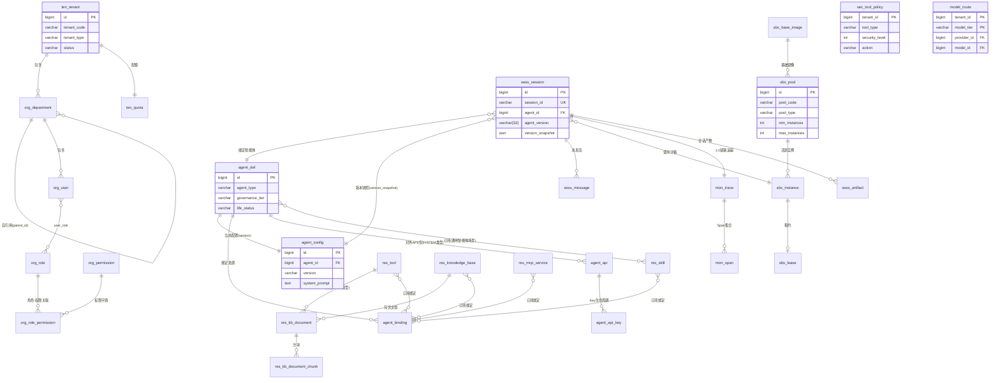

### 数据流转全景图

从用户打开工作台到拿到结果，9 个领域按顺序接力：

```mermaid
flowchart LR
    subgraph "身份层"
        A1[用户登录] --> A2[org_user 验证]
        A2 --> A3[ten_tenant tenant_id 注入]
    end

    subgraph "骨架层"
        B1[选智能体] --> B2[agent_def 加载]
        B2 --> B3[agent_config 当前版本]
        B3 --> B4[agent_binding 查绑定资源]
    end

    subgraph "运行时层"
        C1[创建 sess_session] --> C2[version_snapshot 存 agent_config JSON]
        C2 --> C3[agent_state_session_key → Redis DistributedStore]
        C3 --> C4[agent_binding.resource_type 多态装载]
        C4 --> C5{{调用 LLM + 工具}}
    end

    subgraph "执行层"
        D1[sec_tool_policy (tool_type, security_level) 查表] -->|ALLOW| D2[直接执行]
        D1 -->|APPROVE| D3["HitlFlowService<br/>Redis 存 req → 挂起会话"]
        D1 -->|REJECT| D4[拦截 + 审计]
        D2 --> D5{需要沙箱?}
        D5 -->|是| D6["sbx_pool 匹配 → sbx_instance 分配 → sbx_lease 创建"]
        D5 -->|否| D7[直接返回]
    end

    subgraph "结果层"
        E1[sess_message 按 seq 追加] --> E2[mon_span 每步创建]
        E2 --> E3[mon_trace 闭合]
        E3 --> E4[SSE 推送到前端]
    end

    A3 --> B2
    B4 --> C4
    C5 --> D1
    D6 --> E1
    D7 --> E1
    D3 -->|"审批通过后恢复"| C5

    style A1 fill:#e1f5fe
    style B2 fill:#fff3e0
    style C1 fill:#f3e5f5
    style D1 fill:#ffebee
    style E4 fill:#e8f5e9
```

---

## 一、组织与租户域：数据隔离的根

这是所有其他域 `tenant_id` 的来源。顶层租户 → 部门树 → 用户 → RBAC。

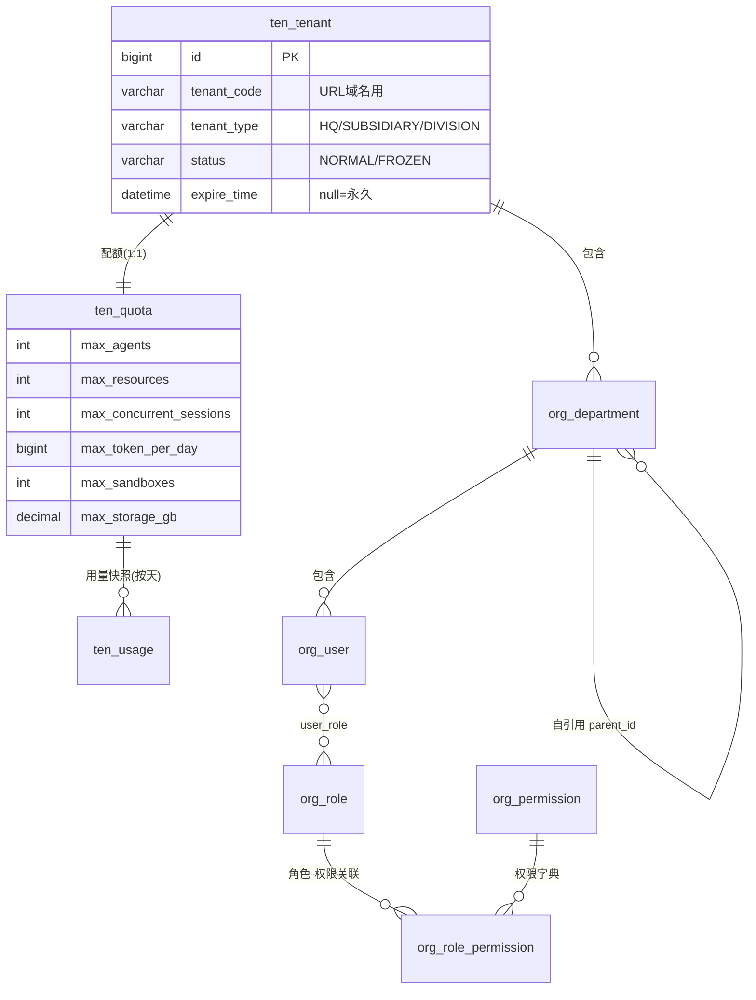

**设计要点**：

- `tenant_code` 是租户的业务标识（如 `corp-a`），URL 域名用。开源版默认 1 个租户，`tenant_code='DEFAULT'`。
- `ten_quota` / `ten_usage` 是"上限 vs 实际用量"的对照关系。每日 cron 汇总 `ten_usage`，超过 `quota` 阈值时触发告警。
- 部门树用 `parent_id` 自引用，无外键约束（DDL 里 FK 全由应用层维护）。
- RBAC 是 **数据驱动的三级模型**：用户 → 角色（org_user_role）→ 权限（org_role_permission INNER JOIN org_permission）
- org_permission：平台共享权限字典（tenant_id=0 全租户可见，tenant_id>0 租户自定义），共 45 个预置权限点覆盖 7 个模块
- org_role_permission：角色-权限关联表，SUPER_ADMIN 拥有全部 45 个权限，其余角色按职责分配子集
- permission_code 格式：`模块:子模块:操作`（如 security:policy:manage / agent:publish）
- 登录时 AuthService.computePermissionsFromDb() 聚合 DB 权限编码写入 JWT payload

#### org_permission — 权限字典

平台共享权限点定义（tenant_id=0 全租户可见），租户也可在本表定义自定义权限（tenant_id>0）。

| 字段 | 类型 | 说明 |
|---|---|---|
| id | bigint PK | 雪花 ID，段号 2000000000000001000~1999 |
| tenant_id | bigint | 0=平台共享，>0=租户自定义 |
| permission_code | varchar(128) | 权限编码，如 `agent:create` / `security:policy:manage` |
| permission_name | varchar(128) | 权限中文名 |
| permission_type | varchar(32) | MENU / BUTTON / API |
| parent_id | bigint | 父权限 ID，0=模块根节点 |
| sort | int | 同层级排序 |
| status | varchar(32) | NORMAL / DISABLED |

#### org_role_permission — 角色-权限关联

| 字段 | 类型 | 说明 |
|---|---|---|
| id | bigint PK | 雪花 ID |
| tenant_id | bigint | 租户 ID |
| role_id | bigint | 关联 org_role.id |
| permission_id | bigint | 关联 org_permission.id |
| （审计字段）| | create_by/create_time/update_by/update_time/deleted |

---

## 二、智能体域：运行时行为的骨架

一个智能体由 **定义（不可变骨架）+ 配置（版本化可变部分）+ 绑定（N:N 资源关联）** 三张表共同描述。**agent_type 决定资源装载轨道，governance_tier 决定沙箱隔离强度**，两个字段正交。

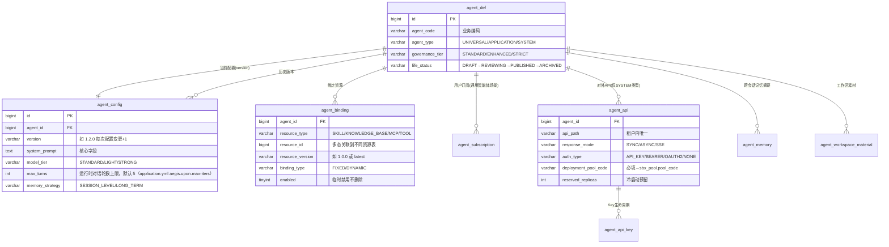

### 为什么是三层（def / config / binding）

| 层                 | 存什么                             | 为什么独立                                                                                        |
| ----------------- | ------------------------------- | -------------------------------------------------------------------------------------------- |
| **agent_def**     | 骨架：agent_type / governance_tier / life_status / owner | **一旦选定不能改**——agent_type 决定运行时资源装载轨道（开放 vs 封闭），governance_tier 决定沙箱隔离强度，改了会导致所有历史会话行为不一致 |
| **agent_config**  | 可变：system_prompt / model / 高级参数 | **版本化**，每次发布 +1。创建会话时把当时的 config JSON 快照到 `sess_session.version_snapshot`，确保会话期间不受后续改版影响     |
| **agent_binding** | N:N 关联到 skill / kb / mcp / tool | **多态关联**用 `resource_type` 字段区分目标表。`binding_type=FIXED` 锁死资源版本不随上游更新漂移，`DYNAMIC` 运行时解析 latest |

### agent_type 决定资源轨道，governance_tier 决定隔离强度

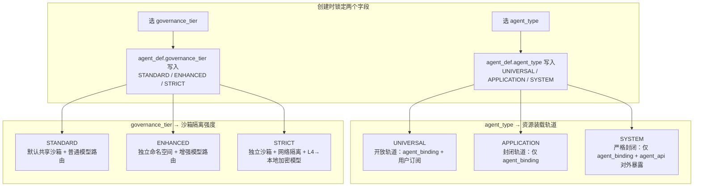

两个字段正交——你可以有一个 UNIVERSAL + STRICT 的通用智能体（严格隔离），也可以有一个 APPLICATION + STANDARD 的应用智能体（标准隔离）。默认 UNIVERSAL/APPLICATION 自动分配 STANDARD，SYSTEM 自动分配 ENHANCED。

### agent_api：只有 SYSTEM 档位能用

`agent_api.deployment_pool_code` 是个有意思的设计——它把对外 API 的沙箱池部署硬编码在 API 配置里，不是动态路由。`reserved_replicas` 是冷启动预留副本数（默认 1），admin Reconcile 定时检查池内实际实例数，如果低于 reserved_replicas 就补齐，保证 API 调用进来时沙箱已经热好。

---

## 三、会话域：运行时全链路的锚点 ★★★★

这是 Aegis 运行时最核心的域。**一个 sess_session = 一条 mon_trace = N 条 sess_message = N 个 mon_span = 一组 Redis DistributedStore Key**。

### ER 关系

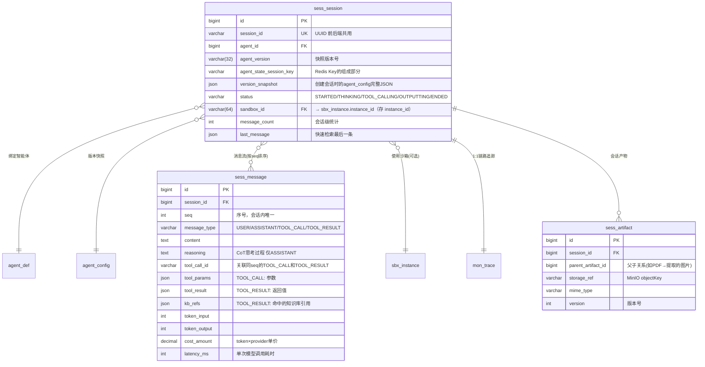

### 一次对话的数据流转（从创建到结束）

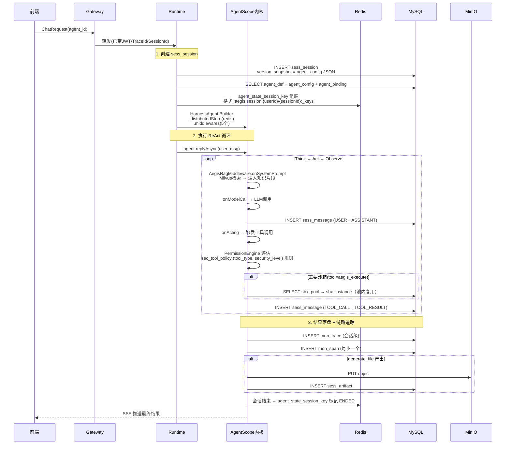

### agent_state_session_key 和 Redis DistributedStore 的映射

这是连接 MySQL 会话域和 AgentScope 内核的关键桥梁。运行时 HarnessAgent 所有状态变更都通过这个 Key 存 Redis，**不落 MySQL**（MySQL 只存会话元数据和消息历史）。

```
agent_state_session_key: tenantId:userId:agentType:agentId:sessionId
          ↓
Redis Key 实际展开（AgentScope RedisDistributedStore 自动生成）:

  aegis:session:{userId}/{sessionId}:agent_state        ← 当前 AgentState（单值）
  aegis:session:{userId}/{sessionId}:agent_state:list   ← AgentState 历史（列表）
  aegis:session:{userId}/{sessionId}:_keys             ← 会话内所有 Key 的索引
  aegis:store:item:{userId}/{sessionId}\0{filename}    ← Workspace 文件内容
  aegis:store:idx:{userId}/{sessionId}                  ← Workspace 文件索引
```

为什么**会话状态存 Redis 不存 MySQL**？

| 场景                  | Redis   | MySQL             |
| ------------------- | ------- | ----------------- |
| ReAct 循环每一步都要读写状态   | 微秒级，不阻塞 | 毫秒级，频繁 UPDATE 锁竞争 |
| SSE 流式推送需要快速取最新状态   | 直接 GET  | SELECT + JOIN 慢   |
| 多实例 runtime 下会话状态共享 | 天然共享内存  | 分布式事务成本高          |

**但 sess_message 必须落 MySQL**——审计追溯、历史会话回放、可观测面板查询都需要，Redis 里的状态是会过期的。

### 消息四类型串成完整执行链

```
USER ────────────────────────────────────────────────────┐
  │ content + artifact_ids                                │
  │                                                       ▼
  │ ASSISTANT ←───────────────────────────────────────────┘
  │ content + reasoning(CoT) + token + cost_amount
  │
  │ LLM 决定调用工具 ↓
  │
  ▼
TOOL_CALL ──────────────────────────────────────────────┐
  │ tool_call_id + tool_name + tool_params               │
  │                                                       ▼
  │ TOOL_RESULT ←────────────────────────────────────────┘
  │ tool_call_id(匹配上条) + tool_result + kb_refs      │
  │
  │ 结果再喂回 LLM → 继续循环或结束
  └─────────────────────────────────────── ASSISTANT(最终回复)
```

**cost_amount 计算链路**：`cost_amount = token_input × model_def.input_cost/1000 + token_output × model_def.output_cost/1000`（input_cost/output_cost 在 model_def 表，单位：元/千 token）。runtime 每次 ASSISTANT 消息落库时查表计算。

---

## 四、资源治理域：能力供给与装载轨道

四类资源（工具 / 技能 / 知识库 / MCP），每种都有生命周期 + 订阅关系。**关键差异在运行时装载轨道**——通用智能体开放（自动装载用户订阅），应用/系统智能体封闭（只加载绑定）。

### ER 关系

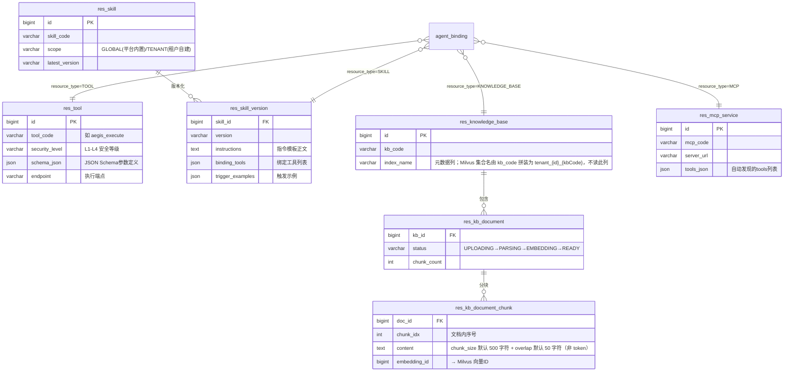

### 知识库 RAG 全链路（嵌入 Milvus）

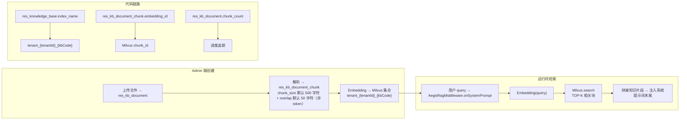

### 订阅机制让通用智能体自动装载

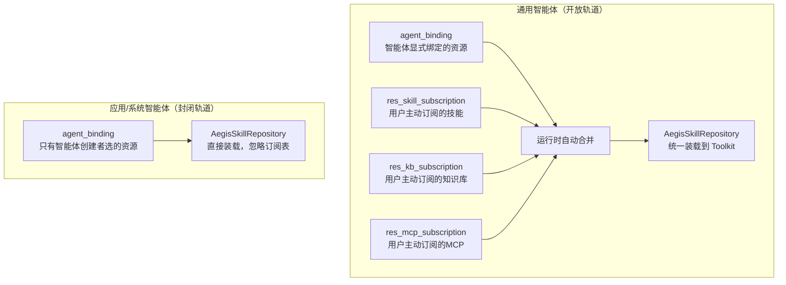

---

## 五、安全策略域：运行时的实时防线 ★★★★

四张策略配置表 + 两张 HITL 流程表。**AgentScope PermissionEngine（规则由 AegisPermissionRuleLoader 装载）在每次工具调用前实时评估**。

### ER 关系

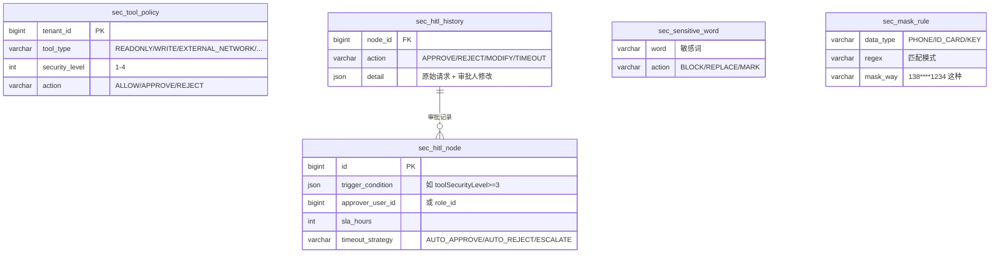

### sec_tool_policy 查表（tool_type × security_level，等级直映兜底）

这张表按**工具类型**和**安全等级**（int 1-4）决定每次工具调用的命运。

```
查表顺序：
1. **特权角色豁免**：SECURITY_OFFICER/PLATFORM_ADMIN/SUPER_ADMIN → 直接 ALLOW
2. **显式策略命中**：(tool_type, security_level) 查 sec_tool_policy → 得到 action
3. **等级直映兜底**：L1/L2 → ALLOW，L3 → APPROVE（触发 HITL），L4 → REJECT
4. **放行规则**：内置低风险工具白名单（BuiltinToolRiskConfig）、MCP 只读前缀工具（get_/query_/search_ 等 11 种前缀）直接放行
```

**为什么用 (tool_type, security_level) 而不是 (agent_tier, security_level)**？因为治理档位（governance_tier）不参与资源访问决策（v4.3 明确移除），agent_type 也不参与工具策略查表。查表 key 是工具的固有属性（READONLY/INTERNAL_API/WRITE/EXTERNAL_NETWORK/CODE_EXEC/HIGH_RISK 六种）× 安全等级（1-4）。

**等级直映兜底**是最常走的路径：L1/L2 直接放行，L3 触发 HITL 审批，L4 直接拒绝。显式策略表给管理员一个差异化配置入口，但基础行为由等级直映保证。

### HITL 完整流程（嵌入 Redis）

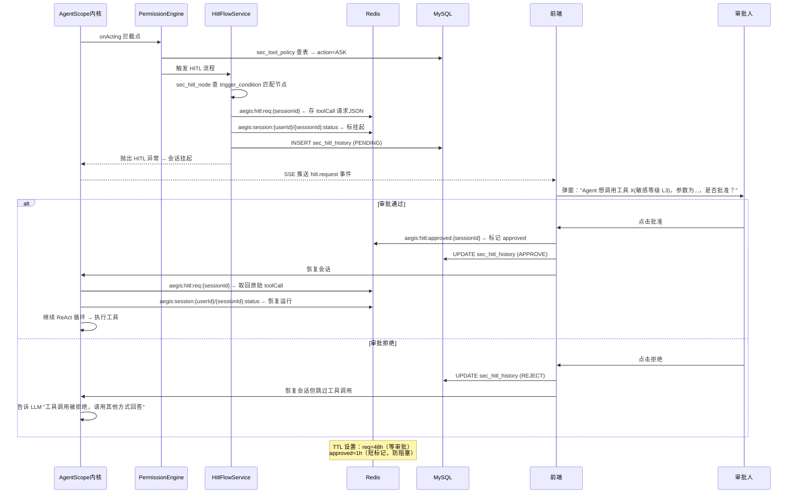

### 安全策略缓存 + Pub/Sub 热更新

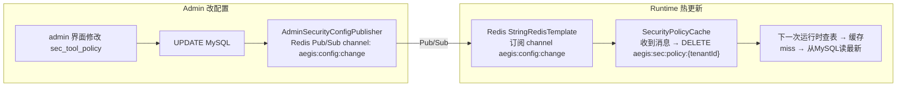

---

## 六、沙箱域：隔离执行的池化复用 ★★★

Docker 容器 / K8s Pod 池化管理。runtime 按需分配、用完归还、空闲超时回收。

### ER 关系

```mermaid
erDiagram
    sbx_base_image ||--o{ sbx_pool : "基础镜像"
    sbx_pool ||--o{ sbx_instance : "活跃实例"
    sbx_instance ||--o| sbx_lease : "租约(正在被哪个会话占用)"

    sbx_base_image {
        bigint id PK
        varchar image_name "如 ubuntu:24.04-python3.11"
        varchar registry "docker.io / 私有仓库"
        varchar pull_policy "ALWAYS/IF_NOT_PRESENT/NEVER"
    }
    sbx_pool {
        bigint id PK
        varchar pool_code "业务编码"
        varchar namespace "K8s模式: aegis-sbx-t{tenantId}-{poolCode}"
        bigint tenant_id "0=全局池"
        varchar pool_type "LIGHT/STANDARD/HEAVY/ISOLATED/DEBUG"
        int min_instances / max_instances
        int idle_timeout_min "空闲超时自动回池"
        varchar network_policy "ISOLATED/RESTRICTED/NO_EXTERNAL"
    }
    sbx_instance {
        bigint id PK
        varchar instance_id "Docker: containerId / K8s: ns/podName"
        bigint pool_id FK
        varchar status "IDLE/OCCUPIED/RESIDENT/ABNORMAL/DESTROYED"
        bigint session_id "哪个会话在用"
        datetime last_heartbeat "超时判定异常"
        tinyint initialized "AgentScope 就绪门控"
    }
    sbx_lease {
        bigint session_id FK
        bigint instance_id FK
        datetime created_at
        datetime expire_at "过期时间"
        varchar status "ACTIVE/EXPIRED/RELEASED"
    }
    sbx_operation_log {
        bigint pool_id / instance_id
        varchar operation_type "ALLOCATE/RELEASE/RECLAIM/DESTROY/HEARTBEAT"
        varchar from_status → to_status
        tinyint success
        varchar error_code
    }
```

### 沙箱生命周期状态机

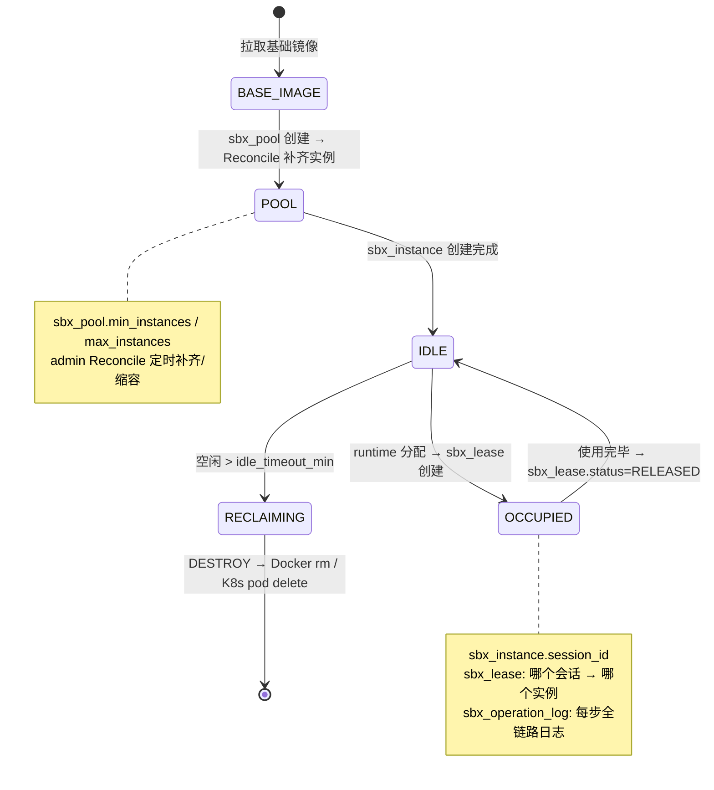

### 池化匹配逻辑（运行时）

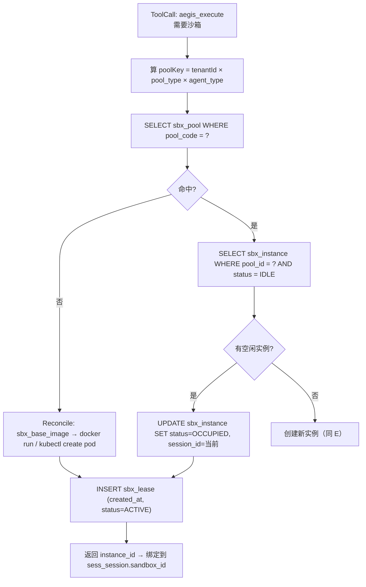

### Docker vs K8s 的 instance_id 差异

| 模式     | instance_id 格式          | 存储位置                                          |
| ------ | ----------------------- | --------------------------------------------- |
| Docker | containerId（SHA256 64位） | sbx_instance.instance_id                      |
| K8s    | `namespace/podName`     | sbx_instance.instance_id + sbx_pool.namespace |

runtime 的 `AegisSandboxBackend` SPI 接口统一封装，上层不感知差异。

---

## 七、模型域：推理引擎的动态路由

小域，快速过。

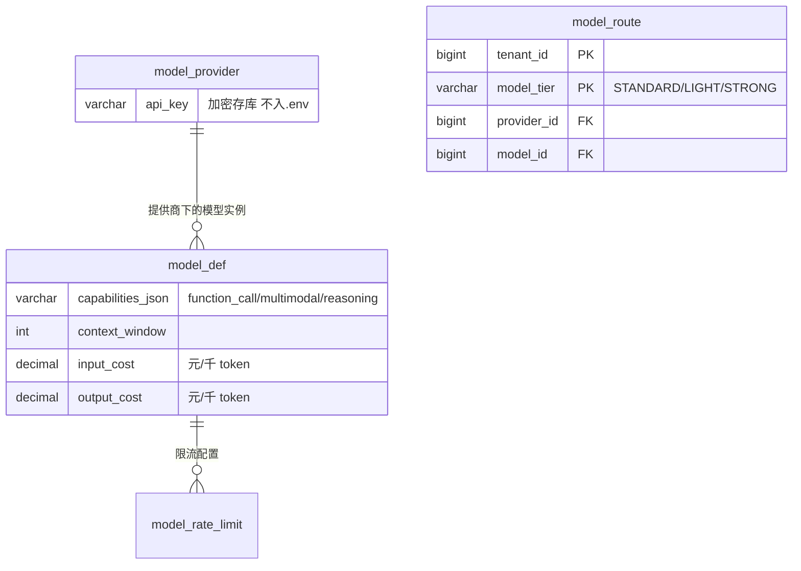

**model_route 是最有意思的表**——让 runtime 能按 `(model_tier, tenant_id)` 动态路由到不同 Provider。同档位（STANDARD），A 租户走 DeepSeek，B 租户走通义千问。价格列在 **model_def**（input_cost / output_cost，元/千 token），model_provider 不含价格。`cost_amount = token_input × input_cost/1000 + token_output × output_cost/1000`，runtime 在 ASSISTANT 消息落库时自动查表计算。

---

## 八、可观测域：Trace/Span 和会话 1:1 绑定

极简域，快速过。

```mermaid
erDiagram
    sess_session ||--|| mon_trace : "1:1"
    mon_trace ||--o{ mon_span : "Span集合"

    mon_trace {
        varchar trace_id UUID
        bigint session_id FK
        bigint agent_id FK
        bigint duration_ms
        varchar status "COMPLETED/EXCEPTION/HITL_SUSPENDED"
    }
    mon_span {
        varchar span_id
        varchar parent_span_id "构Span树"
        varchar span_name
        varchar span_type "REASONING/TOOL_CALL/RAG/MODEL_CALL"
        bigint start_time / end_time / duration_ms
        json input_json / output_json
    }
```

**设计亮点**：`span_type` 四种类型（REASONING / TOOL_CALL / RAG / MODEL_CALL）让前端可观测面板能渲染不同颜色的节点，**一眼看到 LLM 花了多少时间推理、多少时间调工具、多少时间做 RAG**。

TraceStore SPI 是 AgentScope 2.0.2 原生接口，Aegis 的 `MysqlTraceStore` 实现把每次对话落这两张表。没有用 OpenTelemetry 采集——因为 Aegis 自己的中间件链（AegisTraceMiddleware）已经在每个拦截点 + 每次工具调用 + 每次 RAG 检索时手动创建 Span，粒度比 OTel 自动采集更精细（能区分 RAG 和普通模型调用）。

---

## 附录：外部组件清单（按业务域嵌入）

| 组件                     | 嵌入哪个域             | 是否必须 | 核心理由                                                                         |
| ---------------------- | ----------------- | ---- | ---------------------------------------------------------------------------- |
| **Redis**              | 会话域 + 安全域         | ✅ 必须 | AgentScope DistributedStore 硬依赖（HarnessAgent 构建直接失败）+ ZSET 限流原子性 + HITL 异步恢复 |
| **Milvus**             | 资源治理域（知识库 RAG）    | ✅ 必须 | 知识库的向量检索引擎，按 `tenant_{id}_{kbCode}` 跨租户物理隔离                                  |
| **MinIO**              | 会话域（产物）+ 沙箱域（快照）  | ✅ 必须 | AgentScope OSS SPI 对接 + 附件存储 + 产物存储                                          |
| **Nacos**              | 无直接嵌入             | ✅ 必须 | 三进程服务发现 + 配置热更新                                                              |
| **etcd**               | 无直接嵌入（Milvus 内部用） | ✅ 被动 | Milvus v2.5 元数据存储，跟随 Milvus 启动                                               |
| **PaddleOCR**          | 资源治理域（文档解析）       | ❌ 可选 | 扫描版 PDF 解析，Docker profile `ocr` 启动                                           |
| **Prometheus/Grafana** | 可观测域              | ❌ 可选 | 额外指标采集面板。Aegis 自己有 mon_trace/mon_span，Docker profile `observability` 启动      |

### 双锁分工（保留，不可删）

- **IDistributedLock + RedisDistributedLock + Redisson 依赖** → 有活跃消费方。admin 侧 SandboxReconcileLockService 依赖它实现 Reconcile 领导者锁（防多 admin 实例并发巡检）。与 AgentScope 的 RedisSandboxExecutionGuard（内核锁）是"巡检互斥（业务锁）"与"执行互斥（内核锁）"两层设计。（注：原 AegisSandboxCoordinator 分配锁已随 Phase 2 减法删除，runtime 侧 aegis_execute 走 AegisSandboxPoolExecutor 无锁复用路径）
- Gateway 进程的 RedisConfig → AuthFilter 纯 JWT 不查 Redis，整个 gateway 不做 Redis 读写，**可安全删除**（见审计报告 E-06）。
