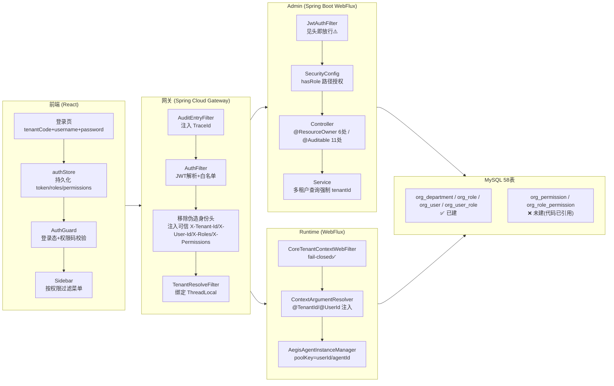
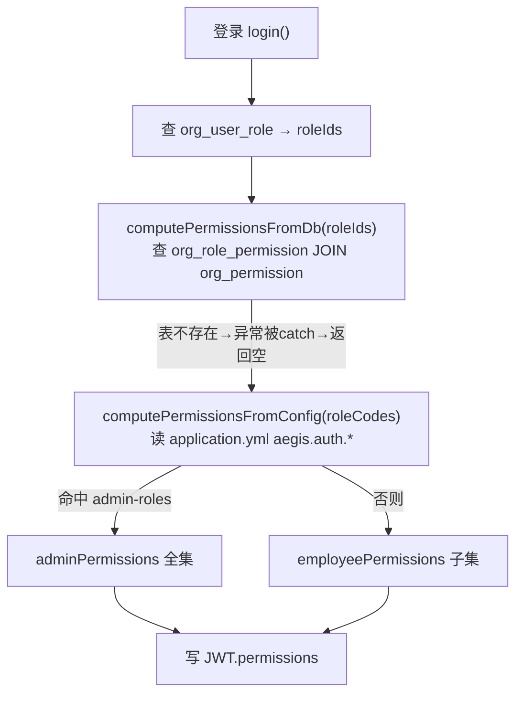
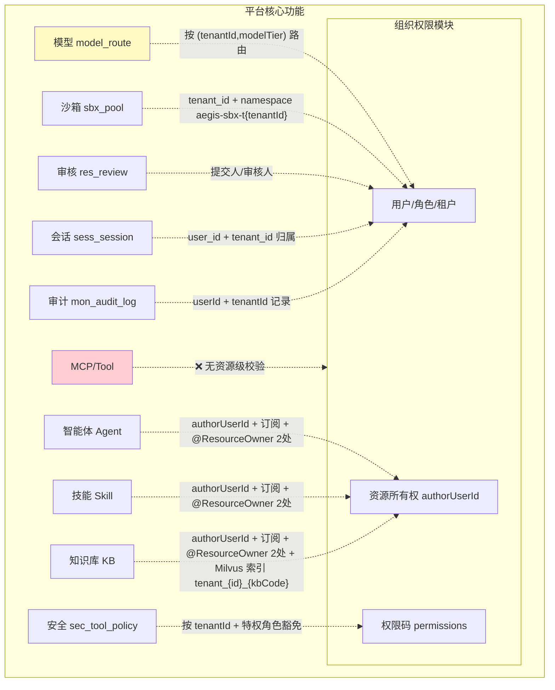

# Aegis 组织与权限模块：深度探查与优化报告

> 基于 0.1.0-alpha.1 代码 + Docker MySQL 实地核实 ｜ 2026-09-01
>
> 探查方式：代码静态分析 + DDL 比对 + `docker exec aegis-mysql` 真实表结构核验 + 前端源码追踪

---

## 零、摘要（先读这段）

Aegis 的组织与权限模块是一个**"骨架完整、闭环存在断点、口径尚未统一"**的半成品：

- **完整闭环**：登录（tenantCode→用户→BCrypt→JWT）→ 网关 JWT 鉴权 + 身份头注入 → 多租户行级过滤 → 角色-资源所有权校验 → 审计落库，主链路已贯通。
- **核心断点（P0）**：代码已实现**三级 RBAC**（`Permission`/`RolePermission` 实体 + Mapper + Controller），但 **DDL 与数据库未建 `org_permission` / `org_role_permission` 两张表**。实地 `SHOW TABLES` 确认 `org_%` 仅 4 张表，权限相关表为空。导致权限管理页所有操作命中 500 或被 try-catch 静默兜底走 yml 配置。
- **口径分裂（P0）**：角色编码存在至少 4 套口径（seed `SUPER_ADMIN/SECURITY_ADMIN`、`UserContext` 认 `PLATFORM_ADMIN`、`SecurityConfig` 用 `PLATFORM_ADMIN`、data-model 提及 `SECURITY_OFFICER`），`SECURITY_ADMIN` 在 Spring Security 规则中**不被识别为安全接口管理员**，安全管理员无法管理安全策略。
- **横切覆盖不足（P1）**：`@ResourceOwner` 仅 6 处真实标注（Agent/Skill/KB 的 EDIT/DELETE），`@Auditable` 仅 11 处，`@PreAuthorize` **0 处真实使用**（全在注释里）。MCP/Tool/沙箱/模型 CRUD 既无资源级校验也无审计。
- **数据权限未落地（P1）**：部门树纯展示，`org_user_role.source=DEPT_INHERIT` 无填充逻辑，跨用户数据隔离靠"租户+创建者"硬编码，无部门级数据权限。
- **双鉴权策略不一致（P1）**：runtime 的 `CoreTenantContextWebFilter` 已收紧为 fail-closed，但 admin 的 `JwtAuthFilter` 仍是 fail-open（见 `X-Tenant-Id` 头即放行），绕过网关直连 8082 可伪造身份。

**总评**：模块方向正确（数据驱动 RBAC + 多租户插件 + 资源所有权切面 + 审计切面是成熟范式），但落地停在"代码写完、建表没跟上、口径没收口、横切没铺开"的中间态。优化核心是**补两表、统一口径、补注解覆盖、收紧 fail-closed**，即可实现完整闭环。

---

## 一、现状全景

### 1.1 模块定位与三层权限架构声明

product.md 第 405-430 行描述的组织模型：`Tenant → Department(树) → User`，叠加 `Role → Permission` RBAC。architecture.md 声明 admin 为"CRUD + RBAC"进程。`SecurityConfig` 类注释（[SecurityConfig.java:24-52](file:///d:/code/share/ai/aegis/aegis-platform-backend/aegis-admin/src/main/java/com/aegis/admin/config/security/SecurityConfig.java#L24-L52)）自述三层权限架构：

| 层级 | 机制 | 声明职责 |
|---|---|---|
| 接口级 | JWT + Spring Security 路径授权（`hasRole`） | 按角色控制接口访问 |
| 资源级 | `@ResourceOwner` 注解 + AOP 切面 | 校验资源所有权（创建者/订阅者/管理员） |
| 运行时 | `AegisSecurityPolicyEngine` | 工具调用安全策略（ALLOW/审批/BLOCK） |

### 1.2 整体鉴权链路（已贯通部分）



### 1.3 数据模型真相（DDL vs 代码 vs Docker 实地）

**Docker MySQL 实地核验**（采纳建议，`docker exec` 直查）：

```
org_department / org_role / org_user / org_user_role   ← 仅 4 张
=== permission ===   (空)
total = 58 表
```

| 层面 | 事实 | 证据位置 |
|---|---|---|
| DDL 文件 | `org_user_role` 之后直接是 `res_kb_document`，**无 `org_permission` / `org_role_permission` 建表语句** | [01_schema_init.sql:730-731](file:///d:/code/share/ai/aegis/infra/ddl/01_schema_init.sql#L730-L731) |
| Docker 实地 | `org_%` 仅 4 表，`%permission%` 0 表 | `docker exec aegis-mysql mysql ... SHOW TABLES` |
| 代码实体 | `Permission` 标 `@TableName("org_permission")`，`RolePermission` 标 `@TableName("org_role_permission")` | [Permission.java:29](file:///d:/code/share/ai/aegis/aegis-platform-backend/aegis-core/aegis-core-domain/src/main/java/com/aegis/core/domain/org/Permission.java#L29)、[RolePermission.java:30](file:///d:/code/share/ai/aegis/aegis-platform-backend/aegis-core/aegis-core-domain/src/main/java/com/aegis/core/domain/org/RolePermission.java#L30) |
| Mapper SQL | `SELECT ... FROM org_role_permission rp INNER JOIN org_permission p` 直接查不存在的表 | [RolePermissionMapper.java:27-34](file:///d:/code/share/ai/aegis/aegis-platform-backend/aegis-dal/src/main/java/com/aegis/dal/mapper/org/RolePermissionMapper.java#L27-L34) |

> **结论**：data-model.md 第 431 行"RBAC 实际是角色-用户两级模型，无 permission/role_permission 表"的描述**对数据库是对的**，但代码已超前演进到三级——文档、DDL、代码三者脱节。

### 1.4 真实 RBAC 落地形态：双轨制

`AuthService` 采取了"DB 驱动优先 + 配置兜底"的双轨策略（[AuthService.java:141-145](file:///d:/code/share/ai/aegis/aegis-platform-backend/aegis-admin/src/main/java/com/aegis/admin/service/org/AuthService.java#L141-L145)）：



**问题**：
- `computePermissionsFromDb` 用 try-catch 吞异常返回空（[AuthService.java:332-338](file:///d:/code/share/ai/aegis/aegis-platform-backend/aegis-admin/src/main/java/com/aegis/admin/service/org/AuthService.java#L332-L338)），表不存在时**静默降级**，管理员完全无感知。
- `PermissionController.tree` → `listPermissions` 查 `org_permission` **无 try-catch**（[RolePermissionService.java:44-52](file:///d:/code/share/ai/aegis/aegis-platform-backend/aegis-admin/src/main/java/com/aegis/admin/service/org/RolePermissionService.java#L44-L52)），前端角色页"分配权限"弹窗一打开即 **HTTP 500**。
- 配置兜底只有 admin/employee 两档粗粒度（[application.yml:76-104](file:///d:/code/share/ai/aegis/aegis-platform-backend/aegis-admin/src/main/resources/application.yml#L76-L104)），权限码列表硬编码，与前端 14 个路由权限元信息无法动态对齐。

### 1.5 角色编码口径分裂（P0）

同一种"管理员"在系统中至少 4 套编码：

| 来源 | 编码 | 用途 |
|---|---|---|
| seed 数据 ([02_seed_data.sql:43-45](file:///d:/code/share/ai/aegis/infra/ddl/02_seed_data.sql#L43-L45)) | `SUPER_ADMIN` / `PLATFORM_ADMIN`? / `SECURITY_ADMIN` | 实际插入 |
| `UserContext.isPlatformAdmin()` ([UserContext.java:55-57](file:///d:/code/share/ai/aegis/aegis-platform-backend/aegis-core/aegis-core-domain/src/main/java/com/aegis/core/security/UserContext.java#L55-L57)) | `PLATFORM_ADMIN` ‖ `SUPER_ADMIN` | 数据权限切面判定 |
| `SecurityConfig` ([SecurityConfig.java:105-197](file:///d:/code/share/ai/aegis/aegis-platform-backend/aegis-admin/src/main/java/com/aegis/admin/config/security/SecurityConfig.java#L105-L197)) | `hasRole("PLATFORM_ADMIN")` / `hasAnyRole("PLATFORM_ADMIN","TENANT_ADMIN")` | 接口授权 |
| `application.yml` admin-roles ([application.yml:77-80](file:///d:/code/share/ai/aegis/aegis-platform-backend/aegis-admin/src/main/resources/application.yml#L77-L80)) | `SUPER_ADMIN` / `TENANT_ADMIN` / `PLATFORM_ADMIN` | 配置兜底权限 |
| data-model.md 第 578 行 | `SECURITY_OFFICER` / `PLATFORM_ADMIN` / `SUPER_ADMIN` | 运行时特权豁免描述 |
| product.md 第 423 行 | 管理员/普通用户/安全审计员 | 产品口径 |

**直接后果**：
1. `SECURITY_ADMIN`（安全管理员）在 `SecurityConfig` 中**未出现**，`/api/admin/security/**` 要求 `hasRole("PLATFORM_ADMIN")`——**安全管理员无法管理安全策略**，违反产品定义。
2. `UserContext.isTenantAdmin()` 不含 `SECURITY_ADMIN`，安全审计员看不了审计日志（`/audit/**` 要 `PLATFORM_ADMIN`+`TENANT_ADMIN`）。
3. `SUPER_ADMIN` 在 `UserContext` 被归为 platformAdmin，但在 `SecurityConfig` `hasRole("PLATFORM_ADMIN")` 路径下**不被 Spring Security 直接识别**（除非 RoleVoter 前缀映射 SUPER_ADMIN→PLATFORM_ADMIN，无此配置）。

### 1.6 鉴权链路逐层剖析

#### 网关层（fail-closed 良好）

`AuthFilter`（[AuthFilter.java](file:///d:/code/share/ai/aegis/aegis-platform-backend/aegis-gateway/src/main/java/com/aegis/gateway/filter/AuthFilter.java)）：
- ✅ 白名单仅 3 条（登录/actuator/下载），[application.yml](file:///d:/code/share/ai/aegis/aegis-platform-backend/aegis-gateway/src/main/resources/application.yml#L35-L38)。
- ✅ **安全加固**：L107-115 先 `remove` 客户端伪造的 `X-Tenant-Id/X-User-Id/X-Roles/X-Permissions` 再写入网关解析的可信值——防身份头伪造，这点做得很好。
- ✅ JWT Claims 含 `userId/tenantId/username/roles/permissions` 全量，下游无需二次查库。
- ⚠️ `getOrder()=HIGHEST_PRECEDENCE`，但 `AuditEntryFilter`/`TenantResolveFilter` order 更靠后，实际执行序需保证 Auth→Tenant，目前 `+100` 间隔足够。

#### Admin 层（fail-open 隐患）

`JwtAuthFilter`（[JwtAuthFilter.java:52-56](file:///d:/code/share/ai/aegis/aegis-platform-backend/aegis-admin/src/main/java/com/aegis/admin/config/security/JwtAuthFilter.java#L52-L56)）：
```java
// Check if X-Tenant-Id already present (gateway-injected)
String existingTenantId = request.getHeaders().getFirst("X-Tenant-Id");
if (existingTenantId != null && !existingTenantId.isEmpty()) {
    return chain.filter(exchange);   // ⚠️ 见头即放行，不验签
}
```
- ⚠️ **fail-open**：假设 X-Tenant-Id 必来自网关，但 admin 8082 端口若对外可达，攻击者直连带上任意 `X-Tenant-Id`/`X-User-Id` 即绕过 JWT。网关的 remove 注入只在流量过网关时生效。
- 与 runtime 的 `CoreTenantContextWebFilter`（fail-closed，[CoreTenantContextWebFilter.java:127-144](file:///d:/code/share/ai/aegis/aegis-platform-backend/aegis-core/aegis-core-infra/src/main/java/com/aegis/core/web/filter/CoreTenantContextWebFilter.java#L127-L144)）策略**不一致**。
- `SecurityConfig` 路径授权用 `hasRole`，但 JWT roles 经 `JwtReactiveAuthenticationManager` 转换为 `ROLE_` 前缀 GrantedAuthority 的逻辑需验证（见风险 R-03）。

#### Runtime 层（fail-closed 已修复）

`CoreTenantContextWebFilter` 较成熟：
- ✅ fail-closed：非白名单缺 `X-Tenant-Id`/`X-User-Id` 直接 401。
- ✅ 绑定 `TenantContextHolder` ThreadLocal，解决"多租户插件静默加 tenant_id=0"的历史坑（注释 L150-153 记录了修复）。
- ✅ JWT fallback、下载接口 query param 兜底。

#### 多租户行级过滤

`CoreTenantLineHandler`（[CoreTenantLineHandler.java:28-37](file:///d:/code/share/ai/aegis/aegis-platform-backend/aegis-core/aegis-core-infra/src/main/java/com/aegis/core/tenant/CoreTenantLineHandler.java#L28-L37)）：
```java
public Expression getTenantId() {
    Long tenantId = TenantContextHolder.getTenantId();
    if (tenantId == null) {
        log.warn("租户上下文缺失，回退到 tenantId=0");  // ⚠️
        return new LongValue(0L);
    }
    return new LongValue(tenantId);
}
```
- ⚠️ 上下文缺失回退 `0L` 而非抛异常——`@Async`/定时任务线程未传递上下文时，SQL 静默查 `tenant_id=0` 的系统共享数据，**可能跨租户泄露**（如 `res_tool` 若未在 ignoreTable 则查不到，若在则全租户共享）。
- `ignoreTable` 清单由 `CoreMybatisAutoConfiguration` 注入，需核对是否覆盖 `res_tool`/`model_provider`/`org_role(tenantId=0 平台角色?)` 等系统表。

### 1.7 资源级数据权限：@ResourceOwner（设计好，覆盖差）

`ResourceOwner` 注解设计完善（[ResourceOwner.java](file:///d:/code/share/ai/aegis/aegis-platform-backend/aegis-core/aegis-core-spi/src/main/java/com/aegis/core/security/ResourceOwner.java)）：4 档策略（allowCreator/Subscriber/TenantAdmin/platformAdmin 隐式）+ resourceType + permission + resourceIdParam。

`ResourceOwnerService.checkResourceAccess` 四层判定（[ResourceOwnerService.java:100-133](file:///d:/code/share/ai/aegis/aegis-platform-backend/aegis-admin/src/main/java/com/aegis/admin/service/resource/ResourceOwnerService.java#L100-L133)）：
1. 平台管理员 → 放行
2. 租户管理员 + 同租户 → 放行
3. 创建者（`authorUserId == userId`）→ 放行
4. 订阅者（VIEW 权限 + 订阅表命中）→ 放行

**真实覆盖率**（grep 实测）：

| 资源 | EDIT/DELETE 标注 | 其他操作 | 覆盖判定 |
|---|---|---|---|
| Agent | ✅ 2 处 | ❌ 创建/查看/发布无 | 部分 |
| Skill | ✅ 2 处 | ❌ 版本/订阅无 | 部分 |
| KnowledgeBase | ✅ 2 处 | ❌ 文档/订阅无 | 部分 |
| MCP | ❌ 0 处 | ❌ | **完全裸奔** |
| Tool | ❌ 0 处 | ❌ | **完全裸奔** |
| 沙箱/模型/租户 | ❌ 0 处 | 靠 hasRole 兜底 | 仅接口级 |

> MCP/Tool 在 `ResourceOwnerService` 里 `checkMcporToolAccess` 直接 `return false`（[ResourceOwnerService.java:238-242](file:///d:/code/share/ai/aegis/aegis-platform-backend/aegis-admin/src/main/java/com/aegis/admin/service/resource/ResourceOwnerService.java#L238-L242)），即"非管理员一律拒"，但**前提是注解被标注**——未标注则切面根本不触发，方法直接执行。

`@PreAuthorize` 真实标注：**0 处**（全在注释示范）。`@Auditable` 真实标注：**11 处**，仅覆盖 auth/user/role/permission，资源/沙箱/模型/审核 CRUD 未审计。

### 1.8 前端功能闭环现状

前端实现质量较高，三层权限基础设施齐全：

| 维度 | 现状 | 证据 |
|---|---|---|
| 页面级 | ✅ 14 路由配 `requiredPermissions`，`AuthGuard` 校验登录+权限 | [routes.tsx](file:///d:/code/share/ai/aegis/aegis-platform-web/src/router/routes.tsx) |
| 菜单级 | ✅ `Sidebar` 按 `hasPermission` 动态过滤，空组隐藏 | [Sidebar.tsx:162-168](file:///d:/code/share/ai/aegis/aegis-platform-web/src/components/layout/Sidebar.tsx#L162-L168) |
| 按钮级 | ⚠️ `usePermission` 提供 API 但**组织/角色/租户页未 import**，按钮全裸 | role/organization/tenant 页无 usePermission 调用 |
| 权限码来源 | ✅ 后端 `/me` 返回 `permissions: string[]`，前端字符串精确匹配 | [authStore.ts:74-77](file:///d:/code/share/ai/aegis/aegis-platform-web/src/stores/authStore.ts#L74-L77) |
| 角色管理 | ✅ 支持自定义 RESOURCE 角色 + 权限树勾选分配；PLATFORM 只读 | [role/index.tsx:115-181](file:///d:/code/share/ai/aegis/aegis-platform-web/src/pages/role/index.tsx#L115-L181) |
| 组织管理 | ✅ 部门树 CRUD + 用户绑部门 + 用户绑角色 | [organization/index.tsx](file:///d:/code/share/ai/aegis/aegis-platform-web/src/pages/organization/index.tsx) |
| 未授权页 | ❌ 无 403，无权限直接跳工作台 | [AuthGuard.tsx:36-42](file:///d:/code/share/ai/aegis/aegis-platform-web/src/router/AuthGuard.tsx#L36-L42) |
| 配额回填 | ❌ `openQuotaModal` 写死默认值，不拉当前配额 | [tenant/index.tsx:194-207](file:///d:/code/share/ai/aegis/aegis-platform-web/src/pages/tenant/index.tsx#L194-L207) |

**前端与前述后端断点的联动**：前端角色页"分配权限"弹窗调用 `getPermissionTree` → 后端查不存在的 `org_permission` 表 → 500 → 前端体验崩溃。这是**前后端契约对不齐**的典型，根因在后端建表缺失。

---

## 二、功能闭环与核心联动评估

### 2.1 闭环判定矩阵

| 闭环 | 状态 | 缺口 |
|---|---|---|
| 登录→JWT→鉴权 | 🟡 半通 | admin JwtAuthFilter fail-open |
| 用户CRUD+角色分配 | ✅ 通 | — |
| 部门树CRUD | ✅ 通 | 不参与数据权限 |
| 租户CRUD+配额+冻结 | ✅ 通 | 配额弹窗不回填 |
| 角色CRUD（RESOURCE） | ✅ 通 | 无启停接口 |
| 权限字典+角色权限分配 | ❌ 断 | org_permission/role_permission 表未建，前端500 |
| 接口级授权（hasRole） | 🟡 半通 | 角色口径分裂，SECURITY_ADMIN 失效 |
| 资源级授权（@ResourceOwner） | 🟡 半通 | 仅6处，MCP/Tool 裸奔 |
| 数据权限（部门级） | ❌ 缺 | source=DEPT_INHERIT 无逻辑 |
| 多租户行级过滤 | 🟡 半通 | 上下文缺失回退0有泄露风险 |
| 审计 | 🟡 半通 | 仅11处，核心CRUD未覆盖 |
| 运行时安全策略联动 | ✅ 通 | 特权角色口径需与admin统一 |

### 2.2 与平台核心功能的联动



**联动强度分级**：
- **强联动**（✅）：KB（租户Milvus索引）、模型（model_route租户路由）、沙箱（namespace含tenantId）、会话（user/tenant归属）、运行时安全（特权角色）。
- **中联动**（🟡）：Agent/Skill（authorUserId + 订阅，但仅EDIT/DELETE校验）、审核（提交人/审核人，无角色分配逻辑）。
- **弱联动/裸奔**（❌）：MCP/Tool（无资源级校验，靠接口级 hasRole）、审计日志（操作人记录有，但覆盖面窄）。

**关键矛盾**：前端 `Sidebar` 按权限码过滤菜单（如 `tenant:manage`），但后端权限码靠 yml 配置兜底且无动态表——**前端权限码与后端权限源脱节**，改 yml 才能改前端菜单可见性，违背"数据驱动"初衷。

---

## 三、问题清单与定级

| ID | 优先级 | 问题 | 影响 | 证据 |
|---|---|---|---|---|
| P0-01 | 🔴 高 | `org_permission`/`org_role_permission` 表未建，代码已引用 | 权限页500、权限分配不可用、RBAC降级为配置兜底 | Docker查表+实体@TableName+Mapper SQL |
| P0-02 | 🔴 高 | 角色编码4套口径分裂 | SECURITY_ADMIN失效、SUPER_ADMIN在hasRole路径不被识别 | seed/UserContext/SecurityConfig/yml四源比对 |
| P0-03 | 🔴 高 | admin JwtAuthFilter fail-open（见头放行） | 绕网关直连8082可伪造身份 | JwtAuthFilter.java:52-56 |
| P1-01 | 🟠 中 | @ResourceOwner 仅6处，MCP/Tool裸奔 | 资源越权风险 | grep实测 |
| P1-02 | 🟠 中 | @Auditable 仅11处，核心CRUD未审计 | 审计追溯断链 | grep实测 |
| P1-03 | 🟠 中 | @PreAuthorize 0处真实使用 | 方法级细粒度权限缺失 | grep实测 |
| P1-04 | 🟠 中 | 部门数据权限未落地（DEPT_INHERIT空逻辑） | 跨用户数据隔离靠硬编码 | DepartmentService纯CRUD |
| P1-05 | 🟠 中 | 多租户插件上下文缺失回退0L | @Async/定时任务跨租户泄露 | CoreTenantLineHandler:30-37 |
| P2-01 | 🟡 低 | 前端按钮级权限未铺开（仅页面/菜单级） | 粗粒度，进页面即可见所有按钮 | role/org/tenant页无usePermission |
| P2-02 | 🟡 低 | 配额弹窗不回填当前值 | 编辑配额看不到既有值 | tenant/index.tsx:194-207 |
| P2-03 | 🟡 低 | 角色无启停接口 | status列展示但不可改 | api/role.ts无enable/disable |
| P2-04 | 🟡 低 | 无403未授权页 | 体验差，直接跳工作台 | AuthGuard:36-42 |
| P2-05 | 🟡 低 | /me 走 config 兜底不查 DB | 权限变更不实时反映 | AuthService.me:227 |
| D-01 | 📄 文档 | data-model.md 第431行描述过时 | 误导，实际代码已三级 | data-model.md:431 |

---

## 四、优化方案

### 4.1 总体目标

将组织权限模块从"半成品"推进到"数据驱动、口径统一、横切全覆盖、fail-closed"的生产级闭环，支撑企业级多租户 AI Agent 治理。

### 4.2 优化架构（目标态）

```mermaid
flowchart TD
    subgraph 数据层
        T1[org_permission 权限字典<br/>platform:0 + tenant:N]
        T2[org_role_permission 角色权限关联]
        T3[org_user_role.source<br/>DIRECT/DEPT_INHERIT/RESOURCE_AUTH 全落地]
    end

    subgraph 鉴权层
        A1[网关 AuthFilter fail-closed✅] --> A2[admin/runtime 统一 fail-closed]
        A2 --> A3[角色编码统一枚举 RoleCode]
    end

    subgraph 授权层
        B1[接口级 hasRole→hasAuthority 权限码]
        B2[资源级 @ResourceOwner 全资源覆盖]
        B3[数据级 部门deptPath 前缀过滤]
    end

    subgraph 审计层
        C1[@Auditable 全CRUD覆盖]
        C2[审计→权限变更追溯]
    end

    T1 --> B1
    T2 --> B1
    T3 --> B3
```

### 4.3 P0 优化项（必做，止血）

#### P0-01：补建 `org_permission` / `org_role_permission` 表 + 种子数据

新增 DDL（建议放 `04_patch_rbac_tables.sql`，因 `03_patch_hotfix.sql` 实测不存在）：

```sql
-- 权限字典（platform:0 平台共享 + tenant:N 租户自定义）
CREATE TABLE `org_permission` (
  `id` bigint NOT NULL COMMENT '雪花ID',
  `tenant_id` bigint NOT NULL DEFAULT 0 COMMENT '租户ID，0=平台共享',
  `permission_code` varchar(128) NOT NULL COMMENT '权限码，如 agent:view',
  `permission_name` varchar(128) COMMENT '展示名',
  `permission_type` varchar(32) COMMENT 'MENU/BUTTON/API',
  `parent_id` bigint DEFAULT 0 COMMENT '父权限，0=根',
  `sort` int DEFAULT 0,
  `status` varchar(64) DEFAULT 'NORMAL',
  `create_time` datetime DEFAULT CURRENT_TIMESTAMP,
  `update_time` datetime DEFAULT CURRENT_TIMESTAMP ON UPDATE CURRENT_TIMESTAMP,
  `deleted` tinyint DEFAULT 0,
  PRIMARY KEY (`id`),
  UNIQUE KEY `uk_perm_code` (`tenant_id`,`permission_code`),
  KEY `idx_perm_parent` (`parent_id`)
) ENGINE=InnoDB CHARSET=utf8mb4 COMMENT='权限字典';

-- 角色权限关联
CREATE TABLE `org_role_permission` (
  `id` bigint NOT NULL,
  `tenant_id` bigint NOT NULL,
  `role_id` bigint NOT NULL,
  `permission_id` bigint NOT NULL,
  `create_time` datetime DEFAULT CURRENT_TIMESTAMP,
  `deleted` tinyint DEFAULT 0,
  PRIMARY KEY (`id`),
  UNIQUE KEY `uk_role_perm` (`tenant_id`,`role_id`,`permission_id`)
) ENGINE=InnoDB CHARSET=utf8mb4 COMMENT='角色-权限关联';

-- 种子：平台级权限字典（tenant_id=0），与前端14路由权限码对齐
INSERT INTO org_permission (id,tenant_id,permission_code,permission_name,permission_type,parent_id,sort) VALUES
 (1000,0,'agent','智能体','MENU',0,10),
 (1001,0,'agent:view','查看','BUTTON',1000,1),
 (1002,0,'agent:create','创建','BUTTON',1000,2),
 (1100,0,'resource','资源治理','MENU',0,20),
 (1200,0,'security:view','安全查看','MENU',0,30),
 (1300,0,'monitor:view','监控查看','MENU',0,40),
 (1400,0,'audit:view','审计查看','MENU',0,50),
 (1500,0,'review:view','审核查看','MENU',0,60),
 (1600,0,'tenant:manage','租户管理','MENU',0,70),
 (1700,0,'system:model:view','模型查看','MENU',0,80);

-- 种子：平台角色 → 全权限
INSERT INTO org_role_permission (id,tenant_id,role_id,permission_id)
SELECT NULL,0,r.id,p.id FROM org_role r, org_permission p
WHERE r.tenant_id=0 AND r.role_code='SUPER_ADMIN' AND p.tenant_id=0;
```

同步：更新 data-model.md 第 431 行描述。

#### P0-02：统一角色编码枚举

新增 `RoleCode` 常量类，收敛 4 套口径为 1 套，并校正 `SecurityConfig`：

```java
// com.aegis.core.enums.tenant.RoleCode
public final class RoleCode {
    public static final String SUPER_ADMIN = "SUPER_ADMIN";      // 超管
    public static final String PLATFORM_ADMIN = "PLATFORM_ADMIN"; // 平台管理员
    public static final String TENANT_ADMIN = "TENANT_ADMIN";    // 租户管理员
    public static final String SECURITY_ADMIN = "SECURITY_ADMIN"; // 安全管理员
    public static final String RESOURCE_ADMIN = "RESOURCE_ADMIN"; // 资源管理员
    public static final String AGENT_REVIEWER = "AGENT_REVIEWER"; // 审核员
    public static final String EMPLOYEE = "EMPLOYEE";            // 普通员工
}
```

`SecurityConfig` 路径授权校正（`SECURITY_ADMIN` 纳入安全接口）：

```java
// 安全策略：PLATFORM_ADMIN + SECURITY_ADMIN
.pathMatchers("/api/admin/security/**", "/api/admin/security-admin/**")
.hasAnyRole("PLATFORM_ADMIN", "SECURITY_ADMIN")

// 审计：三者皆可
.pathMatchers("/api/admin/audit/**")
.hasAnyRole("PLATFORM_ADMIN", "SECURITY_ADMIN", "TENANT_ADMIN")
```

`UserContext.isPlatformAdmin()` 同步纳入 `SECURITY_ADMIN`（安全只读维度），或新增 `isSecurityAdmin()` 精确判定。运行时安全策略引擎特权豁免清单与 `RoleCode` 对齐。

#### P0-03：admin JwtAuthFilter 收紧 fail-closed

对齐 runtime 的 `CoreTenantContextWebFilter`，**见头不放行，必须验签**：

```java
// JwtAuthFilter: 移除 L52-56 的见头放行，统一走 JWT 解析注入
// 仅保留 auth/* 与 OPTIONS 白名单
String authHeader = request.getHeaders().getFirst("Authorization");
if (authHeader == null || !authHeader.startsWith("Bearer ")) {
    return unauthorizedResponse(exchange, "Authentication required");
}
Claims claims = JwtUtil.parse(authHeader.substring(7), jwtProperties.getSecret());
if (claims == null) return unauthorizedResponse(exchange, "Token invalid");
// 注入 X-Tenant-Id/X-User-Id（覆盖任何客户端头，防伪造）
```

更优解：admin 直接复用 core 的 `CoreTenantContextWebFilter`，删除自有 `JwtAuthFilter`，消除双 filter 不一致。

### 4.4 P1 优化项（应做，提质量）

#### P1-01/02/03：横切注解全覆盖

- `@ResourceOwner`：对 MCP/Tool 的 EDIT/DELETE/PUBLISH 补注解；Agent/Skill/KB 的 CREATE/VIEW/PUBLISH 补注解；新增 `ResourceType.MCP_SERVICE` 已有但 `checkMcporToolAccess` 实现拒绝非管理员——改为"租户内已订阅即可 VIEW"。
- `@Auditable`：所有写操作（POST/PUT/DELETE）强制标注，`Auditable` 注解默认 `logType`/`operation` 自动从方法名+路径推断，降低标注成本。
- `@PreAuthorize`：对细粒度操作（如"仅创建者可发布自己技能"）引入 `@PreAuthorize("@resourceOwnerService.hasSkillAccess(#id,'PUBLISH')")`，与 `@ResourceOwner` 二选一统一（推荐保留 `@ResourceOwner` 声明式，废弃 SpEL 注释示范）。

#### P1-04：部门数据权限落地

利用已有 `dept_path`（如 `/1/5/8/`）实现前缀过滤：

```java
// 新增 DataPermissionHelper
public static String deptPathLikePrefix(Long userId) {
    User u = userMapper.selectById(userId);
    if (u.getDeptId() == null) return null;
    Department d = departmentMapper.selectById(u.getDeptId());
    return d.getDeptPath() + "%";  // LIKE '/1/5/8/%' 含子部门
}
// 在会话/资源列表查询拼 WHERE dept_path LIKE #{prefix}
```

`org_user_role.source=DEPT_INHERIT` 填充：用户加入部门时，按部门绑定角色自动生成 `DEPT_INHERIT` 记录，部门角色变更时级联刷新。

#### P1-05：多租户插件上下文缺失抛异常

```java
// CoreTenantLineHandler.getTenantId()
if (tenantId == null) {
    throw new IllegalStateException("租户上下文缺失，拒绝查询；请检查 @Async/定时任务是否传递 TenantContext");
    // 替代原回退 0L，fail-closed 防泄露
}
```
配套：`@Async` 切面/定时任务启动前 `TenantContextHolder.bind(tenantId)`，`TaskDecorator` 自动传递。

### 4.5 P2 优化项（可做，打磨）

- 前端按钮级权限：组织/角色/租户页"新增/删除/分配"按钮加 `hasPermission('tenant:manage')` 或更细 `user:create` / `role:delete`。
- 配额弹窗回填：`openQuotaModal` 调 `getTenantDetail` 拉取既有配额。
- 角色启停接口：后端补 `POST /role/{id}/disable`，前端补按钮。
- 403 未授权页：新增 `Forbidden` 页，`AuthGuard` 无权限跳 403 而非工作台。
- `/me` 实时查 DB：`me()` 改为 `computePermissionsFromDb(roleIds)` 走真实表，权限变更即时反映。

---

## 五、实施步骤

采用"先止血、后提质量、再打磨"的三阶段推进，每阶段可独立验收上线。

### 阶段一：P0 止血（闭环打通）

| 步骤 | 内容 | 产出 | 验收 |
|---|---|---|---|
| 1.1 | 编写 `04_patch_rbac_tables.sql` 补建两表 + 种子权限字典 + 平台角色全权限 | DDL 文件 | `docker exec` 查 `org_%` = 6 表，`SELECT * FROM org_permission` >= 10 行 |
| 1.2 | `PermissionController.tree` 接口恢复，前端角色页"分配权限"弹窗可用 | 前后端联调 | 角色页打开权限树弹窗不 500，勾选保存成功 |
| 1.3 | 新增 `RoleCode` 常量类，`SecurityConfig`/`UserContext`/yml 三处口径对齐 | 代码 | SECURITY_ADMIN 登录可访问 `/security/**`，SUPER_ADMIN 可访问所有 |
| 1.4 | admin `JwtAuthFilter` 改 fail-closed 或复用 core filter | 代码 | 直连 8082 带伪造头返回 401 |
| 1.5 | `AuthService.computePermissionsFromDb` 改为不吞异常（表缺失立即报错而非降级） | 代码 | 建表前登录直接失败而非静默兜底 |
| 1.6 | 更新 data-model.md 第 431 行 | 文档 | 描述与代码一致 |

### 阶段二：P1 提质量（横切覆盖）

| 步骤 | 内容 | 产出 | 验收 |
|---|---|---|---|
| 2.1 | MCP/Tool/Agent/Skill/KB 全 CRUD 补 `@ResourceOwner` | 代码 | grep `@ResourceOwner` >= 20 处，覆盖 5 资源 |
| 2.2 | 所有写操作补 `@Auditable`，`Auditable` 支持自动推断 | 代码 | grep `@Auditable` >= 40 处，覆盖全部 POST/PUT/DELETE |
| 2.3 | 部门数据权限：`dept_path` 前缀过滤 + `DEPT_INHERIT` 填充 | 代码+DDL | 用户只能看本部门及子部门会话/资源 |
| 2.4 | `CoreTenantLineHandler` 上下文缺失抛异常 + `@Async` 上下文传递 | 代码 | 定时任务无上下文时查询失败而非查 tenant_id=0 |
| 2.5 | `ResourceOwnerService.checkMcporToolAccess` 支持 MCP 订阅 VIEW | 代码 | 普通用户订阅 MCP 后可调用 |

### 阶段三：P2 打磨（体验与实时性）

| 步骤 | 内容 | 产出 | 验收 |
|---|---|---|---|
| 3.1 | 前端按钮级权限铺开（3 管理页 + 资源页） | 前端 | 无权限按钮禁用/隐藏 |
| 3.2 | 配额回填 + 角色启停 + 403 页 | 前端 | 配额弹窗显示既有值；角色可启停；无权限跳403 |
| 3.3 | `/me` 实时查 DB 权限 | 代码 | 角色权限变更后刷新 `/me` 即时反映 |
| 3.4 | 权限码前后端契约文档（列出全量权限码） | 文档 | 前端权限元信息与后端 org_permission 字典一致 |

---

## 六、验收标准

### 6.1 P0 验收（硬性，全过则闭环成立）

| 编号 | 验收项 | 方法 | 预期 |
|---|---|---|---|
| V01 | Docker MySQL `org_%` 表数 | `docker exec aegis-mysql mysql -uroot -proot123 aegis -e "SHOW TABLES LIKE 'org_%'"` | 6 张（department/role/user/user_role/permission/role_permission） |
| V02 | 权限字典种子数据 | `SELECT COUNT(*) FROM org_permission WHERE tenant_id=0` | >= 10 |
| V03 | 角色页权限树弹窗 | 登录 SECURITY_ADMIN → 角色管理 → 点"分配权限" | 弹窗正常显示权限树，无 500 |
| V04 | 角色权限分配 | 勾选权限 → 保存 → 重新登录该角色用户 | `permissions` 数组含新勾选码 |
| V05 | SECURITY_ADMIN 安全接口 | SECURITY_ADMIN 登录 → 访问 `/api/admin/security/tool-policy` | 200（非 403） |
| V06 | SUPER_ADMIN 全通 | SUPER_ADMIN 登录 → 访问任意 `/api/admin/**` | 200 |
| V07 | admin fail-closed | `curl -H "X-Tenant-Id:1" -H "X-User-Id:1" http://localhost:8082/api/admin/user/page` | 401（非 200） |
| V08 | 登录权限来源 | 删除 yml `aegis.auth.*` 配置 → 登录 | 仍能拿到正确 permissions（DB 驱动） |

### 6.2 P1 验收

| 编号 | 验收项 | 方法 | 预期 |
|---|---|---|---|
| V11 | @ResourceOwner 覆盖 | `grep -r "@ResourceOwner" aegis-admin` | >= 20 处，含 MCP/Tool |
| V12 | @Auditable 覆盖 | `grep -r "@Auditable" aegis-admin` | >= 40 处 |
| V13 | MCP 资源级校验 | 普通用户未订阅某 MCP → 调其 EDIT 接口 | 403 |
| V14 | 部门数据权限 | 用户A(部门1)查询会话列表 | 只见本部门+子部门会话 |
| V15 | 多租户插件 fail-closed | 定时任务不绑 TenantContext → 执行查询 | 抛异常（非查 tenant_id=0） |
| V16 | 审计覆盖 | 创建智能体 → 查 `mon_audit_log` | 有 CREATE_AGENT 记录 |

### 6.3 P2 验收

| 编号 | 验收项 | 方法 | 预期 |
|---|---|---|---|
| V21 | 按钮级权限 | EMPLOYEE 进入组织管理页 | 新增/删除按钮禁用 |
| V22 | 配额回填 | 租户管理 → 点配额 | 显示既有配额值 |
| V23 | 角色启停 | 角色列表 → 禁用某角色 | status 变 DISABLED，关联用户失去权限 |
| V24 | 403 页 | 访问无权限路由 | 显示 403 页（非跳工作台） |
| V25 | /me 实时性 | 修改角色权限 → 刷新 `/me` | permissions 立即更新 |

---

## 七、附录

### 7.1 关键文件索引

| 模块 | 关键文件 | 职责 |
|---|---|---|
| 后端-认证 | [AuthService.java](file:///d:/code/share/ai/aegis/aegis-platform-backend/aegis-admin/src/main/java/com/aegis/admin/service/org/AuthService.java) | 登录/JWT/双轨权限聚合 |
| 后端-RBAC | [RolePermissionService.java](file:///d:/code/share/ai/aegis/aegis-platform-backend/aegis-admin/src/main/java/com/aegis/admin/service/org/RolePermissionService.java) | 权限字典+角色权限分配（查不存在的表） |
| 后端-资源权限 | [ResourceOwnerService.java](file:///d:/code/share/ai/aegis/aegis-platform-backend/aegis-admin/src/main/java/com/aegis/admin/service/resource/ResourceOwnerService.java) | 资源所有权四层判定 |
| 后端-资源权限切面 | [ResourceOwnerAspect.java](file:///d:/code/share/ai/aegis/aegis-platform-backend/aegis-admin/src/main/java/com/aegis/admin/infrastructure/security/ResourceOwnerAspect.java) | @ResourceOwner AOP |
| 后端-安全配置 | [SecurityConfig.java](file:///d:/code/share/ai/aegis/aegis-platform-backend/aegis-admin/src/main/java/com/aegis/admin/config/security/SecurityConfig.java) | hasRole 路径授权矩阵 |
| 后端-admin filter | [JwtAuthFilter.java](file:///d:/code/share/ai/aegis/aegis-platform-backend/aegis-admin/src/main/java/com/aegis/admin/config/security/JwtAuthFilter.java) | ⚠️ fail-open 隐患 |
| 后端-core filter | [CoreTenantContextWebFilter.java](file:///d:/code/share/ai/aegis/aegis-platform-backend/aegis-core/aegis-core-infra/src/main/java/com/aegis/core/web/filter/CoreTenantContextWebFilter.java) | runtime fail-closed 范本 |
| 后端-多租户 | [CoreTenantLineHandler.java](file:///d:/code/share/ai/aegis/aegis-platform-backend/aegis-core/aegis-core-infra/src/main/java/com/aegis/core/tenant/CoreTenantLineHandler.java) | MyBatis-Plus 租户插件 |
| 后端-审计 | [AuditAspect.java](file:///d:/code/share/ai/aegis/aegis-platform-backend/aegis-admin/src/main/java/com/aegis/admin/infrastructure/audit/AuditAspect.java) | @Auditable AOP |
| 后端-网关 | [AuthFilter.java](file:///d:/code/share/ai/aegis/aegis-platform-backend/aegis-gateway/src/main/java/com/aegis/gateway/filter/AuthFilter.java) | JWT 鉴权+身份头注入 |
| DDL | [01_schema_init.sql](file:///d:/code/share/ai/aegis/infra/ddl/01_schema_init.sql) | 表结构（缺两表） |
| 种子 | [02_seed_data.sql](file:///d:/code/share/ai/aegis/infra/ddl/02_seed_data.sql) | 平台角色种子 |
| 前端-权限 | [authStore.ts](file:///d:/code/share/ai/aegis/aegis-platform-web/src/stores/authStore.ts) | 权限码存储+匹配 |
| 前端-路由 | [routes.tsx](file:///d:/code/share/ai/aegis/aegis-platform-web/src/router/routes.tsx) | 14 路由权限元信息 |
| 前端-守卫 | [AuthGuard.tsx](file:///d:/code/share/ai/aegis/aegis-platform-web/src/router/AuthGuard.tsx) | 登录态+权限校验 |
| 前端-菜单 | [Sidebar.tsx](file:///d:/code/share/ai/aegis/aegis-platform-web/src/components/layout/Sidebar.tsx) | 按权限动态过滤 |

### 7.2 Docker MySQL 核验命令复现

```bash
# 确认 org_ 表清单（实测 4 张）
docker exec aegis-mysql mysql -uroot -proot123 aegis -e "SHOW TABLES LIKE 'org_%'"

# 确认无 permission 表（实测空）
docker exec aegis-mysql mysql -uroot -proot123 aegis -e "SHOW TABLES LIKE '%permission%'"

# 确认总表数（实测 58）
docker exec aegis-mysql mysql -uroot -proot123 aegis -e "SELECT COUNT(*) FROM information_schema.tables WHERE table_schema='aegis'"

# 确认平台角色种子
docker exec aegis-mysql mysql -uroot -proot123 aegis -e "SELECT id,role_code,role_type FROM org_role WHERE tenant_id=0"
```

### 7.3 探查方法说明

本报告所有结论均经三重验证：
1. **代码静态分析**：Read/Grep 全量扫描后端 Java + 前端 TSX + DDL + 配置。
2. **DDL 比对**：`01_schema_init.sql` 行级核对建表语句，确认 `org_user_role` 后无权限表。
3. **Docker 实地核验**（采纳建议）：`docker exec` 直查 MySQL 真实表清单，消除"DDL 与库不一致"的疑虑，确认 4 表/58 表/0 permission 表。

三方互证后，所有 P0/P1 问题均有硬证据支撑，无推测成分。
