# Aegis 产品功能说明

> 最后更新：2026-09-03（源码核实）

---

## 一、产品定位与核心模型

### 三类智能体定位

Aegis 把三种场景抽象成三种智能体类型（**agent_type = UNIVERSAL / APPLICATION / SYSTEM**），**从运行时行为、资源加载、安全策略到部署方式全链路差异化**。每个智能体还有独立的治理档位（**governance_tier = STANDARD 默认 / ENHANCED 增强 / STRICT 严格**），叠加控制安全基线。

### 三类智能体

| 智能体类型（agent_type）          | 创建者  | 面向谁     | 运行时资源加载逻辑                                 |
| ---------------------------- | ---- | ------- | ----------------------------------------- |
| **UNIVERSAL**（通用智能体）      | 系统内置 | 所有用户    | 平台内置能力 + 用户主动订阅和创建的资源（技能 / MCP / 知识库，含草稿） |
| **APPLICATION**（应用智能体）    | 业务人员 | 租户内业务团队 | 仅限智能体显式绑定的资源，严格控制不越权                      |
| **SYSTEM**（系统智能体）         | 技术人员 | 系统集成方   | 仅限绑定的高安全等级资源，对外暴露 API 供自动化调用              |

agent_type 决定运行时资源装载轨道：通用智能体开放、应用智能体封闭、系统智能体受控 API。

---

## 二、工作台对话

工作台是登录后的默认页面，也是 **通用智能体** 的主入口。所有用户都能访问工作台，但能看到哪些智能体、能使用哪些技能，取决于当前身份和档位权限。


### 流式对话

逐字渲染（SSE 流式），支持暂停生成、继续生成、一键清空重开。

### @技能引用

输入框输入 `@` 弹出技能选择器，选中即表示"本次对话我要用到这个技能"。被引用的技能会被 **强制注入** 到智能体的系统提示词里，本轮对话期间生效。

### 附件上传

支持图片和文档。上传后系统自动判断两件事：① 当前绑定的模型能不能处理这类附件（多模态能力），② 附件大小是否超出模型上下文限制。自动裁剪或降级提示"该模型不支持，请切换"。

### 执行时间线

每轮对话下方，可视化展示这一轮里发生了什么——工具调用的时间甘特图（并行条 / 串行条）、每个工具的输入参数和返回结果、RAG 检索命中的知识片段。可以折叠和展开，点击任一节点看详情。

### 切换智能体

工作台顶栏点击"切换"按钮，右侧滑出抽屉展示你有权限使用的全部智能体（通用 / 我的 / 订阅），一键切换并自动开启新会话。

### Skill Studio

通用智能体的用户在工作台里就能直接创建新技能。用 `@skill_creator` 引用平台内置的元技能，它会引导你一步步填技能名、写指令模板、选工具，提交后进入审核。审核通过就出现在你的技能列表里。

---

## 三、智能体管理

### 列表

按智能体类型（agent_type）分标签页展示所有你能看到的智能体。支持搜索、按安全等级筛选。


### 创建

创建界面是四向导步骤：

| 步骤   | 做什么                                                         |
| ---- | ------------------------------------------------------------ |
| 基本信息 | 起名、选图标、**选智能体类型**（UNIVERSAL 系统预置 / APPLICATION 应用 / SYSTEM 系统智能体，类型一旦选好不能改）、**选治理档位**（STANDARD 默认 / ENHANCED 增强 / STRICT 严格） |
| 模型配置 | 写系统提示词 + Few-shot 示例、选主模型、配置温度和输出格式、设置超时策略                        |
| 资源绑定 | 勾选要绑定的技能 / 知识库 / MCP 服务。agent_type 不同，可选范围也不同                          |
| 确认   | 回显前三步所有配置，确认后提交创建                                             |

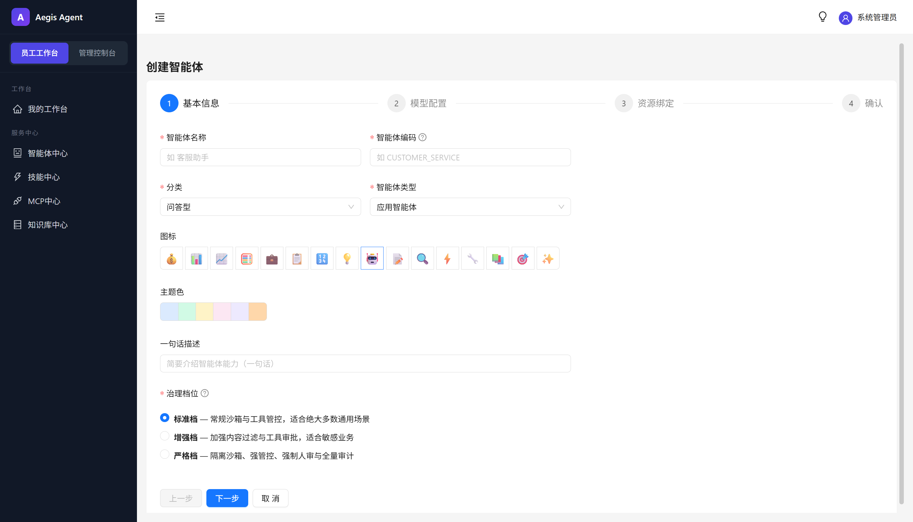

### 详情

五个标签页，按业务阅读顺序排列：

| 标签   | 内容                                   |
| ---- | ------------------------------------ |
| 概览   | 基本信息、当前版本、agent_type、治理档位、安全等级、创建者       |
| 资源绑定 | 绑定清单（技能 / 知识库 / MCP），点击可跳资源详情            |
| 配置参数 | 指令、模型、温度、超时策略                           |
| 版本历史 | 版本历史，可对比两版本差异、回滚                     |
| API 管理 | 当 agent_type 为 **SYSTEM** 时自动生成对外 API 文档，支持在线调试。 |

### 内置智能体

| 智能体           | agent_type   | 作用                                 |
| ------------- | ----------- | ---------------------------------- |
| universal     | UNIVERSAL   | 平台预置的全功能智能体，对话 / 工具 / RAG 全覆盖 |
| skill_creator | UNIVERSAL   | 元技能，`@skill_creator` 引用即可创建新技能     |

---

## 四、资源治理（一）：工具

工具是带参数定义的可执行能力。Aegis 内置了沙箱代码执行等工具，同时支持业务方注册自己的 API 工具。

### 注册

两种方式：

- **API Schema**：粘贴 OpenAPI 格式的接口定义，系统自动解析参数结构
- **手动表单**：逐个填工具名、描述、参数（类型 / 是否必填 / 默认值）、执行端点

### 安全等级

每个工具有一个安全等级，决定它能被哪些 agent_type 的智能体绑定：

| 等级  | 含义                    | 可被绑定到             |
| --- | --------------------- | ----------------- |
| L1  | 公开级（天气查询、汇率换算等）       | 所有 agent_type       |
| L2  | 内部级（员工信息查询、请假提交）     | APPLICATION / UNIVERSAL |
| L3  | 机密级（数据库查询、文件上传、支付） | APPLICATION（同部门）/ SYSTEM |
| L4  | 绝密级（生产写操作、财务转账）      | SYSTEM（直接拒绝 REJECT，等级直映兜底） |

### 生命周期

生命周期由 **res_review 审核流** 管理：

```
DRAFT → REVIEWING → PUBLISHED → ARCHIVED（DEPRECATED）
           ↑         │
           └── REJECTED（审核驳回回到 DRAFT 修改重提）
```

---

## 五、资源治理（二）：技能

技能是 **"指令模板 + 工具绑定"** 的打包体。工具是原子能力，技能是把一组工具和一段 Prompt Engineering 成果打包在一起，用户可以订阅、修改、组合。

### 技能市场

技能市场里有两类技能：

- **平台内置**（GLOBAL 范围）：所有用户自动可见，比如 skill_creator
- **租户自建**（TENANT 范围）：租户内业务团队自己开发、自己发布的技能

通用智能体的用户可以**订阅**别人发布的技能，订阅后这些技能自动出现在该用户的通用智能体工作台里。

### Skill Studio

可视化技能编辑器。左侧写 `SKILL.md` 指令模板（支持 Markdown + 变量占位符），右侧配 `triggers.json` 触发条件和绑定的工具。写完点"提交审核"，过了安全扫描就能发。

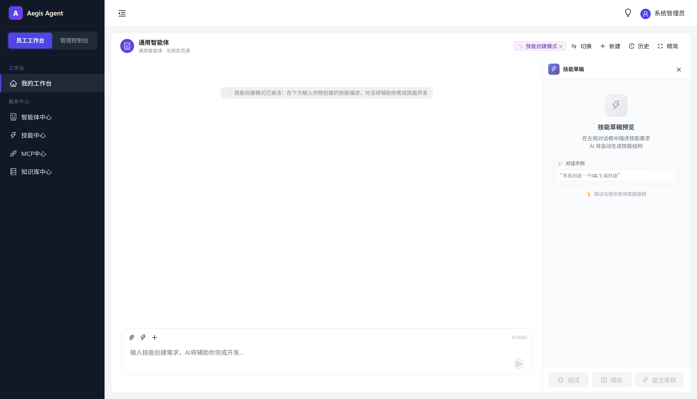

### 审核发布

技能提交后先跑安全扫描，八大维度任何一个命中 HIGH 风险直接阻断，修完才能继续。扫描过了才进人工审核。

### 分轨装载

资源（技能 / MCP / 知识库）在运行时怎么进入模型上下文，取决于 **agent_type**：

| agent_type              | 装哪些资源                                       |
| ----------------------- | ------------------------------------------- |
| **UNIVERSAL**（通用智能体）      | 平台内置能力 + **用户主动订阅和创建的**（技能 / MCP / 知识库，含草稿） |
| **APPLICATION**（应用智能体）    | 平台内置能力 + **智能体显式绑定的**（由创建者选好，用户不能自行添加订阅）    |
| **SYSTEM**（系统智能体）         | 平台内置能力 + **智能体显式绑定的**（严格控制，防越权）             |

开放场景（通用）允许用户自由组合，封闭场景（应用/系统）只暴露经过审核的资源集。

另外，通用智能体还有一条兜底：用户在工作台用 `@技能名` 引用了一个没订阅但可见的技能，允许本轮临时注入（会话级）。应用/系统智能体没有这个兜底，必须走绑定。

---

## 六、资源治理（三）：知识库 & MCP

### 知识库

**面向 RAG 增强对话的文档库**。上传文档后自动分块嵌入，运行时 RAG 中间件检索相关片段注入系统提示词。

| 能力   | 说明                                |
| ---- | --------------------------------- |
| 支持格式 | PDF / Markdown / Word / 纯文本       |
| 分块策略 | 默认 500 字符 / 块 + 50 字符 重叠（可调范围 100-4000） |
| 隔离   | 按租户 + 知识库分索引，跨租户不可检索              |
| 检索测试 | 上传后可输入问题测试检索效果，返回命中的文档片段和相似度      |

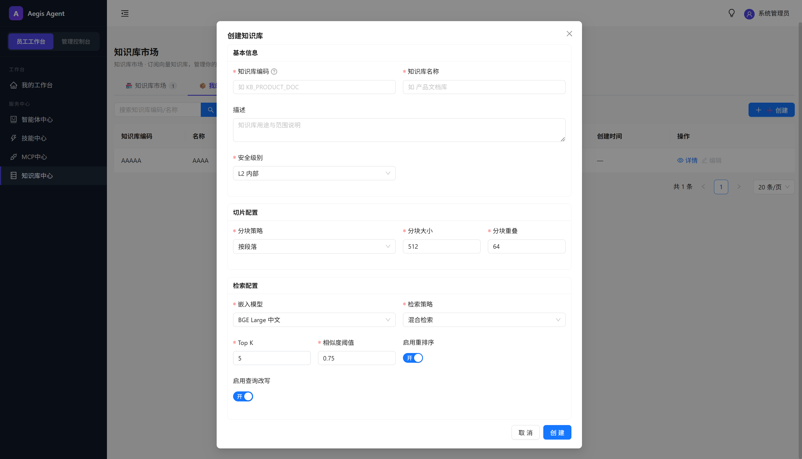
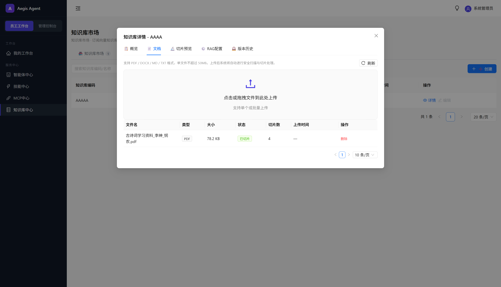

### MCP 服务

**对接外部 MCP 协议服务**。输入 MCP Server URL，点连接测试，系统自动发现 Server 提供的 tools 列表并注册。

MCP 服务在会话期间按需加载。智能体可以像调用平台内置工具一样调用 MCP 提供的工具。

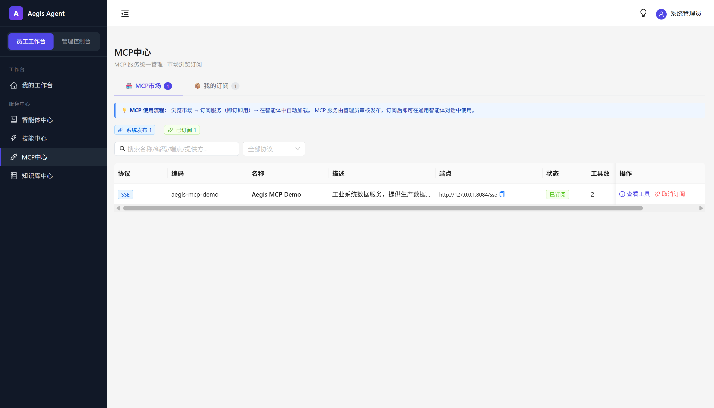

---

## 七、模型管理

### Provider（提供商）

配置 LLM API 接入点。每个 Provider 可挂多个模型实例。

| 字段                 | 说明                                |
| ------------------ | --------------------------------- |
| Provider 名称        | OpenAI / DeepSeek / 通义千问 / 自建模型服务 |
| API Endpoint + Key | 加密存数据库，不入 .env                    |
| 模型能力标记             | 多模态 / 函数调用 / 上下文长度                |
| 计费单价               | Token 单价，可观测模块据此估算对话成本            |

### 实例与限流

按租户 / 用户 / 智能体三个维度配置 QPS 和 Token 上限。超上限返回友好提示。

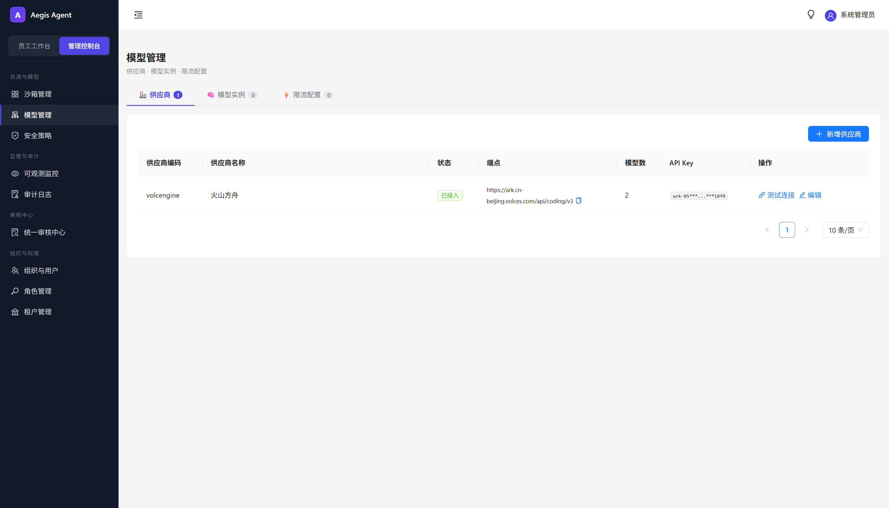

---

## 八、运行时核心

### 对话执行流程

```
用户在工作台发消息
    │
    ▼
网关：生成 TraceId + JWT 鉴权 + 提取租户
    │
    ▼
运行时装配
    │  ① 判断走哪个 agent_type 的资源装载轨道
    │  ② 加载智能体模板（指令 / 绑定资源 / 模型）
    │  ③ 创建会话快照，记录版本
    │  ④ 构建运行时上下文（租户 + 用户 + @技能 + 会话资源）
    ▼
HarnessAgent 中间件链（6 个，从外到内：Trace → SandboxRouting → BindingSync → RAG → Mask → Audit）
    │  工具安全决策不在这条链内，由 AgentScope PermissionEngine 在 onActing 实时评估 sec_tool_policy
    ▼
HarnessAgent ReAct 循环
    │  Think → Act（调工具）→ Observe → Think ...
    ▼
SSE 事件流推送到前端
    │  模型回答分段 / 工具调用事件 / 思考气泡 / 最终结束
    ▼
前端：打字机渲染 + 时间线实时更新
```

### HITL 人工审批

当安全策略判定"这个操作需要人来确认"：

```
运行时中间件拦截 → 会话状态挂起 → 前端弹出审批弹窗
    │
    ├── 用户点「允许」→ 继续执行，写入审计
    └── 用户点「拒绝」→ 终止，写入审计
```

---

## 九、安全治理

三道防线：**静态扫描（发布前）→ 运行时策略引擎（执行中）→ 事后审计追溯**。

### 静态扫描（发布前）

技能/工具提交审核时自动触发，八大维度：

| 维度    | 检测什么                            | 风险等级        |
| ----- | ------------------------------- | ----------- |
| 提示词注入 | "忽略以上指令"等越狱模式                   | HIGH → 阻断   |
| 敏感内容  | 身份证号、手机号、密钥                     | MEDIUM → 警告 |
| 工具越权  | 绑定工具等级与声明不匹配                    | MEDIUM → 警告 |
| 破坏性命令 | `rm -rf /`、`mkfs`、`dd of=/dev`  | HIGH → 阻断   |
| 数据外泄  | curl/wget POST 外发、反向 shell      | HIGH → 阻断   |
| 持久化   | crontab / systemd / shell-rc 篡改 | MEDIUM → 警告 |
| 网络监听  | listen socket / 反向 shell        | MEDIUM → 警告 |
| 混淆载荷  | base64→bash、`eval $(curl ...)`  | HIGH → 阻断   |

### 运行时策略引擎

每次工具调用 / 模型输出 / 网络访问前实时评估，三种决策：

| 决策               | 含义    | 场景                |
| ---------------- | ----- | ----------------- |
| ALLOW | 放行    | 普通工具调用、公开知识库检索    |
| ASK   | 挂起等审批 | 调 L3 工具、出站外部域名（对应策略 APPROVE） |
| DENY  | 拦截    | 敏感词命中、IP 不在白名单（对应策略 REJECT） |


### 策略配置

| 配置   | 说明                               |
| ---- | -------------------------------- |
| 工具策略 | 按工具类型（READONLY/WRITE/EXTERNAL_NETWORK/...）× 安全等级（L1-L4）配 ALLOW / APPROVE / REJECT；等级直映兜底：L1/L2→ALLOW, L3→ASK, L4→DENY |
| 出站策略 | 域名黑白名单 + SSRF 校验                 |
| 敏感词  | BLOCK（直接拦）/ REPLACE（标记后放行）       |
| 脱敏规则 | 正则匹配 → 替换为 `******`              |
| 内容审计 | 所有安全事件自动落日志                      |

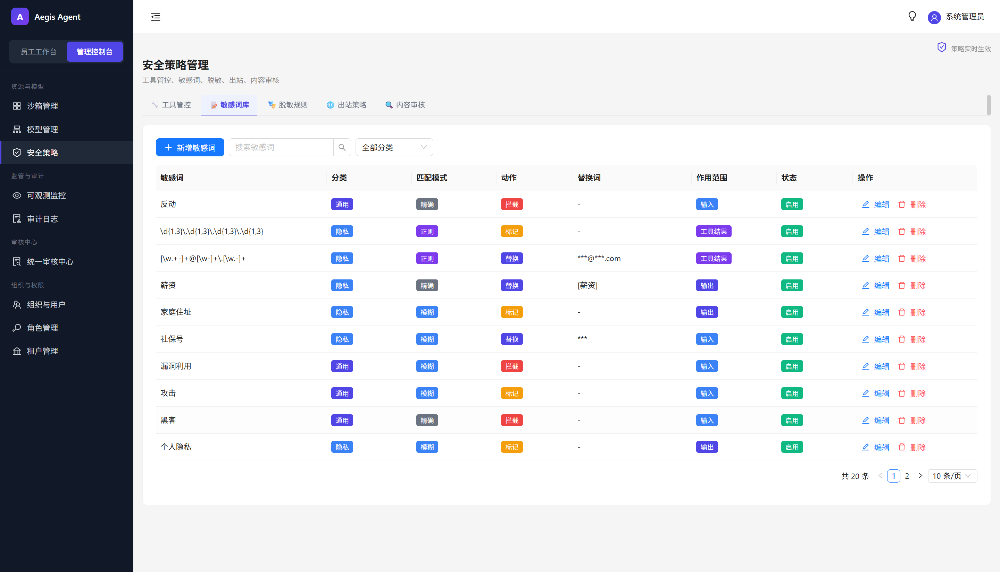

---

## 十、可观测

### 链路追踪

网关为每条请求生成唯一 TraceId，贯穿全链路。运行时 `AegisTraceMiddleware` 为每次工具调用、模型调用、RAG 检索各产生一条 Span（AGENT / REASONING / TOOL_CALL / MODEL_CALL）。

查询维度：按会话聚合、按用户查、按智能体查、按 TraceId 精确查。

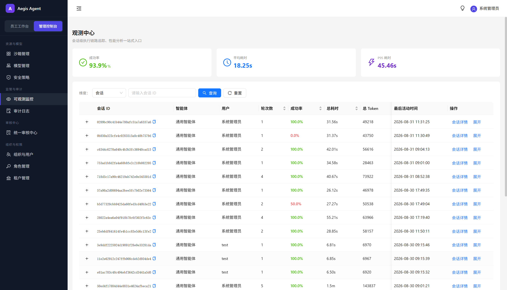

### 会话详情

以会话为根节点的聚合视图，一次对话里每一轮的完整信息：

```
会话概览
├── 基本信息：会话ID / 智能体 / 用户 / 开始结束时间
├── 统计：轮次 / 成功数 / 失败数 / 总耗时 / 总Token / 成本估算
└── 轮次列表（可展开）
    ├── 用户消息（原文 + 附件）
    ├── 智能体思考（分段展示）
    ├── 工具调用（Gantt 图 · 输入输出 · 耗时）
    ├── RAG 检索（命中的知识片段）
    └── 最终回答（Token 数 · 模型名 · 耗时）
```


### 统计面板

| 指标             | 说明               |
| -------------- | ---------------- |
| 链路总量           | 时间范围内的对话轮次总数     |
| 成功率            | 排除安全拦截、工具失败、模型超时 |
| 平均耗时 / P95 耗时  | 端到端延迟            |
| 总 Token / 成本估算 | 按模型单价折算          |
| 失败分布 TOP N     | 最常见失败原因          |

### 审计日志

管理后台所有写操作 + 安全事件自动落日志，支持按类型、操作人、时间范围查询。

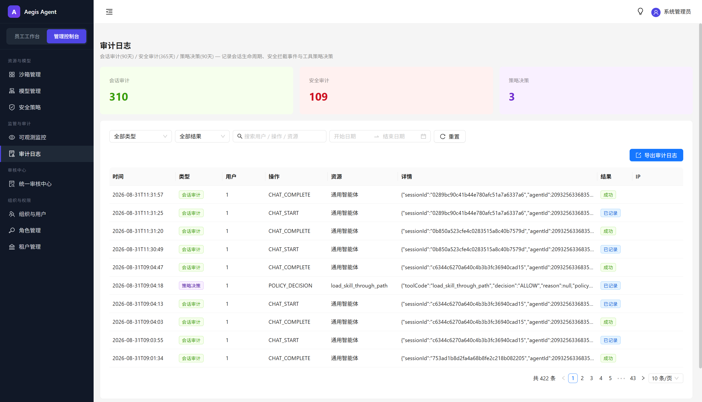

---

## 十一、沙箱管理

### 两种模式

| 模式      | 适用        | 说明                      |
| ------- | --------- | ----------------------- |
| Docker  | 本地 / 开源体验 | 挂载宿主 Docker sock，按需创建容器 |
| K8s     | 生产        | Pod 池化，多副本共享命名空间        |
| Process | CPU 敏感场景  | 不启动独立容器，在 runtime 进程内沙箱执行  |

### 惰性分配

**纯聊天不占沙箱**。只有当对话里出现需要执行代码的工具调用时才触发分配：

```
请求进来 → 判断智能体档位和沙箱需求
    │
    ├── 不需要沙箱 → 直接走 LLM
    │
    └── 需要沙箱
         → 按档位 × 租户 × 用户 算沙箱池 key
         → 池中命中就复用
         → 没命中就创建新实例
```

### 空闲回收

工具调用后刷新该会话的"最后使用时间"。周期扫描看每个沙箱实例空闲多久，超过阈值自动回池释放。


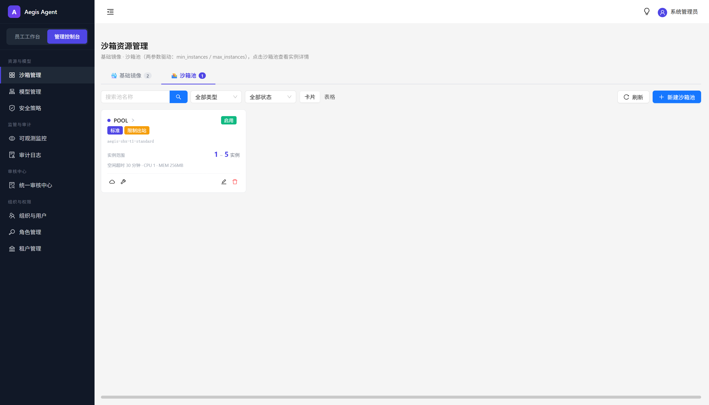

---

## 十二、审核中心

平台内所有需要人工审批的操作统一在这里汇总：

| 审核类型   | 触发               | 前置条件             |
| ------ | ---------------- | ---------------- |
| 技能审核   | 业务人员提交发布          | 静态安全扫描通过         |
| 知识库审核  | 业务人员提交发布          | —                |
| MCP 审核 | 技术人员提交注册 MCP 服务    | —                |
| 智能体审核  | 业务人员提交发布应用/系统智能体 | —                |

审批通过 / 驳回后自动通知提交人，同时写审计日志。

> HITL（运行时人工审批）不走审核中心，由安全策略引擎在会话执行时实时挂起并前端弹窗，见「九、安全治理 → 运行时策略引擎」。

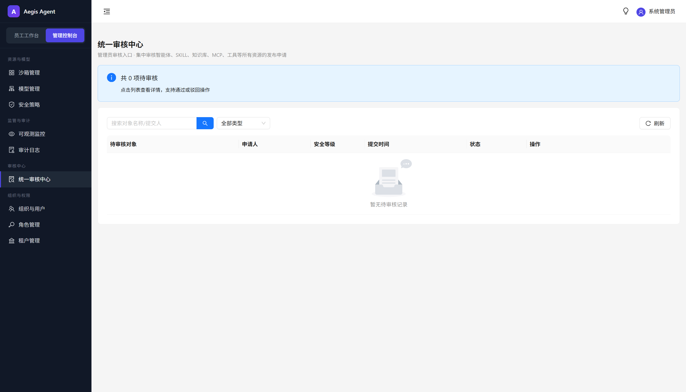

---

## 十三、组织、权限与用户

### 组织模型

```
Tenant（租户）              ← 多租户隔离的边界
  ├── Department（部门）     ← 树形，决定资源可见范围
  │     └── User（用户）
  └── Role（角色）→ Permission（权限点）  ← RBAC
```

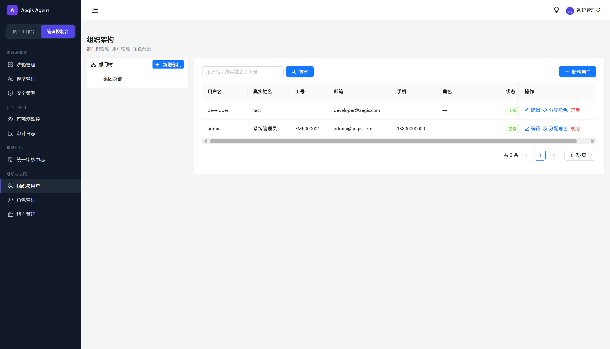

### 租户

每个租户独立拥有自己的用户、角色、智能体、资源和数据。租户之间完全隔离。

### 角色与权限

系统预置 7 个种子角色（三级 RBAC，数据驱动）：

| 角色编码 | 中文名 | 权限范围 |
|---|---|---|
| SUPER_ADMIN | 超级管理员 | 全平台所有权限（45 个） |
| ENTERPRISE_ADMIN | 企业管理员 | 租户内全部管理权限（36 个） |
| SECURITY_ADMIN | 安全管理员 | 安全策略/审计日志/脱敏规则/敏感词（10 个） |
| RESOURCE_ADMIN | 资源管理员 | SKILL/MCP/KB/TOOL 审核发布（17 个） |
| AGENT_REVIEWER | 智能体审核员 | 智能体审核 + 资源查看（7 个） |
| AGENT_CREATOR | 智能体创建者 | 智能体创建/编辑/发布 + 资源查看（10 个） |
| EMPLOYEE | 普通员工 | 资源查看 + 智能体创建（7 个） |

权限点按 `模块:子模块:操作` 格式定义，覆盖系统管理、安全管控、资源管理、沙箱、观测、模型、审批 7 大模块。登录时从 DB 实时聚合权限编码写入 JWT，前端根据权限编码控制按钮级显隐，后端 SecurityConfig + @ResourceOwner + @Auditable 三重防线。

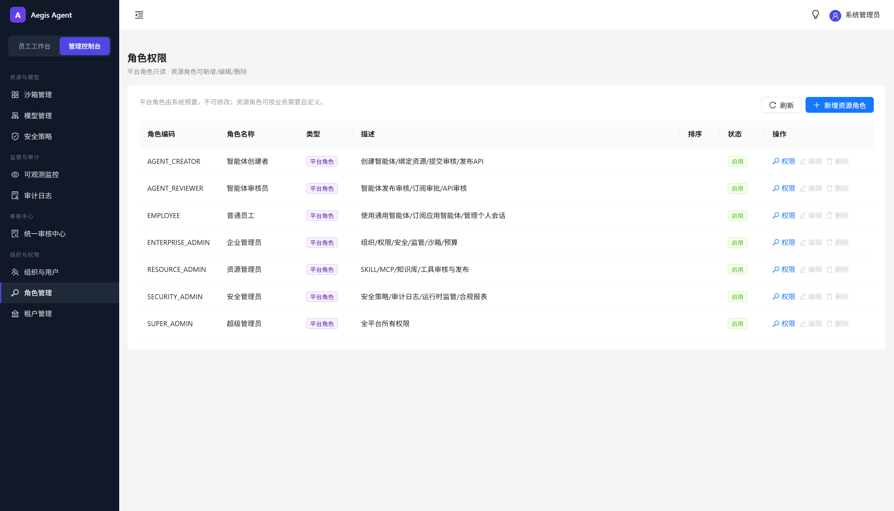

### 登录与用户中心

用户中心个人资料页面，改密码、看自己创建的技能、看自己发起的审核。
