# 资源管理更新机制剖析

> 适用版本：0.1.0-alpha.1 ｜ 最后更新：2026-09-03（源码核实）
> 覆盖四类资源：**智能体 / 技能 / 知识库 / MCP**。核心回答三个问题：怎么创建、怎么发布、runtime 端怎么感知变更。

---

## 序章：全景概览

四类资源的生命周期不完全一样，但**审核→发布→runtime 装载**这条主线是相同的。差异在于：
- 智能体有版本快照（sess_session 里存 JSON），改了不影响进行中的会话
- 技能有版本号（res_skill_version），绑定的 FIXED 类型会锁死版本
- 知识库有文档处理进度（上传→解析→Embedding→Milvus）
- MCP 有协议差异（REST fallback → JSON-RPC）

### 生命周期状态机（统一模型）

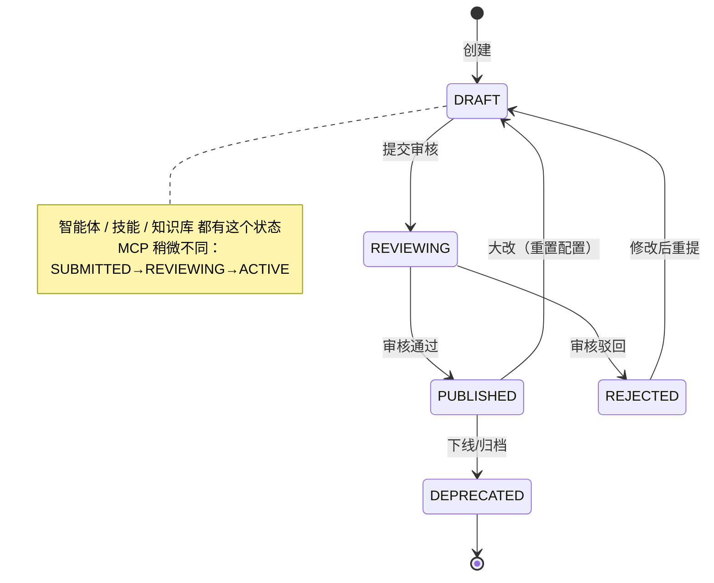

### Runtime 感知变更的三条路径

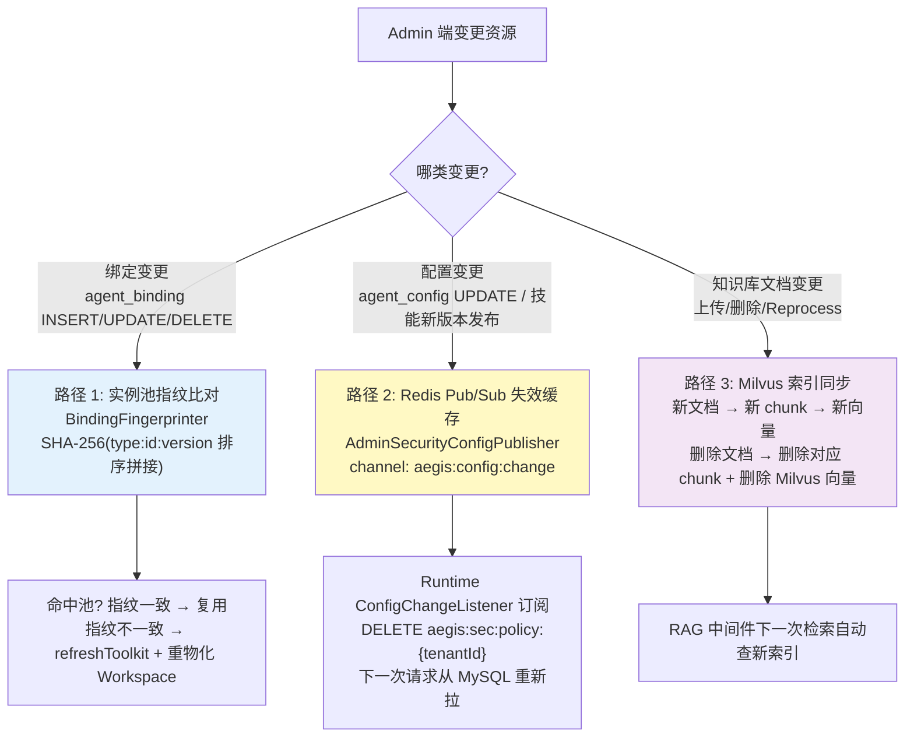

---

## 一、智能体管理

### 完整生命周期

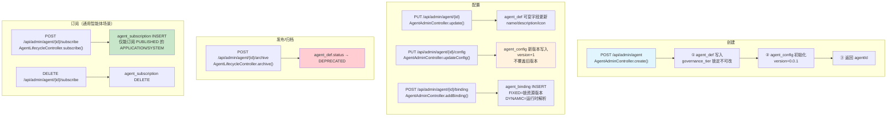

### agent_config 版本化机制

**这是智能体最重要的设计**：每次配置变更不是 UPDATE 旧行，而是 INSERT 新行 + version+1。理由：

```
sess_session.version_snapshot  ←  创建会话时存当时的 agent_config JSON
sess_session.agent_version     ←  创建会话时存 version 数字
```

**已经进行中的会话**：runtime 用 version_snapshot 里的老配置继续执行，不受后续变更影响。
**新创建的会话**：自动取最新 version 的 agent_config。

### Runtime 装载智能体时的查询链路

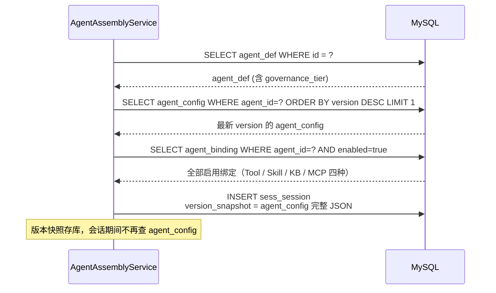

### BindingFingerprinter — 实例池指纹比对

**这是 runtime 感知绑定变更的核心机制**。AegisAgentInstanceManager 以 `poolKey` 为粒度缓存 HarnessAgent 实例，`BindingFingerprinter` 用来判断缓存是否失效。

```java
// BindingFingerprinter.fingerprint() 源码逻辑
// 1. 遍历 agent_binding 列表
// 2. 每条拼接为 "resourceType:resourceId:resourceVersion"
// 3. 按字符串排序后用 "|" 连接
// 4. SHA-256 摘要

// 示例：三个绑定
//   KNOWNLEDGE_BASE:5:1
//   SKILL:12:0     (version=0 = latest)
//   TOOL:7:1
// → 排序后拼接: "KNOWNLEDGE_BASE:5:1|SKILL:12:0|TOOL:7:1"
// → SHA-256:   "a3f1b9..."
```

| 场景 | 指纹变化 | 实例池行为 |
|---|---|---|
| 绑定新增一个 SKILL | SHA 变 | refreshToolkit（Toolkit.removeTool + re-register）+ WorkspaceMaterializer 重物化 Workspace |
| 绑定删除一个 TOOL | SHA 变 | 同上 |
| 绑定的 SKILL 从 FIXED v1.0 改成 FIXED v1.1 | SHA 变 | 同上 |
| 绑定的 SKILL version=0（DYNAMIC），SKILL 本身有新版本发布 | SHA **不变**（binding 表 version 还是 0）| **不自动刷新**——DYNAMIC 类型设计就是跟随上游，runtime 每次装载时直接拉 skill.latest_version |
| 绑定列表完全没变 | SHA 相同 | 直接复用缓存实例，跳过 refreshToolkit（冷启动 500-2000ms → <50ms） |

### 配置变更后的热更新路径

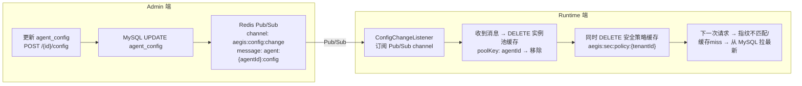

---

## 二、技能管理

### 完整生命周期

```mermaid
flowchart TD
    subgraph "创建"
        A1["SkillManageService.create()<br/>POST /api/admin/skill"] --> A2["① skill 主表 INSERT<br/>scope=TENANT / GLOBAL<br/>author_type=USER / SYSTEM"]
        A2 --> A3["② skill_version INSERT<br/>version=0.0.1<br/>status=DRAFT<br/>skill_md / tools_json / triggers_json"]
        A3 --> A4["返回 skillId + versionId"]
    end

    subgraph "审核与发布"
        B1["POST /api/admin/skill/{id}/submit-review"] --> B2["res_review + res_review_node 创建"]
        B2 --> B3["审核通过 → skill_version.status = PUBLISHED<br/>skill.latest_version 更新"]
        B2 --> B4["审核驳回 → skill_version.status = REJECTED<br/>作者收到通知，可修改后重新提交"]
    end

    subgraph "用户端订阅"
        C1["POST /api/runtime/skill/{id}/subscribe<br/>SkillUserController"] --> C2["res_skill_subscription INSERT<br/>subscriber_type=USER<br/>skill_code + skill_version"]
        C3["DELETE /api/runtime/skill/{id}/subscribe"] --> C4["res_skill_subscription DELETE"]
    end

    subgraph "Runtime 装载（分轨）"
        D1["UNIVERSAL 智能体<br/>AegisSkillRepository.getAllSkills()"] --> D2["GLOBAL 平台内置<br/>+ 用户订阅的 res_skill_subscription<br/>+ 用户自建（含 DRAFT）"]
        D3["APPLICATION / SYSTEM 智能体"] --> D4["GLOBAL 平台内置<br/>+ agent_binding 绑定的<br/>**忽略订阅表**"]
    end

    style A1 fill:#e1f5fe
    style B3 fill:#c8e6c9
    style C2 fill:#fff3e0
    style D2 fill:#f3e5f5
    style D4 fill:#ffebee
```

### 分轨装载规则（来自 AegisSkillRepository 源码）

| governance_tier | 装载来源 | 是否加载订阅表 | 是否加载 DRAFT |
|---|---|---|---|
| **UNIVERSAL**（开放轨道） | GLOBAL 平台内置 + **res_skill_subscription** + 用户自建（author=userId） | ✅ 是 | ✅ 是（用户自己建的草稿） |
| **APPLICATION**（封闭轨道） | GLOBAL 平台内置 + **agent_binding** | ❌ 否 | ❌ 否 |
| **SYSTEM**（严格封闭） | GLOBAL 平台内置 + **agent_binding** | ❌ 否 | ❌ 否 |

**为什么 APPLICATION/SYSTEM 不加载订阅？** 防止越权——UNIVERSAL 是面向个人的，用户可以自由订阅技能；但 APPLICATION/SYSTEM 是业务/系统集成场景，如果允许加载用户订阅，用户就能通过订阅 L4 高风险技能绕过 APPLICATION 档位的安全策略。

### 技能发布新版本后的 runtime 感知

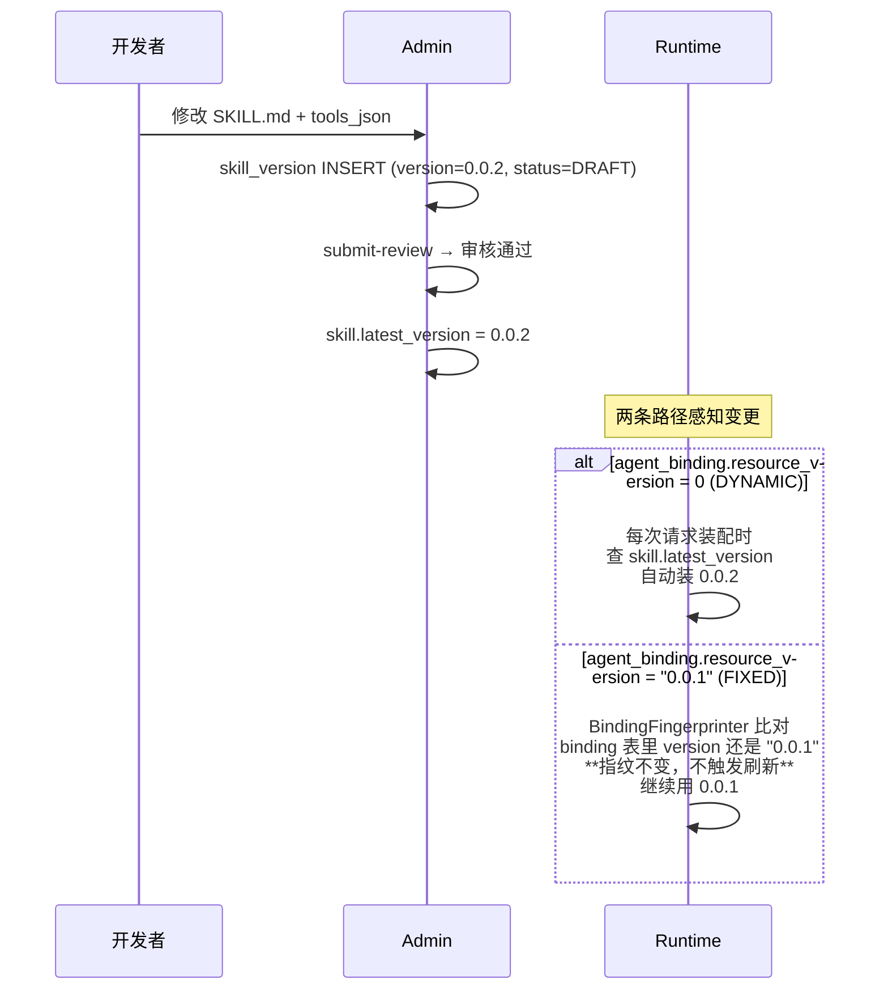

**FIXED vs DYNAMIC 的设计意图**：
- FIXED（锁死版本）：业务方依赖某个技能的稳定行为，技能升级可能改了 tools_json 导致不兼容
- DYNAMIC（跟随最新）：平台内置技能，bugfix/安全补丁需要自动生效

### @技能 显式引用

ChatRequest.skills 字段允许前端用户在对话时通过 `@技能名` 显式激活技能：

```json
{
  "agentId": 42,
  "message": "@sql_gen 帮我查销售业绩",
  "skills": [{"code": "sql_gen"}]
}
```

AegisSkillRepository 在 RuntimeContext 里读 `CTX_REQUESTED_SKILLS` 属性，对显式引用的技能：
- 可见 → **强制包含**（即使不在常规装载集里）
- 不可见 / 不存在 → 记入 rejectedCodes，前端收到 skill_ref 事件标记为 REJECTED

---

## 三、知识库管理

### 完整生命周期

知识库 = 容器 + 文档 + 分块 + Milvus 索引。变更频率很高（每次上传/删除文档都要走流程）。

```mermaid
flowchart TD
    subgraph "创建知识库"
        A1["KbController.create()<br/>POST /api/admin/resource/kb"] --> A2["res_knowledge_base INSERT<br/>kb_code + index_name = tenant_{id}_{kbCode}<br/>life_status = DRAFT"]
    end

    subgraph "上传文档"
        B1["POST /api/admin/resource/kb/{id}/upload/apply<br/>获取 MinIO 上传凭证"] --> B2["客户端直传 MinIO<br/>res_kb_document INSERT<br/>status = UPLOADING"]
        B2 --> B3["POST /api/admin/resource/kb/{id}/upload/notify<br/>通知服务端上传完成"]
        B3 --> B4["FileParseEngine 解析<br/>status: UPLOADING → PARSING"]
        B4 --> B5["生成 res_kb_document_chunk<br/>每块 500 字符 + 50 重叠"]
        B5 --> B6["Embedding → Milvus 集合<br/>status: PARSING → EMBEDDING → READY"]
        B6 --> B7["ProcessProgressVO SSE 推送进度<br/>GET /documents/{docId}/progress/stream"]
    end

    subgraph "运维操作"
        C1["DELETE /api/admin/resource/kb/{id}/documents/{docId}"] --> C2["res_kb_document + res_kb_document_chunk DELETE"]
        C2 --> C3["Milvus 集合 DELETE chunk_id"]
        C4["POST /api/admin/resource/kb/{id}/documents/{docId}/reprocess"] --> C5["重新走 B4 → B6 流程"]
    end

    subgraph "发布与订阅"
        D1["POST /api/admin/resource/kb/{id}/publish"] --> D2["res_knowledge_base.life_status = PUBLISHED"]
        D3["POST /api/runtime/kb/{id}/subscribe<br/>KbUserController"] --> D4["res_kb_subscription INSERT"]
    end

    style B6 fill:#c8e6c9
    style C5 fill:#fff3e0
    style D4 fill:#e3f2fd
```

### 文档处理进度追踪

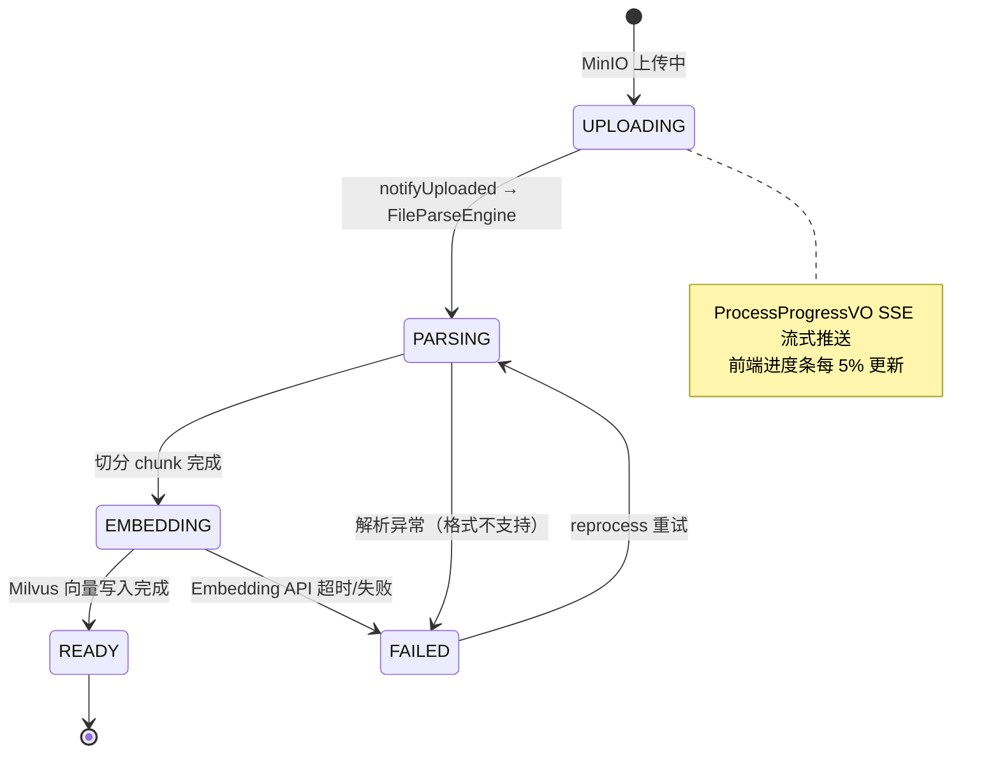

### Milvus 集合命名与物理隔离

```
集合名格式: tenant_{tenantId}_{kbCode}
示例: tenant_1_sales_report

字段:
  chunk_id    BIGINT      ← res_kb_document_chunk.id
  doc_id      BIGINT      ← res_kb_document.id
  content     VARCHAR     ← 500 字符文本片段
  embedding   FLOAT[dim] ← 维度由 Embedding Provider 决定（非固定）
  tenant_id   BIGINT      ← 冗余字段，双重保险跨租户隔离
```

删除文档时：先删 `res_kb_document_chunk` 表 → 再从 Milvus 集合删对应的 chunk_id。运行时 RAG 中间件查 Milvus 时用 `tenant_{tenantId}_{kbCode}` 做硬隔离，**永远不会跨租户误查**。

### RAG 检索链路（runtime 端）

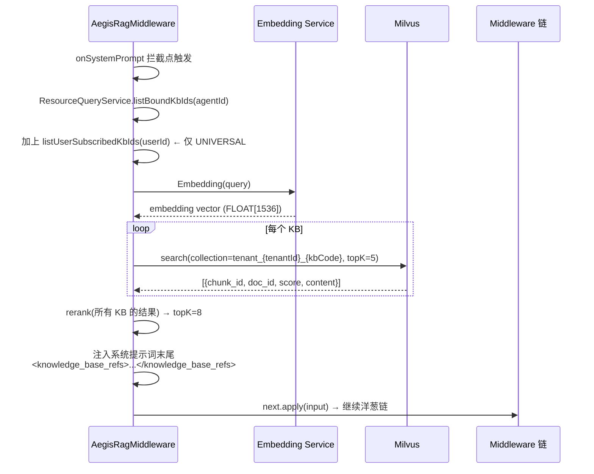

---

## 四、MCP 管理

### 完整生命周期

MCP 和前三个不同：它是**外部服务接入**，不是内部创建。管理重心在"发现工具 + 连接健康检查 + 订阅授权"。

```mermaid
flowchart TD
    subgraph "接入方式"
        A1["POST /api/admin/mcp/services/register<br/>McpController.registerFromServer"] --> A2["输入: server_url + protocol<br/>(SSE / StreamableHttp / REST)"]
        A2 --> A3["McpInvoker.listTools(server_url)<br/>MCP protocol.initialize + tools/list"]
        A3 --> A4["res_mcp_service INSERT<br/>tools_json = 发现的工具列表<br/>life_status = SUBMITTED"]
        A4 --> A5["激活 /api/admin/mcp/services/{id}/activate<br/>→ life_status = ACTIVE"]
    end

    subgraph "双协议调用"
        B1["McpInvoker.invoke()"] --> B2{"service.protocol?"}
        B2 -->|"REST (REST端点模式)"| B3["invokeViaRestFallback<br/>POST /api/mcp/tools/{toolName}/invoke"]
        B2 -->|"SSE / StreamableHttp"| B4["invokeViaHttp<br/>先试 REST fallback<br/>失败 → JSON-RPC POST"]
        B3 --> B5["REST 成功则直接返回<br/>失败才走 JSON-RPC"]
        B4 --> B6["JSON-RPC POST 请求<br/>endpoint = server_url"]
    end

    subgraph "订阅与授权"
        C1["POST /api/runtime/mcp/{id}/subscribe<br/>McpUserController"] --> C2["res_mcp_subscription INSERT"]
        C3["Runtime 装载"] --> C4["ResourceQueryService.listBoundMcpIds(agentId) + listUserSubscribedMcpIds(userId)"]
    end

    style A3 fill:#fff3e0
    style B3 fill:#e1bee7
    style B6 fill:#e1bee7
```

### MCP 工具调用的双通道兜底

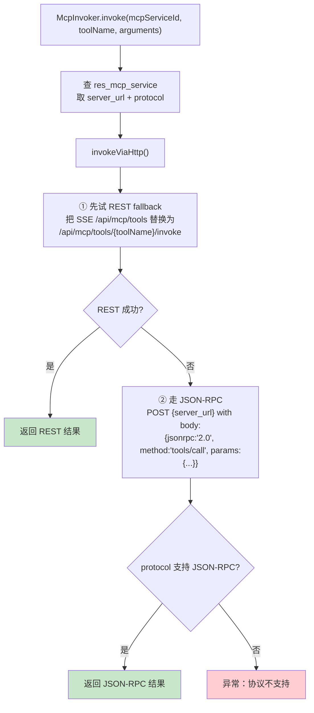

**为什么需要双通道？** MCP 协议 2025 年才稳定，早期 Server 实现有的只暴露 REST、有的只暴露 SSE、有的同时支持 JSON-RPC。McpInvoker 的 REST fallback → JSON-RPC 兜底保证了对老 Server 的兼容性。

---

## 五、四类资源的装载矩阵（runtime 端）

### 谁能加载什么

| 资源 | UNIVERSAL（开放轨道） | APPLICATION（封闭轨道） | SYSTEM（严格封闭） |
|---|---|---|---|
| **技能** | GLOBAL 内置 + 用户订阅 + 用户自建（**含 DRAFT**） | GLOBAL 内置 + **agent_binding** | GLOBAL 内置 + **agent_binding** |
| **知识库** | agent_binding + **用户订阅** + 会话级 resources 引用 | agent_binding + 会话级 resources 引用（临时） | agent_binding |
| **MCP** | agent_binding + **用户订阅** + 会话级 resources 引用 | agent_binding + 会话级 resources 引用（临时） | agent_binding |
| **工具** | agent_binding | agent_binding | agent_binding |

### 装载合并的代码逻辑

```
// ResourceQueryService.java 合并逻辑（UNIVERSAL 智能体）
List<Long> kbIds = new ArrayList<>();
kbIds.addAll(listBoundKbIds(agentId));        // agent_binding
kbIds.addAll(listUserSubscribedKbIds(tenantId, userId));  // 用户订阅（含 DRAFT）
// 会话级 resources 引用（ChatRequest.resources.kbIds）
if (request.getResources() != null) {
    kbIds.addAll(request.getResources().getKbIds());
}
// 去重 + 过滤 PUBLISHED 状态
return findPublishedKnowledgeBasesByIds(new HashSet<>(kbIds));

// APPLICATION/SYSTEM：只走 listBoundKbIds，**忽略订阅表**
```

### 会话级资源引用的临时语义

ChatRequest.resources 字段允许用户在对话中临时选择资源（不改变长期订阅关系）。优先级：**显式引用 > 绑定 > 订阅**。仅限当前会话生效，不写 res_*_subscription 表。

---

## 六、变更影响范围总结

| 变更动作 | 影响范围 | Runtime 感知方式 | 是否影响进行中会话 |
|---|---|---|---|
| 修改 agent_config（新 version） | 新会话取新版本，旧会话用 version_snapshot | Redis Pub/Sub → 实例池缓存失效 | ❌ 不影响 |
| 修改 agent_def（name/icon/description） | 全部会话的展示名称变，但核心行为不变 | 下一次装配时从 MySQL 拉 | ❌ 不影响行为 |
| 增删 agent_binding | 全部实例池指纹失效 | BindingFingerprinter SHA-256 变化 → refreshToolkit | ⚠️ 影响：新绑定生效、旧绑定失效 |
| 发布技能新版本（latest_version 更新） | FIXED 绑定继续用旧版；DYNAMIC 绑定自动更新 | DYNAMIC 每次查 latest_version；FIXED 指纹不变 | ❌ FIXED 不受影响，✅ DYNAMIC 自动生效 |
| 上传知识库新文档 | 下一次 RAG 检索自动包含 | Milvus 索引实时同步 | ❌ 不影响，只影响后续对话 |
| 删除知识库文档 | 同上 | Milvus 索引删除 | ❌ 不影响 |
| 修改 sec_tool_policy（安全策略） | 全局生效 | Redis Pub/Sub → DELETE aegis:sec:policy:{tenantId} | ✅ 立即生效 |
| MCP Server 激活/停用 | 下一次 McpInvoker.invoke() 时发现 | ResourceQueryService 过滤 ACTIVE 状态 | ❌ 不影响进行中的工具调用 |

---

## 附录：核心 Service/类速查

| 类名 | 职责 | 在哪一端 |
|---|---|---|
| `AgentAdminController` | 智能体 CRUD + config/binding 管理 | Admin |
| `AgentLifecycleController` | 智能体 archive + subscribe/unsubscribe | Admin |
| `SkillManageService` | 技能 createDraft + submitReview + update | Admin |
| `KbController` | 知识库 create + upload + publish + reprocess | Admin |
| `McpController` | MCP registerFromServer + activate/deactivate | Admin |
| `ReviewProcessEngine` | 通用审核引擎（技能/知识库/工具） | Admin |
| `AgentAssemblyService` | 装配：查 def + config + binding + 创建 session + 构建 context | Runtime |
| `AegisAgentInstanceManager` | 实例池（poolKey 粒度 + LRU + TTL + Lazy 沙箱 + 指纹比对） | Runtime |
| `BindingFingerprinter` | SHA-256(type:id:version 排序) 指纹计算 | Runtime |
| `BindingSyncMiddleware` | 装配阶段由 `AgentAssemblyService` 调用：绑定指纹比对 + 重物化 Workspace（非洋葱链中间件） | Runtime |
| `AegisSkillRepository` | RuntimeContextSkillRepository SPI 实现，按档位分轨装载 | Runtime |
| `ResourceQueryService` | 聚合 Tool/Skill/Kb/Mcp 五 Mapper，供装配层统一查询 | Runtime |
| `AegisRagMiddleware` | onSystemPrompt → Embedding → Milvus → 知识片段注入 | Runtime |
| `McpInvoker` | REST fallback → JSON-RPC 双通道 MCP 工具调用 | Runtime |
| `McpToolProviderImpl` | 把 MCP tools 转成 AgentScope Toolkit | Runtime |
| `ConfigChangeListener` | Redis Pub/Sub 订阅，收到消息失效缓存 | Runtime |
| `WorkspaceMaterializer` | 把 agent_workspace_material 物化到沙箱文件系统 | Runtime |
| `SkillUserController` | 用户端技能 subscribe/unsubscribe + 可见列表 | Admin（用户端） |
| `KbUserController` | 用户端知识库 subscribe/unsubscribe + 我的知识库 | Admin（用户端） |
| `McpUserController` | 用户端 MCP subscribe/unsubscribe | Admin（用户端） |
