# 运行时全流程剖析

> 适用版本：0.1.0-alpha.1 ｜ 最后更新：2026-09-02（基于 AgentScope 2.0.2 源码 + aegis-runtime 源码复核）

---

## 序章：全局一瞥

从用户浏览器点开 SSE 连接到 Agent 返回最终回复，一共经过 6 个阶段、3 个进程、6 个中间件、N 次 ReAct 循环。

### 一句话链路

```
浏览器 → Gateway（鉴权+注入租户头）→ Runtime（校验→装配→执行→事件转换→投影持久化）→ AgentScope 内核（ReAct 循环 + 洋葱链中间件 + LLM + 工具调用 + 安全拦截 + HITL）→ SSE 流式回传
```

### 阶段划分

```
┌──────────────────────────────────────────────────────────────────────────────┐
│  阶段 1: 入口校验  │  阶段 2: 智能体装配  │  阶段 3: AgentScope 构建         │
│  ChatRequest      │  AgentAssemblySvc  │  AegisAgentInstanceManager       │
│  Validator        │  → AegisTaskCtx    │  → HarnessAgent.Builder          │
└──────────────────────────────────────────────────────────────────────────────┘
                                    ↓
┌──────────────────────────────────────────────────────────────────────────────┐
│  阶段 4: 洋葱链中间件  │  阶段 5: ReAct 循环（Think→Act→Observe）│  阶段 6: 投影持久化 │
│  6 层中间件     │  agent.streamEvents(msgs, rc)          │  SessionProjectionSvc │
└──────────────────────────────────────────────────────────────────────────────┘
```

---

## 一、入口：ChatRequest 进 Runtime

### 输入：HTTP 请求

```http
POST /api/runtime/task/chat
Content-Type: application/json
Accept: text/event-stream

// Gateway 自动注入的头（用户请求里没有）
X-Tenant-Id: 1
X-User-Id: 1001
X-Dept-Id: 50
X-Client-IP: 10.0.0.5
Authorization: Bearer eyJhbGci...

// 用户请求体
{
  "agentId": 42,
  "sessionId": null,              // null = 创建新会话
  "message": "帮我查一下上个月销售部门的业绩报表",
  "attachments": [
    { "name": "报表模板.xlsx", "storageRef": "tenant1/att/abc123", "mimeType": "application/vnd.openxmlformats-officedocument.spreadsheetml.sheet" }
  ],
  "skills": [],                   // @技能名 显式引用，为空=用绑定的技能
  "resources": null,              // 会话级临时资源引用
  "replyId": "req-uuid-abc123",   // 客户端重试去重用
  "isolationStrategy": null       // null = SHARED_PER_SCOPE（默认）
}
```

### 处理链路

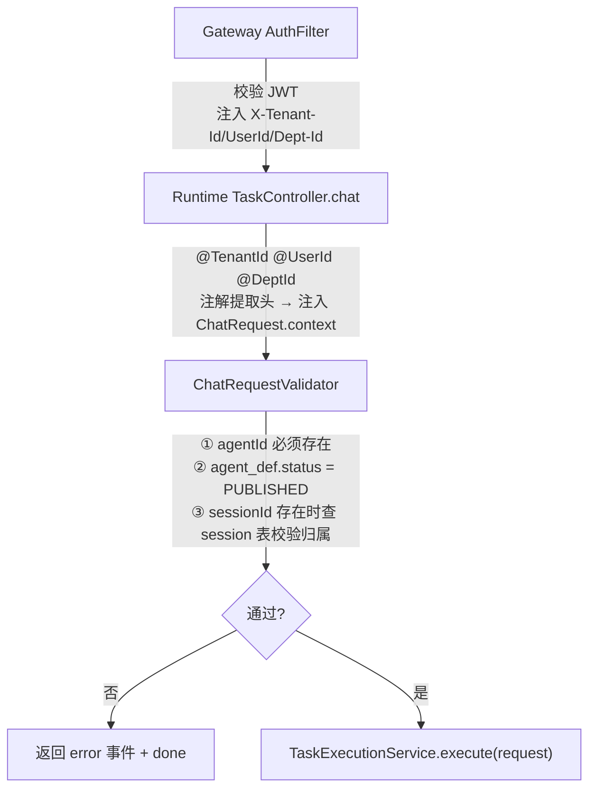

ChatRequestValidator 的核心校验规则（来自 `ChatRequestValidator.java`）：

| 校验项 | 说明 |
|---|---|
| agentId | 必填，查 agent_def 表，必须 PUBLISHED |
| sessionId | 有值时查 sess_session，校验 tenant_id + user_id 归属 |
| isolationStrategy | null 或非法值 → 默认 SHARED_PER_SCOPE |
| replyId | 非空时 Redis SETNX 去重（`reply:t{tenantId}:{sessionId|new}:{replyId}`），重复请求直接返回上次结果 |

---

## 二、智能体装配：AgentAssemblyService.assemble()

装配是**同步阻塞**操作，在 `boundedElastic` 线程池执行。一次性完成 5 件事，输出 `AegisTaskContext`（执行上下文）。

### 装配流程

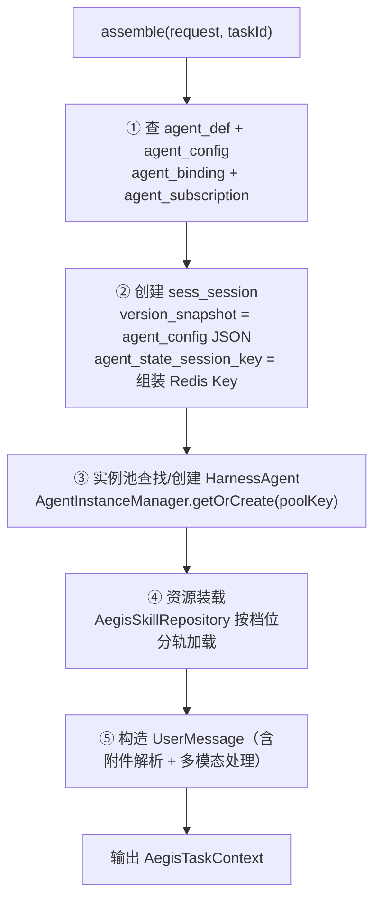

### poolKey（实例池粒度）

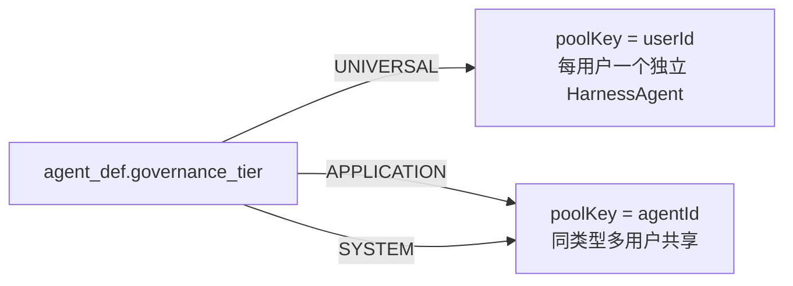

实例池命中时通过 `BindingFingerprinter` 比对当前请求携带的 agent_binding 版本指纹：
- **一致** → 直接复用，跳过重装配（冷启动 500-2000ms → <50ms）
- **不一致** → 走 refreshToolkit（Toolkit.removeTool + re-register）+ 重物化 Workspace

### AegisTaskContext 结构（装配输出）

```java
AegisTaskContext {
    String taskId                    // UUID，全链路 traceId
    Long tenantId, userId
    Long agentId
    AgentDef agentDef                // 不可变骨架
    AgentConfig agentConfig          // 当前版本配置
    String sessionId                 // 会话 ID
    HarnessAgent agent               // AgentScope 内核实例
    RuntimeContext runtimeContext    // AgentScope 运行时上下文
    String userMessage               // 清洗后的用户文本
    List<ContentBlock> multimodalBlocks // 多模态（图片）块
    boolean blocked                  // 装配失败标记
    String blockReason               // 失败原因
}
```

---

## 三、AgentScope HarnessAgent 构建

AegisAgentInstanceManager 是 AgentScope 内核和 Aegis 业务层的桥。

### Builder 链式构建（来自源码）

```java
HarnessAgent agent = HarnessAgent.builder()
    .distributedStore(distributedStore)        // → RedisDistributedStore
    .isolationScope(isolationScope)            // USER / AGENT
    .memoryConfig(memoryConfig)                // 记忆策略
    .filesystemSpec(remoteFsSpec)               // → RemoteFS（Phase 2 减法后纯 Remote 路径）
    .permissionContextState(permissionCtx)     // → sec_tool_policy 运行时权限
    .middlewares(middlewareChain.build())       // ← 6 层中间件链
    .tools(toolkit)                            // → AegisSkillRepository 装载的 Toolkit
    .build();
```

### 隔离作用域（IsolationScope）与 Redis Key

> AgentScope 把**对话上下文（AgentState）**与**沙箱隔离（slotKey）**拆成两个独立维度，别混为一谈。

**① AgentState（对话上下文）Redis Key**——由 `AegisRedisConfig` 的 `RedisAgentStateStore`（keyPrefix=`aegis:session:`）管理，格式固定、与治理档无关：

| Key | 类型 | 说明 |
|---|---|---|
| `aegis:session:{userId}/{sessionId}:agent_state` | String(JSON) | 单值对话上下文（运行时主链路，调用前后读写） |
| `aegis:session:{userId}/{sessionId}:agent_state:list` | List | 上下文历史 |
| `aegis:session:{userId}/{sessionId}:_keys` | Set | 本会话全部 Redis Key 索引（删主 key 须连带清） |

**② 沙箱隔离**——Phase 2 减法后由 AgentScope 原生承载：工作区走 `RemoteFilesystemSpec` + IsolationScope（`USER`/`AGENT`），代码执行走 `AegisSandboxPoolExecutor` 池化复用（详见 [sandbox-allocation-and-recycling.md](sandbox-allocation-and-recycling.md)）：

| agent_type | IsolationScope | 语义 |
|---|---|---|
| UNIVERSAL | USER | 同一用户跨会话共享工作区 |
| APPLICATION | AGENT | 同一智能体跨会话共享 |
| SYSTEM | AGENT | 对外 API 场景（RESIDENT 常驻实例，**实例状态**而非 IsolationScope 枚举值） |

### 代码执行沙箱池路径（aegis_execute）

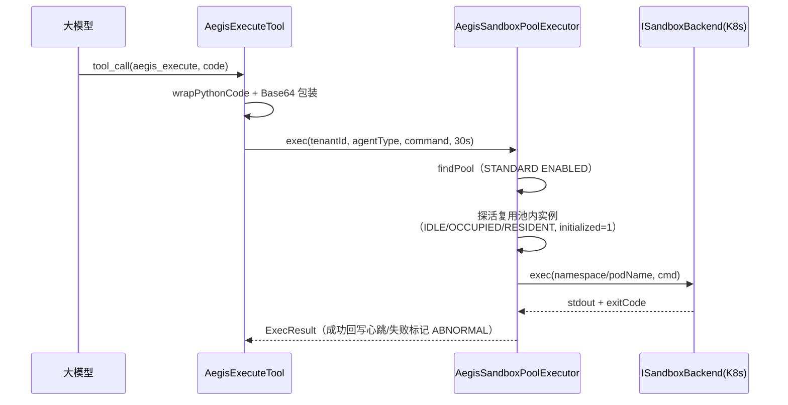

---

## 四、中间件链（6 层）

AgentScope 2.0.2 的 Middleware 有 **5 个拦截点**：4 个**洋葱型**（`onAgent` / `onReasoning` / `onActing` / `onModelCall`）+ 1 个**管道型变换**（`onSystemPrompt`）。order 值越大越外层、越先执行，对 4 个洋葱型统一生效；`onSystemPrompt` 按 order 排序后串联改写系统提示词。

### order 值（各中间件 `order()` 方法，经 Spring 注入 `List<MiddlewareBase>` 排序装配）

Phase 2 精简后保留 6 层（Trace/SandboxRouting/BindingSync/RAG/Mask/Audit），Security/TenantIsolation/Intent/ContentFilter/SandboxHeartbeat/Memory 等中间件已删除——安全决策收敛到 AgentScope 原生 PermissionEngine（`AegisPermissionRuleLoader` 从 sec_tool_policy 映射规则），记忆由 HarnessAgent 原生 MemoryConfig 承载：

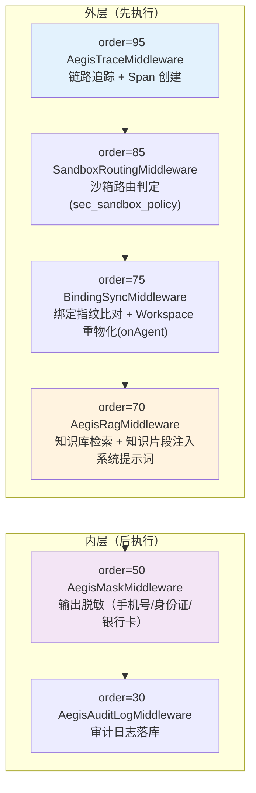

### 洋葱链在 5 个拦截点分别做什么

| 拦截点 | 类型 / 触发时机 | 主要中间件 | 做什么 |
|---|---|---|---|
| **onAgent** | 洋葱·最外层，进入 Agent 时 | TraceMiddleware(95) + BindingSyncMiddleware(75) | 创建 Agent Span，开启链路追踪；绑定指纹比对 + Workspace 重物化 |
| **onSystemPrompt** | 管道·发给 LLM 之前 | RagMiddleware(70) | RAG 知识片段注入系统提示词 |
| **onModelCall** | 洋葱·每次调 LLM 时 | TraceMiddleware(95) | 创建 MODEL_CALL Span 记录 I/O |
| **onReasoning** | 洋葱·LLM 返回 CoT 时 | TraceMiddleware | 创建 REASONING / tool_call Span |
| **onActing** | 洋葱·LLM 决定调工具时 | TraceMiddleware + AgentScope PermissionEngine | 工具权限评估（sec_tool_policy → ALLOW/ASK/DENY），结果记入 trace |

### 工具权限评估（AgentScope PermissionEngine）

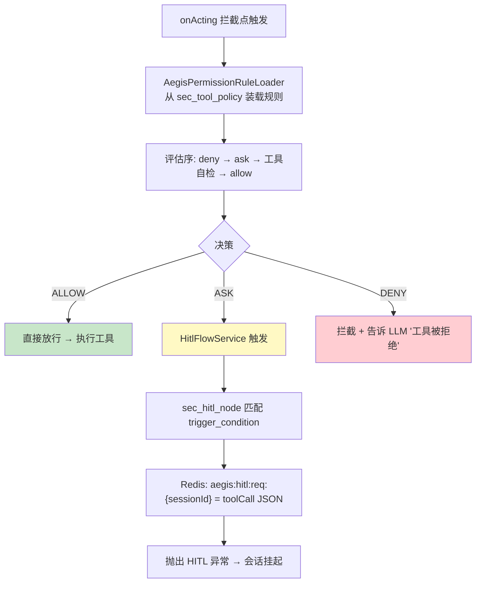

---

## 五、ReAct 循环：Think → Act → Observe

一个完整对话可能经过 1-N 轮循环。

### 循环结构

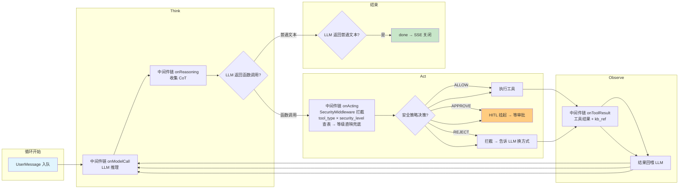

### 每轮循环的事件序列（SSE 输出）

以一个典型的两轮对话为例（查销售业绩 → 调用 execute 执行 SQL → 返回结果）：

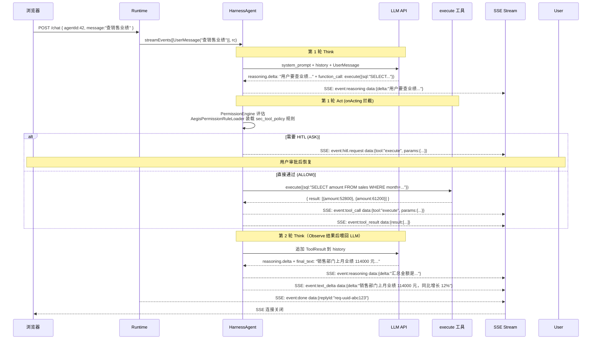

---

## 六、SSE 事件协议

AgentScope AgentEvent 经 HarnessEventConverter 转换后以 SSE 点分事件名推送到前端。共 **20 种**事件类型（types/session.ts 的 SseEventType 联合）。

### 事件类型字典

| 事件名 | 触发时机 | data 示例 |
|---|---|---|
| `agent_start` | 装配完成、HarnessAgent 准备好时 | `{"taskId":"uuid","sessionId":"sess-uuid","agentName":"销售助手","model":"doubao-seed-2.0-lite"}` |
| `message.delta` | LLM 流式输出文本片段 | `"销售部门上月业绩"` |
| `reasoning.delta` | LLM CoT 思考过程片段 | `"用户要查的是销售部门整体业绩..."` |
| `tool.call` | 工具调用发起 | `{"tool":"aegis_execute","params":{"code":"SELECT..."}}` |
| `tool.result` | 工具执行完成 | `{"tool":"aegis_execute","result":[{"amount":52800}],"kb_refs":[]}` |
| `kb.reference` | RAG 知识库引用（单独发出） | `[{"kbCode":"sales_kb","docName":"2025H1报表.pdf","score":0.87}]` |
| `task.status` | 任务状态变更（STARTED/THINKING/TOOL_CALLING/PAUSED/ENDED） | `{"status":"TOOL_CALLING"}` |
| `hitl.request` | 安全策略触发 APPROVE 时 | `{"tool":"aegis_execute","level":"L3","params":{...},"sessionId":"sess-uuid"}` |
| `subagent.start` | 子智能体启动 | `{"agentId":"xxx","sessionId":"sess-uuid"}` |
| `subagent.end` | 子智能体结束 | `{"replyId":"..."}` |
| `artifact.created` | 会话产物创建（generate_file） | `{"fileId":"xxx","downloadUrl":"..."}` |
| `skill.activated` | 技能激活 | `{"code":"chart_gen"}` |
| `skill.rejected` | 技能被拒绝（@技能不存在或无权限） | `[{"code":"unknown_skill","reason":"not_found"}]` |
| `skill.creator.draft.*` | Skill Creator 元技能工作流（draft 创建、schema 解析、安全扫描结果等） | 随子事件不同 |
| `skill.creator.debug.result` | 技能调试执行结果 | `{"stdout":"...","stderr":"..."}` |
| `skill.package.result` | 技能打包结果 | `{"packageUrl":"..."}` |
| `skill.draft.*` | 技能草稿相关事件 | 随子事件不同 |
| `error` | 执行异常 | `{"code":"NETWORK_TIMEOUT","message":"LLM API 连接超时"}` |
| `done` | SSE 关闭信号（**必发**，前端靠它关闭 EventSource） | `{"replyId":"req-uuid-abc123"}` |

> **`agent_end` 与 `done` 是两个不同事件**：`AGENT_END` 经 `HarnessEventConverter` 映射为 `agent_end`（data 含本次 token 用量，驱动 `sess_message`/`mon_trace` 终态落库、会话置 ENDED）；`done` 由 `TaskController` 在流末追加，仅作 SSE 关闭信号（前端靠它关闭 EventSource）。两者都真实存在、顺序为 `agent_end` 先、`done` 后。成本 `cost_amount` 当前**恒为 NULL**（运行时未计算，见下文）。

### 完整 SSE 帧示例（raw text）

```yaml
# 帧 1: agent_start
event: agent_start
data: {"taskId":"a3f1...","sessionId":"sess-abc123","agentName":"销售助手","model":"doubao-seed-2.0-lite"}

# 帧 2: skill.activated（@技能显式引用）
event: skill.activated
data: {"code":"sql_gen"}

# 帧 3: reasoning.delta（CoT 思考）
event: reasoning.delta
data: "用户要查的是上月销售部门业绩，我需要执行 SQL 查询..."

# 帧 4: tool.call
event: tool.call
data: {"tool":"aegis_execute","params":{"code":"SELECT SUM(amount) FROM sales WHERE dept='sales' AND month='2026-07'"}}

# 帧 5: tool.result
event: tool.result
data: {"tool":"aegis_execute","result":[{"SUM(amount)":114000}],"kb_refs":[]}

# 帧 6: reasoning.delta（第二轮思考）
event: reasoning.delta
data: "查询结果是 114000 元..."

# 帧 7-9: message.delta（流式文本输出，可能拆多帧）
event: message.delta
data: "销售部门"
event: message.delta
data: "上月业绩 114,000 元"
event: message.delta
data: "，同比增长 12%"

# 帧 10: done（结束，仅 replyId）
event: done
data: {"replyId":"req-uuid-abc123"}
```

---

## 七、投影持久化：SessionProjectionService

**流式输出过程中 fire-and-forget 落库，不阻塞 SSE 主线程。** 所有 UPDATE/INSERT 操作异步执行。

### 运行时数据状态：两套会话记忆并存（关键）

一次会话的"记忆"分散在**两类存储**：

| 存储 | Key / 表 | 性质 | 读写时机 | 用途 |
|---|---|---|---|---|
| Redis（AgentScope） | `aegis:session:{userId}/{sessionId}:agent_state` | **运行时上下文（主链路必落）** | 调用开始 `GET` 重载、调用结束 `SET` 落盘 | ReAct 循环的对话缓冲，分布式部署取到最新状态 |
| MySQL（Aegis） | `sess_message` / `sess_session` | **审计/回放投影（异步可降级）** | 流式 fire-and-forget 落库 | 消息留痕、状态机、前端历史查询 |

> `agent_state` 为运行态（丢失则本轮对话断片），`sess_message` 为审计 / 回放投影；`deleteSession` 级联清 MySQL 并删 AgentScope Redis key。

### 状态流转

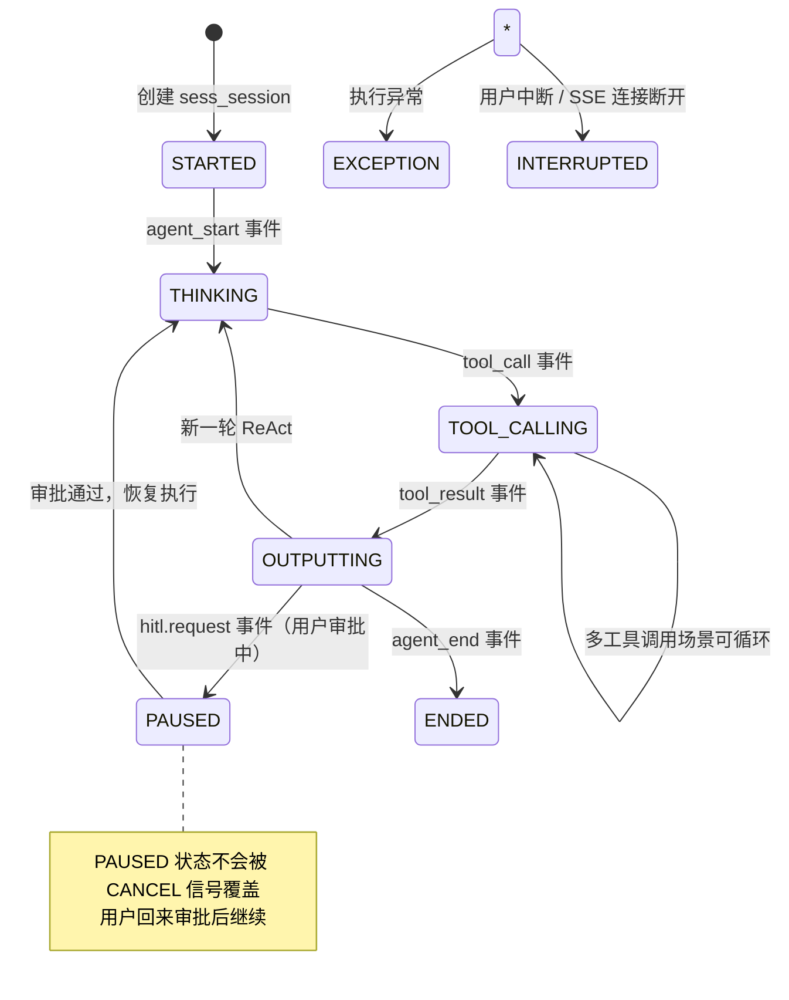

### 事件驱动落库

| 事件 | 触发落库 | 写入表 |
|---|---|---|
| `agent_start` | sess_session status → THINKING | sess_session |
| `tool_call` | sess_message INSERT（TOOL_CALL） | sess_message |
| `tool_result` | sess_message INSERT（TOOL_RESULT） + mon_span INSERT | sess_message, mon_span |
| `text_delta` | 不直接落（累积到 agent_end 一次性落） | — |
| `hitl.request` | sess_session status → PAUSED + sec_hitl_history INSERT | sess_session, sec_hitl_history |
| `agent_end` | sess_message INSERT（ASSISTANT，含 reasoning + token；cost_amount 不计算）+ sess_session status → ENDED + mon_trace INSERT | sess_message, mon_trace |
| `generate_file` 工具 | sess_artifact INSERT + MinIO PUT | sess_artifact, MinIO |

### 成本：当前只落 token，不计算金额（实现缺口）

运行时**只持久化 token 计数**，不计算金额成本：

- `sess_message.token_input` / `token_output`、`sess_session.token_used`、`mon_trace.token_input` / `token_output` 来自 LLM 回传的 `ChatUsage`，**真实落库**；
- `sess_message.cost_amount` / `mon_trace.cost_amount` 字段存在，但 `aegis-runtime` 内**无任何代码计算或赋值**（grep `costAmount` 零命中），运行时恒为 `NULL`；
- `model_def.input_cost` / `output_cost`（元/千 token）仅 Admin 模型管理配置，runtime 不参与计费。

> 若需真实金额，应在 `agent_end` 处用 `ChatUsage × ModelDef 单价` 补算（当前未接线）。

---

## 八、HITL 审批流（完整闭环）

当 AgentScope PermissionEngine 评估工具策略为 ASK 时触发（规则由 `AegisPermissionRuleLoader` 从 sec_tool_policy 装载）。会话进入 PAUSED 状态，等待用户审批。

### 全流程时序

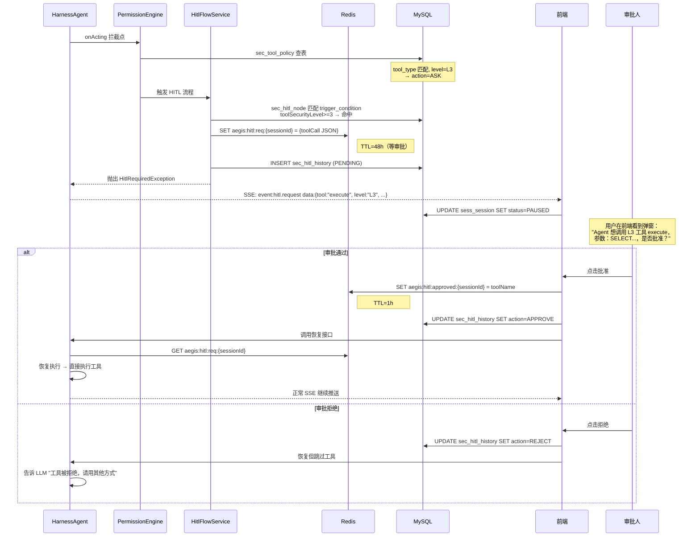

---

## 九、网络重试与异常处理

### Retry 策略（来自 `TaskExecutionService.java`）

```java
MAX_NETWORK_RETRIES = 2
RETRY_DELAY_MS = 1500  // backoff
```

只对**网络类异常**重试：ConnectException / SocketTimeoutException / UnknownHostException。业务异常（比如 AgentScope PermissionDeniedException）不重试。

### 异常分类处理

| 异常类型 | 处理方式 |
|---|---|
| 网络类（LLM API 连接超时/DNS 解析失败） | 重试 2 次 → 耗尽后返回 `error` 事件 |
| 业务类（PermissionDenied / HitlRequired） | 不重试 → 立即转成对应事件 |
| 流式中断（用户关闭页面） | `doFinally` 兜底 → `InterruptSignalManager.forceUnregister` + `onForceTerminate` |
| SSE Buffer 溢出 | `onBackpressureBuffer(256, DROP_OLDEST)` → 丢弃最旧的 event |

### SSE BufferOverflow 策略

浏览器网络抖动时 SSE 连接积压。AgentScope streamEvents Flux 使用 **DROP_OLDEST**：缓冲区满（256 个 event）时丢弃最旧的 text_delta。

---

## 十、中断与控制流

### 两种中断方式

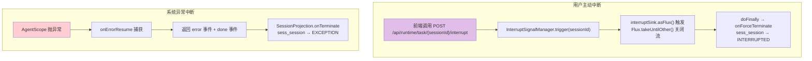

---

## 附录：完整事件序列速查

以一个最典型的对话（两轮 ReAct，一次 execute 工具调用）为例：

| # | SSE 事件 | 来源 | 持久化动作 |
|---|---|---|---|
| 1 | `agent_start` | Runtime 装配完成 | sess_session → THINKING |
| 2 | `skill_ref` | SkillRepository 解析 @技能 | — |
| 3 | `reasoning` (CoT 片段) | LLM ReAct 第 1 轮 | mon_span(REASONING) |
| 4 | `tool_call` | LLM 函数调用 | sess_message INSERT(TOOL_CALL) + mon_span(TOOL_CALL) |
| 5 | `tool_result` | 工具执行完成 | sess_message INSERT(TOOL_RESULT) + mon_span(TOOL_CALL) |
| 6 | `reasoning` (CoT 片段) | LLM ReAct 第 2 轮 | mon_span(REASONING) |
| 7 | `text_delta` × N | LLM 流式输出（拆多帧） | — |
| 8 | `done` | Runtime 关闭 SSE（仅 replyId） | sess_session → ENDED |

如果中间触发 HITL，在 tool_call 之后会插入 `hitl.request` → sess_session → PAUSED → 等审批 → 恢复后续事件。

---

## 附录：Redis Key 全景

| Key Pattern | 谁写谁读 | TTL | 用途 |
|---|---|---|---|
| `aegis:session:{userId}/{sessionId}:agent_state` | AgentScope 内核自动读写 | 会话存活期 | AgentState 序列化（单值） |
| `aegis:session:{userId}/{sessionId}:agent_state:list` | AgentScope 内核 | 会话存活期 | AgentState 历史（列表） |
| `aegis:session:{userId}/{sessionId}:_keys` | AgentScope 内核 | 会话存活期 | 会话内所有 Key 的索引 |
| `aegis:store:item:{userId}/{sessionId}\0{filename}` | AgentScope Workspace | 会话存活期 | Workspace 文件内容 |
| `aegis:store:idx:{userId}/{sessionId}` | AgentScope Workspace | 会话存活期 | Workspace 文件索引 |
| `aegis:hitl:req:{sessionId}` | HITL 触发时写，恢复时读 | **48h** | 工具调用原始请求 JSON |
| `aegis:hitl:approved:{sessionId}` | 审批通过时写，恢复时读 | **1h** | 审批标记 |
| `aegis:security:policy:{tenantId}:{policyType}` | SecurityCache 读，Admin 通知时失效 | 30min | 安全策略 JSON 缓存（policyType: TOOL/CONTENT/MASK/OUTBOUND/HITL） |
| `reply:t{tenantId}:{sessionId|new}:{replyId}` | TaskController.chat 写，重试请求检查 | 5min | 客户端重试去重 SETNX |
| `aegis:rate_limit:{scopeType}:{scopeId}:{window}` | RateLimitService 读写 | 窗口级 | 限流 ZSET 计数器 |

---

## 附录：涉及的核心 Service/类速查

| 类名 | 职责 | 在哪一步 |
|---|---|---|
| `TaskController` | HTTP 入口，注解提取租户头 | 阶段 1 |
| `ChatRequestValidator` | agentId/sessionId 校验 | 阶段 1 |
| `TaskExecutionService` | 编排：装配 → 流式执行 → 异常处理 → doFinally 兜底 | 阶段 2+5+6 |
| `AgentAssemblyService` | 同步装配：查库 → 创建 session → 构建 context | 阶段 2 |
| `AegisAgentInstanceManager` | 实例池管理 + RemoteFS + Middleware 装配 | 阶段 3 |
| `List<MiddlewareBase>` | Spring 注入按 order() 排序的 6 层中间件 → Builder.middlewares() | 阶段 3 |
| `AegisSkillRepository` | 按档位分轨装载 Toolkit（技能/MCP/知识库） | 阶段 2+3 |
| `AegisPermissionRuleLoader` | sec_tool_policy → PermissionRule 装载给 AgentScope PermissionEngine | onActing 拦截点 |
| `HitlFlowService` | Redis 存 req → 恢复时注入 ConfirmResult | onActing + 恢复 |
| `SessionProjectionService` | fire-and-forget 投影：工具消息 / 终态落库 / 状态流转 | 流式中 + 终态 |
| `InterruptSignalManager` | register → sink → trigger 中断 | 流式中 |
| `AgentPoolManager` | LRU + TTL 实例池驱逐 | AegisAgentInstanceManager 内部 |
