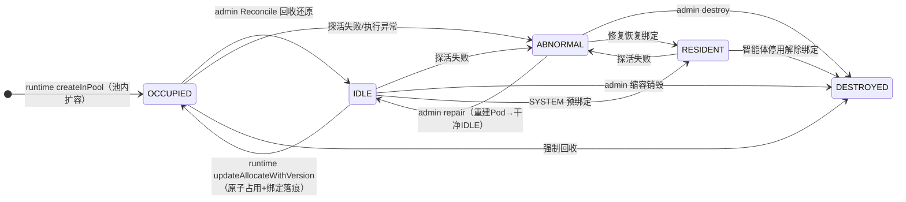
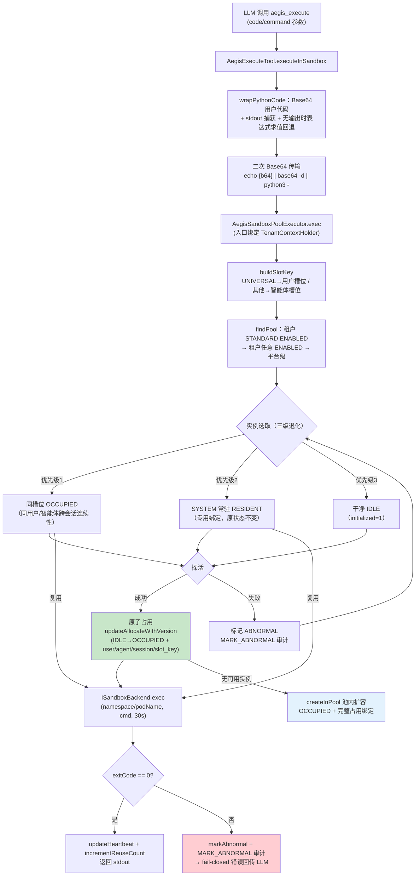
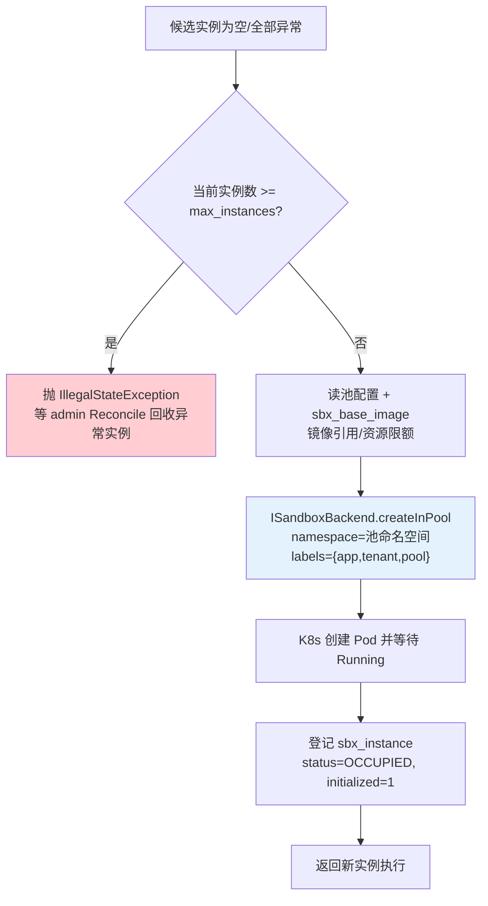
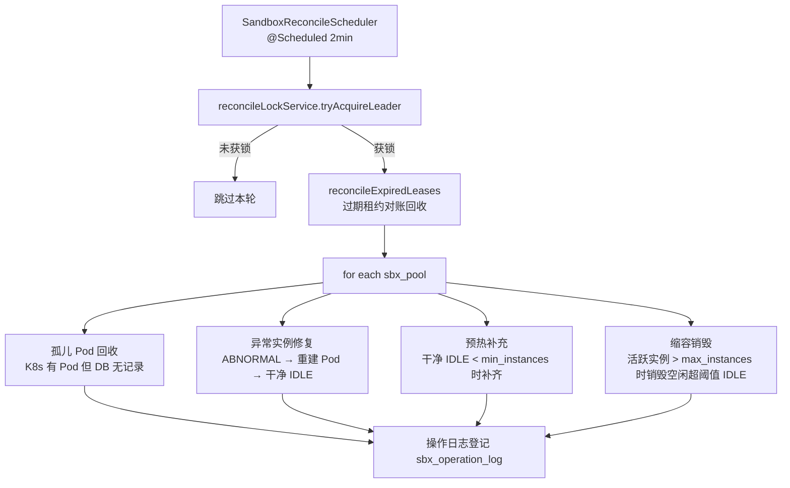
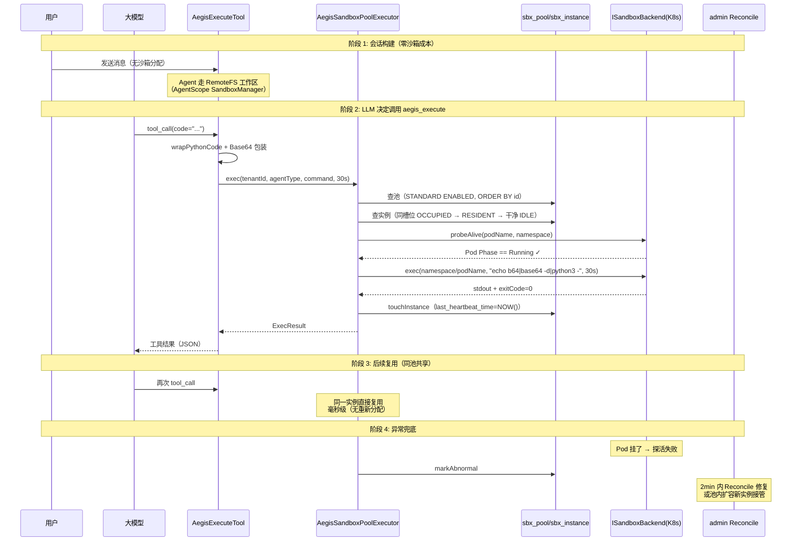

# 沙箱分配与回收

> 适用版本：0.1.0-alpha.1 ｜ 最后更新：2026-09-03
> 核心设计：**极简池化执行** — Phase 2 减法删除自建协调层（Coordinator/ReadinessGate/SlotKeyParser/IdleReleaseTracker 等 9 个类）后，`aegis_execute` 经 `AegisSandboxPoolExecutor` 直连沙箱池：**查池 → 探活复用实例 → exec**；无可用实例时池内扩容。实例状态修复/回收/预热由 admin 侧 Reconcile 统一纳管。

---

## 序章：架构演进与设计取舍

### 为什么删掉旧协调层

Phase 2 之前的自建沙箱协调体系（`AegisSandboxCoordinator` 765 行 + 意图预取 + 门控三态 + 租约）承担了三件事：低延迟分配、跨 JVM 复用、空闲回收。实践暴露的问题：

| 旧组件 | 问题 |
|---|---|
| `AegisIntentMiddleware` 意图预取 | 意图识别本身有延迟，预取收益 < 复杂度成本 |
| `SandboxReadinessGate` 门控三态 | sessionBindings/prefetchFutures 双缓存状态难推理 |
| `AegisSandboxCoordinator` 分布式锁 | Redisson 锁 + slotKey 复用链路 765 行，过度设计 |
| `IdleReleaseTracker` 空闲释放 | 与租约过期、Reconcile 巡检三方职责重叠 |

Phase 2 减法后的新分工：

| 关注点 | 承接方 |
|---|---|
| 工作区/文件语义 | AgentScope 原生 SandboxManager + RemoteFS（`RemoteFilesystemSpec`） |
| 代码执行（aegis_execute） | `AegisSandboxPoolExecutor`（本文档主角） |
| 实例回收/预热/修复 | admin `SandboxReconcileScheduler`（2 分钟周期巡检） |

### 两类沙箱轨道（当前架构）

```
轨道 1：智能体工作区（文件读写/持久化）
  AegisAgentInstanceManager.configureFilesystem()
  → RemoteFilesystemSpec + IsolationScope(USER/AGENT)
  → AgentScope SandboxManager 原生管理（当前 sandboxEnabled=false，纯 RemoteFS）

轨道 2：代码执行（aegis_execute 工具）
  AegisExecuteTool.executeInSandbox()
  → AegisSandboxPoolExecutor.exec()
  → 查池(sbx_pool) → 探活复用(sbx_instance) → ISandboxBackend.exec
```

---

## 一、核心概念

### 隔离范围（IsolationScope）

决定 AgentScope 工作区命名空间与 RedisStore 槽位归属：

| agent_type | IsolationScope | 语义 |
|---|---|---|
| **UNIVERSAL** | `USER` | 同一用户跨会话共享工作区 |
| **APPLICATION** | `AGENT` | 同一智能体跨会话共享 |
| **SYSTEM** | `AGENT` | 对外 API 场景常驻绑定 |

> 代码执行轨道（轨道 2）按 **slotKey 隔离**：UNIVERSAL → 用户槽位 `aegis:{tenantId}:user:{userId}`（同用户跨会话复用同一实例）；APPLICATION/SYSTEM → 智能体槽位 `aegis:{tenantId}:agent:{agentId}`；SYSTEM 另有 RESIDENT 常驻实例（`aegis:resident:sys:{agentId}`，admin Reconcile 预绑定，专用不可劫持）。

### 五个沙箱池类型

```
LIGHT        → 1 vCPU / 512MB     → 代码片段执行、简单 Python
STANDARD     → 2 vCPU / 2GB       → 数据分析、文件处理（默认池）
HEAVY        → 4 vCPU / 8GB       → 大文件处理、深度学习推理
ISOLATED     → 网络隔离 / 禁外部   → 敏感数据场景
DEBUG        → 交互式长会话        → 开发者调试
```

**池路由逻辑**（`AegisSandboxPoolExecutor.findPool`，三级退化 + ORDER BY id 确定性）：
1. 租户专属 + `pool_type=STANDARD` + `status=ENABLED`（代码执行路径的既定档位）
2. 租户专属 + 任意 `ENABLED` 池
3. 平台级（tenant_id=0）`ENABLED` 池兜底；**无池时 fail-fast 抛 IllegalStateException**

> 注：种子仅含 1 个 STANDARD 池（tenant_id=1，namespace=`aegis-sbx-t1-standard`）。

### 实例池状态机（SandboxStateMachine 守护转换）



| 状态 | 含义 | 谁能转过去 |
|---|---|---|
| **IDLE** | 空闲，可被复用 | admin Reconcile 预热/修复 |
| **OCCUPIED** | 正被使用（共享池语义下仍可复用） | runtime 扩容新建 |
| **RESIDENT** | SYSTEM 智能体常驻绑定 | admin 预绑定；不参与动态回收 |
| **ABNORMAL** | 探活失败 | runtime 执行失败标记 / admin 检测 |
| **DESTROYED** | 销毁，不再恢复 | admin 强制回收或缩容 |

---

## 二、代码执行路径：AegisSandboxPoolExecutor

当 LLM 决定调用 `aegis_execute` 时，工具把 Python 代码包装成 Base64 传输脚本，交给池执行器直连沙箱池执行。

### 完整执行流程



### 后台管理联动契约（admin 管理页实时可见）

| 联动动作 | DB 变更 | 后台可见性 |
|---|---|---|
| 分配（IDLE→OCCUPIED） | `updateAllocateWithVersion` 原子写入 user_id/agent_id/session_id/slot_key/allocated_time（乐观锁防并发双占） | 实例列表显示占用方 |
| 复用（同槽位/常驻） | session 重绑定 + reuse_count 递增 + REUSE 审计 | 复用计数实时增长 |
| 每次执行 | `updateHeartbeat` 刷新 last_heartbeat_time | 心跳时间实时 |
| 关键动作审计 | sbx_operation_log 登记（source=RUNTIME，ALLOCATE/REUSE/MARK_ABNORMAL） | 操作审计流水可追溯 |
| 释放 | **归 admin**：孤儿占用扫描（OCCUPIED 且无 ACTIVE 租约且心跳超 5 分钟）→ forceReleaseOccupied → 脏 IDLE → 回收流程重置 | 实例自动回到可用池 |

### 执行器代码骨架

```java
public ISandboxBackend.ExecResult exec(Long tenantId, Long userId, Long agentId,
                                        String sessionId, String agentType,
                                        String command, long timeoutSec) {
    TenantContextHolder.bind(tenantId);   // sbx_operation_log 受租户插件过滤
    try {
        String slotKey = buildSlotKey(tenantId, userId, agentId, agentType);
        SandboxInstance instance = acquireInstance(...);  // 三级选取
        String execId = instance.getNamespace() + "/" + instance.getPodName();
        try {
            ISandboxBackend.ExecResult result = sandboxBackend.exec(tenantId, execId, command, timeoutSec);
            touchInstance(instance);       // updateHeartbeat 回写
            return result;
        } catch (Exception e) {
            markAbnormal(instance, ...);  // 清占用 + ABNORMAL + 审计
            throw e;
        }
    } finally {
        TenantContextHolder.clear();
    }
}
```

### 实例选取查询语义（slotKey 隔离三级退化）

```sql
-- 优先级 1：同槽位 OCCUPIED（同用户/智能体的会话连续性）
SELECT * FROM sbx_instance
WHERE deleted = 0 AND pool_id = ? AND tenant_id = ?
  AND slot_key = ? AND status = 'OCCUPIED'
ORDER BY id ASC LIMIT 1;

-- 优先级 2：SYSTEM 智能体的 RESIDENT 常驻实例（专用绑定，原状态不变）
SELECT * FROM sbx_instance
WHERE deleted = 0 AND pool_id = ? AND tenant_id = ?
  AND slot_key = 'aegis:resident:sys:{agentId}'
  AND status IN ('RESIDENT', 'OCCUPIED')
ORDER BY id ASC LIMIT 1;

-- 优先级 3：干净 IDLE → 探活后经 updateAllocateWithVersion 原子占用（乐观锁）
SELECT * FROM sbx_instance
WHERE deleted = 0 AND pool_id = ? AND tenant_id = ?
  AND status = 'IDLE' AND initialized = 1
ORDER BY id ASC;
```

- `initialized=1`：只选取干净 IDLE，杜绝脏实例残留数据跨用户泄漏
- 占用经乐观锁原子完成（`version` 不匹配 → 尝试下一候选），防并发双占
- 探活失败的实例立即标记 ABNORMAL（清占用 + MARK_ABNORMAL 审计）并继续下一候选

### 心跳回写与异常标记

| 动作 | 触发时机 | DB 变更 |
|---|---|---|
| `updateHeartbeat` | 每次 exec 成功后 | `last_heartbeat_time = NOW()` |
| `incrementReuseCount` | 每次分配/复用 | `reuse_count + 1` |
| `markAbnormal` | exec 抛异常 / 探活失败 | 清占用 + `status = ABNORMAL` + MARK_ABNORMAL 审计 |

心跳回写失败不影响执行结果（仅 debug 日志）；异常标记失败仅告警。

---

## 三、池内扩容：createInPool

池内无可用实例（首次冷启动 / 全部异常）时，执行器在池命名空间内按池配置动态扩容：



关键约束：
- **容量上限保护**：现存非 DESTROYED 实例数 ≥ `max_instances` 时拒绝扩容，防止无限创建
- **池归属标识**：新 Pod 带 `app=aegis-sandbox, tenant, pool` 标签，确保 admin Reconcile 能统一纳管
- **镜像来源**：`sbx_base_image.repository + tag` 组装完整引用
- **资源限额**：`sbx_pool.cpu_limit`（字符串转核数）与 `mem_limit_mb` 传入后端

---

## 四、admin Reconcile：池的守护进程

admin 端 `SandboxReconcileScheduler`（默认 2 分钟周期，Redis 领导者锁防多实例并发）承担池的全部后台管理职责：



| 职责 | 说明 |
|---|---|
| **过期租约对账** | `reconcileExpiredLeases` 回收租约已过期但状态未还原的实例 |
| **孤儿 Pod 回收** | K8s 中存在但 sbx_instance 无记录（或 DESTROYED）的 Pod 直接删除，防泄漏 |
| **异常修复** | ABNORMAL 实例重建 Pod 后还原为干净 IDLE（initialized=1） |
| **预热补充** | 干净 IDLE < min_instances 时创建新实例，受 max_instances 上限约束 |
| **缩容销毁** | 活跃实例 > max_instances 时销毁空闲超阈值的 IDLE |

**缩容保护**：只销毁 `initialized=1` 的干净 IDLE 实例；脏 IDLE（runtime 释放的，initialized=0）不被缩容，下次分配可复用（只需重新初始化工作区，比新建快）。

> 历史教训：`initialized=2`（已装载但未完成初始化）状态的实例必须包含在清理 SQL 中，否则无人使用的 IDLE 实例会永久泄漏。

---

## 五、完整时序：一次代码执行的全周期



---

## 六、故障处理与兜底

### 执行失败

| 失败场景 | 处理 |
|---|---|
| **池不存在** | `IllegalStateException`（fail-fast），工具返回结构化错误 |
| **池已满且无可用实例** | `IllegalStateException`，提示等待 Reconcile 回收 |
| **执行异常（exitCode != 0）** | 实例标记 ABNORMAL + 异常回传 LLM（流不中断） |
| **沙箱后端不可用** | P0-3 fail-closed：返回"沙箱不可用"错误，**禁止降级宿主执行** |
| **探活失败** | 标记 ABNORMAL，尝试池内其他实例；全部异常 → 池内扩容 |

### P0-3 fail-closed 原则

沙箱组件缺失或异常时，`aegis_execute` 返回结构化错误（工具结果照常回传 LLM，对话流不中断），**绝不降级为宿主机本地执行**——原降级路径会裸跑宿主 Python，继承父进程环境/权限且无独立工作目录，沙箱故障窗口等于无审批直通宿主。

### 多租户隔离保障

- `sbx_pool`/`sbx_instance`/`sbx_lease`/`sbx_base_image` 在 MyBatis-Plus 租户插件 ignoreTable 清单中（平台共享表）
- 执行器查询显式追加 `tenant_id = ?` 条件，不依赖 ThreadLocal 租户上下文（Reactor 线程切换安全）
- K8s 命名空间按租户隔离：`aegis-sbx-t{tenantId}-{tier}`

---

## 附录：配置项

| 配置项 | 默认值 | 说明 |
|---|---|---|
| `aegis.admin.sandbox.reconcile.interval-ms` | `120000` | admin Reconcile 巡检周期（毫秒） |
| `aegis.admin.sandbox.reconcile.hard-recycle` | `true` | 回收模式（硬回收直接销毁 Pod） |
| `aegis.runtime.sandbox.backend` | `docker` | Docker / kubernetes / process |
| `aegis.runtime.sandbox.docker.host` | npipe（Windows） | Docker 连接协议 |

> Windows Docker Desktop 环境必须用 `npipe:////./pipe/docker_engine`（四斜杠是 docker-java 解析硬性要求）。

---

## 附录：核心类与职责

| 层 | 类 | 职责 |
|---|---|---|
| **执行入口** | `AegisExecuteTool` | aegis_execute 工具：包装 Python 脚本、Base64 传输、fail-closed 兜底 |
| **池执行器** | `AegisSandboxPoolExecutor` | slotKey 隔离选取 → 原子占用（后台联动落痕）→ exec → 心跳/复用回写/异常审计 → 池内扩容 |
| **后端协议** | `ISandboxBackend` | create/createInPool/destroy/snapshot/restore/exec/probeAlive 统一契约 |
| **K8s 后端** | `KubernetesSandboxBackend` | Pod 全生命周期 + exec（__EXIT_CODE 解析）+ Pod Phase 探活 |
| **启动校验** | `SandboxBackendStartupValidator` | P0-3 启动期校验后端就绪 |
| **池管理** | `SandboxReconcileScheduler` | admin 端巡检：预热补充、缩容销毁、异常修复、孤儿回收、租约对账 |
| **领导锁** | `SandboxReconcileLockService` | Redis 锁防多 admin 实例并发 Reconcile |
| **状态机** | `SandboxStateMachine` | assertCanTransit 守护状态转换规则 |
| **状态枚举** | `SandboxInstanceStatus` | IDLE / OCCUPIED / RESIDENT / ABNORMAL / DESTROYED |
| **池类型** | `SandboxPoolType` | GENERAL / LIGHT / STANDARD / HEAVY / ISOLATED / DEBUG |
| **隔离范围** | `IsolationScope` | USER / AGENT / GLOBAL（AgentScope 工作区命名空间） |
