# 沙箱分配与回收

> 适用版本：0.1.0-alpha.1 ｜ 最后更新：2026-08-31
> 核心设计：**惰性分配（Lazy Allocation）** — Agent 构建期只塞占位壳，沙箱容器/Pod 仅在 LLM 第一次决定调用工具（`aegis_execute`、`generate_file`）时才真正创建。末次使用后 5 分钟自动归还池。

---

## 序章：为什么需要惰性分配

### 两类对话轮次的沙箱依赖

| 轮次 | 占比（典型值） | 是否需要沙箱 | 场景 |
|---|---|---|---|
| **纯文本轮次** | >90% | ❌ 零占用 | 闲聊、知识问答、意图澄清 |
| **沙箱轮次** | <10% | ✅ 必须 | 代码执行、文件 IO、数据分析、图表生成 |

如果每个会话一开始就预占 Pod（非惰性），30 并发用户 × 10% 沙箱占比 × 平均 5 轮交互 = 至少 15 个 Pod。惰性分配让 5 个 Pod 的池就能支撑这 30 个并发用户。

### 核心数据

```
容量公式:    所需 Pod ≈ ceil(N × p × k)
             N = 并发用户数
             p = 沙箱轮次比例
             k = 同时占坑比例（典型 0.3 ~ 0.5）

并发容量:    并发用户 ≈ C / (p × k)
             C = 池容量（min_instances ~ max_instances）
```

典型数字：5 Pod 池，p=10%，k=0.4 → 可支撑 125 并发用户。

---

## 一、核心概念

### IsolationScope × IsolationStrategy × slotKey

这是整个沙箱体系的三元组，决定**谁共享一个 Pod**、**key 怎么算**、**回收策略**。

| IsolationScope | slotKey 格式 | 哪些场景 |
|---|---|---|
| **USER** | `aegis:{tenantId}:user:{userId}` | UNIVERSAL 智能体 — 同一用户的不同会话共享同一沙箱 |
| **AGENT** | `aegis:{tenantId}:agent:{agentId}` | APPLICATION / SYSTEM 智能体 — 同一智能体的不同会话共享 |
| **GLOBAL** | `aegis:{tenantId}:global` | 特殊共享场景 — 所有会话复用同一个 Pod |
| **RESIDENT**（A3 专属） | `aegis:resident:sys:{agentId}` | SYSTEM 智能体的对外 API 部署 — **永不回收**、**永不缩容**、admin 探活失败才重建 |

**SYSTEM 智能体（对外 API 场景）不参与惰性回收**。它走 RESIDENT slotKey，在 agent_api 创建时就预绑定一个沙箱实例，常驻运行。

IsolationStrategy 决定**会话内的隔离粒度**：

| 策略 | 行为 |
|---|---|
| **SHARED_PER_SCOPE** | scope 内共享 Pod，通过工作区目录隔离（`/workspace/{sessionId}/`）。默认 |
| **DEDICATED_PER_SESSION** | 会话独占 Pod，会话结束即销毁（不归还池）。安全等级 L4 场景用 |

### 五个沙箱池类型

```
LIGHT        → 1 vCPU / 512MB     → 代码片段执行、简单 Python
STANDARD     → 2 vCPU / 2GB       → 数据分析、文件处理（默认池）
HEAVY        → 4 vCPU / 8GB       → 大文件处理、深度学习推理
ISOLATED     → 网络隔离 / 禁外部   → 敏感数据场景
DEBUG        → 交互式长会话        → 开发者调试
```

**池路由逻辑**（SandboxPoolRouter，方法 resolveByCode / resolveByAgentMeta）：
1. `agent_api.deployment_pool_code` 显式指定 → 直接用（RESIDENT 绑定）
2. `DEDICATED_PER_SESSION` 隔离策略 → 强制 ISOLATED 池
3. 按 **agent_type** 静态映射：UNIVERSAL → LIGHT、SYSTEM → HEAVY、其他（含 APPLICATION）→ STANDARD
4. 租户私有池优先（tenant_id > 0）→ 系统共享池（tenant_id=0）→ 任意启用池兜底；**无池时 fail-fast 抛 SandboxNotReadyException**

> 注：种子仅含 1 个 STANDARD 池（tenant_id=1），LIGHT/HEAVY/ISOLATED 路由依赖回退到 STANDARD 池。

### 实例池状态机（SandboxStateMachine 守护转换）

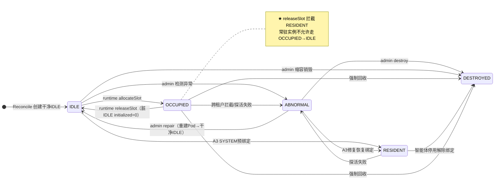

| 状态 | 含义 | 谁能转过去 |
|---|---|---|
| **IDLE** | 空闲，可被分配 | runtime allocateSlot（从池分配）或 admin repair |
| **OCCUPIED** | 正在被某个会话使用 | runtime allocateSlot（从池复用或新建） |
| **RESIDENT** | SYSTEM 智能体常驻绑定 | admin 预绑定；**不允许转 IDLE**（releaseSlot 拦截） |
| **ABNORMAL** | 探活失败、跨租户复用被拦截 | runtime 或 admin 检测 |
| **DESTROYED** | 销毁，不再恢复 | admin 强制回收或缩容 |

**关键约束**（SandboxStateMachine.assertCanTransit 守护）：
- `OCCUPIED → IDLE` **仅允许** runtime `releaseSlot` 触发，且标记**脏 IDLE**（initialized=0）
- `RESIDENT → IDLE` **不允许** —— 常驻实例不参与动态回收
- `IDLE → RESIDENT` **仅允许** A3 路径（agent_api 预绑定）
- `ABNORMAL → RESIDENT` **仅允许** A3 修复路径

---

## 二、构建期：注入占位壳（零成本）

Agent 构建期**不创建任何 Pod/容器**，只塞一个 Lazy 占位沙箱。这是惰性分配的前提。

### 时序

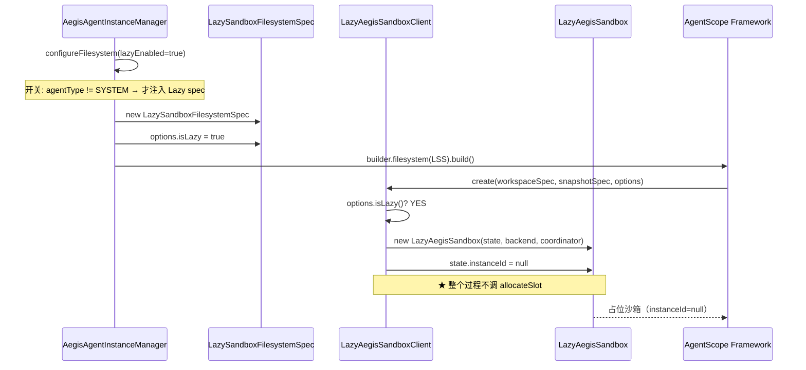

### LazyAegisSandbox 的 5 个 no-op 方法

框架在 reply 期间会触发 `doSetupWorkspace` / `doExec` / `doPersistWorkspace` / `doHydrateWorkspace` / `doDestroyWorkspace` 这 5 个生命周期回调。占位沙箱对它们**全部 no-op**：

```java
// LazyAegisSandbox.java 源码模式
protected <Method>(...) throws Exception {
    if (isPlaceholder()) {
        log.debug("[sandbox-lazy] 占位沙箱 <Method> no-op");
        return;  // 或 return 默认值
    }
    return super.<Method>(...);  // 已分配态 → 走真实后端
}
```

只有当 `awaitSandboxReady` 返回真实 handle 之后、instanceId 被注入 state 时，这 5 个方法才会真正调 `SandboxBackend`（Docker/K8s/Process 三种实现）。

### SYSTEM 智能体不走 Lazy

```java
// AegisAgentInstanceManager.configureFilesystem()
boolean lazyEnabled = sandboxProperties.isLazyAllocationEnabled()
                     && agentType != SYSTEM;  // ← SYSTEM 跳过 Lazy
```

SYSTEM 智能体（对外 API 场景）的 RESIDENT 沙箱在 agent_api 创建时就预绑定了，runtime 直接用真实 instanceId，不需要占位壳。

---

## 三、分配路径：意图预取 + 门控三态 + 协调器

当 LLM 决定调用 `aegis_execute` 时，沙箱从"占位态"切换到"真实态"。三层收敛机制保证低延迟 + 单飞幂等 + 跨 JVM 正确。

### 总体分配路径

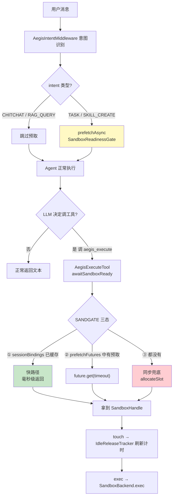

### 第一层：意图预取（AegisIntentMiddleware）

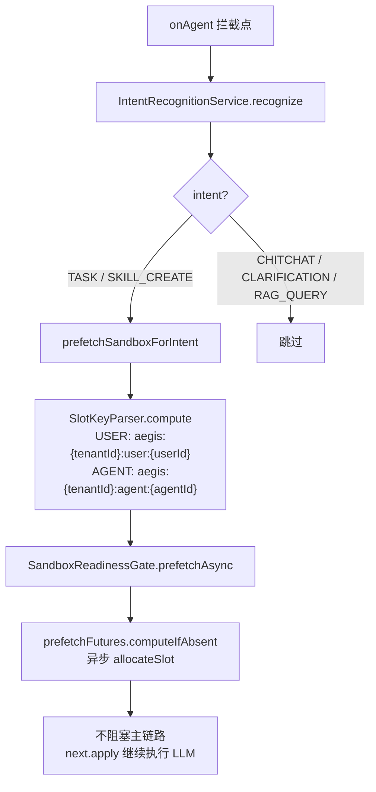

预取把沙箱分配时延**藏在 LLM 首 Token 之间**。如果预取成功，`awaitSandboxReady` 命中 prefetchFutures → 毫秒级；如果预取失败/超时，则降级走同步兜底。

### 第二层：SandboxReadinessGate — 门控三态收敛

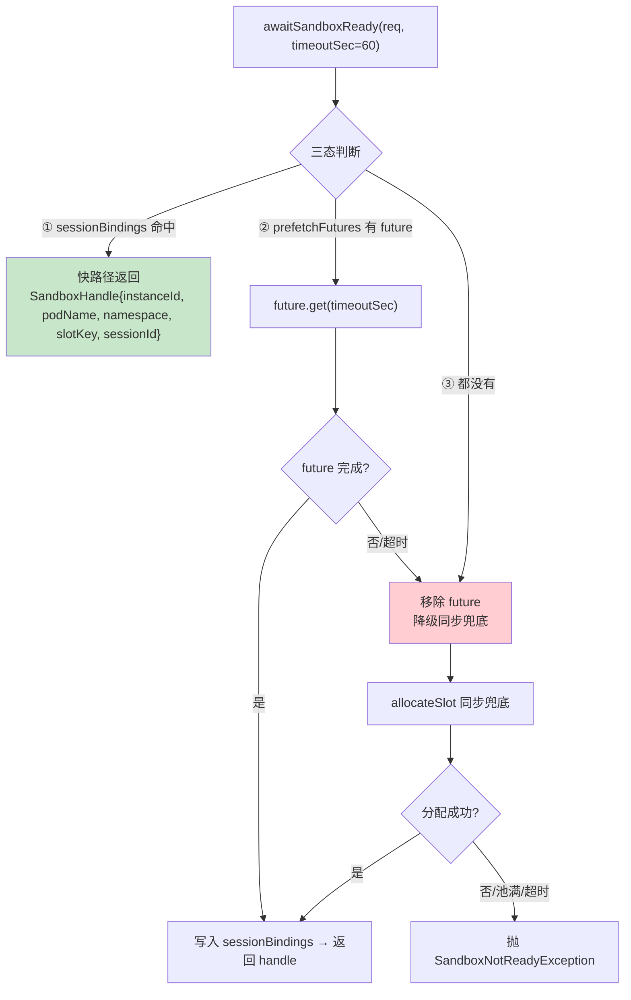

**单飞语义**：
- JVM 内：`sessionBindings`（ConcurrentHashMap）避免同会话多次分配
- 跨 JVM：`AegisSandboxCoordinator.allocateSlot` 内部用 `sandbox:lock:{slotKey}` Redisson 分布式锁 + `findOccupiedBySlotKey` 跨实例复用

### 第三层：AegisSandboxCoordinator — 分配决策树

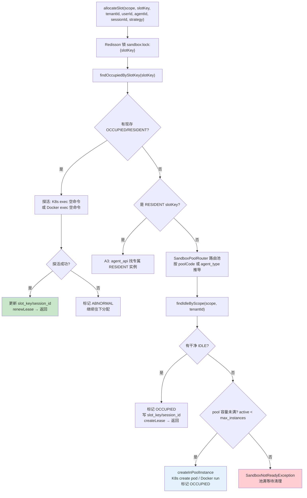

### 租约创建与续约

```java
// SandboxLeaseService.createLease
lease.expireAt = now().plusSeconds(duration);  // 默认 30min
// SandboxLeaseService.renewLease
renewLease(leaseId, duration, unit);  // 每次工具调用后续约
// SandboxLeaseService.releaseLease — 软释放
lease.expireAt = now().plusSeconds(60);  // 60s buffer，允许快速恢复
```

---

## 四、空闲回收：IdleReleaseTracker 周期扫描

### 触发条件

```
cleaner 周期触发（AegisAgentInstanceManager.cleaner）
  ↓
IdleReleaseTracker.scanAndRelease()
  ↓
遍历 entries（ConcurrentHashMap<sessionId, IdleEntry>）
  ↓
now - entry.lastUsedAt > idleReleaseMinutes (默认 5min)?
  ↓
是 → releaseIdleSession
```

### releaseIdleSession 完整链路

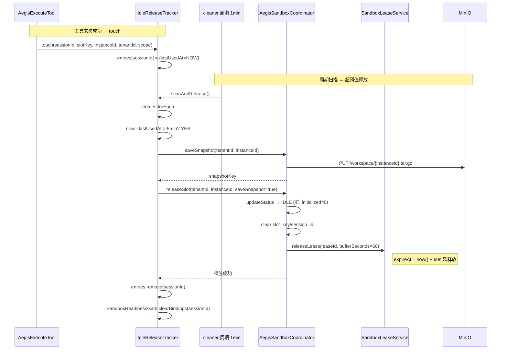

### RESIDENT 实例不参与回收

```java
// AegisSandboxCoordinator.releaseSlot 开头的拦截
if (SlotKeyParser.isResidentSlot(slotKey)) {
    log.info("A3 常驻实例释放被拦截");
    return;  // RESIDENT 不允许走 releaseSlot
}
```

### 租约双重保险

主动释放（IdleReleaseTracker）失败时，租约自然过期兜底：

```java
// SandboxLeaseService.expireAll — admin 侧周期任务
List<SandboxLease> expired = leaseMapper.selectExpiredLeases(now);
for (SandboxLease lease : expired) {
    leaseMapper.markExpired(lease.getLeaseId(), now);
    // → 触发 releaseSlot 清理
}
```

---

## 五、池结构与 Reconcile 管理

admin 端 `SandboxReconcileScheduler` 是**池的守护进程**，定时巡检并补齐/缩容实例。

### 双维度分池

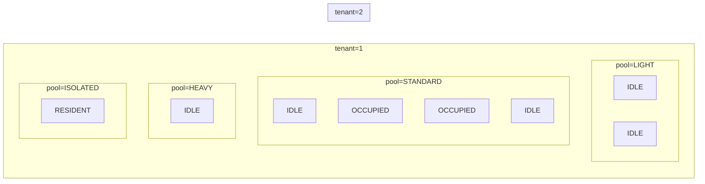

每个池有 `min_instances`（保底）和 `max_instances`（上限）。不同租户可以有完全不同的池配置。

### Reconcile 巡检逻辑

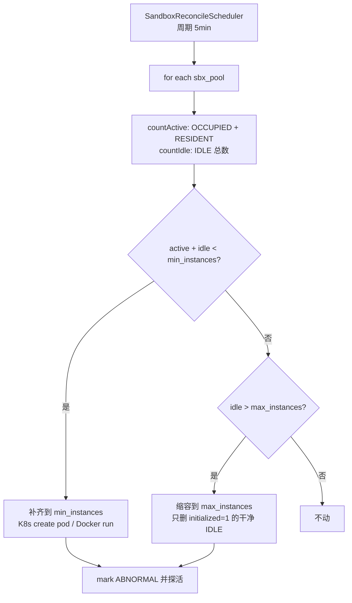

**缩容保护**：只销毁 initialized=1 的干净 IDLE 实例。脏 IDLE（runtime 释放的，initialized=0）不会被缩容，让下次分配可以复用（只需要重新初始化 Workspace，比新建快很多）。

---

## 六、完整时序：一个会话的沙箱全周期

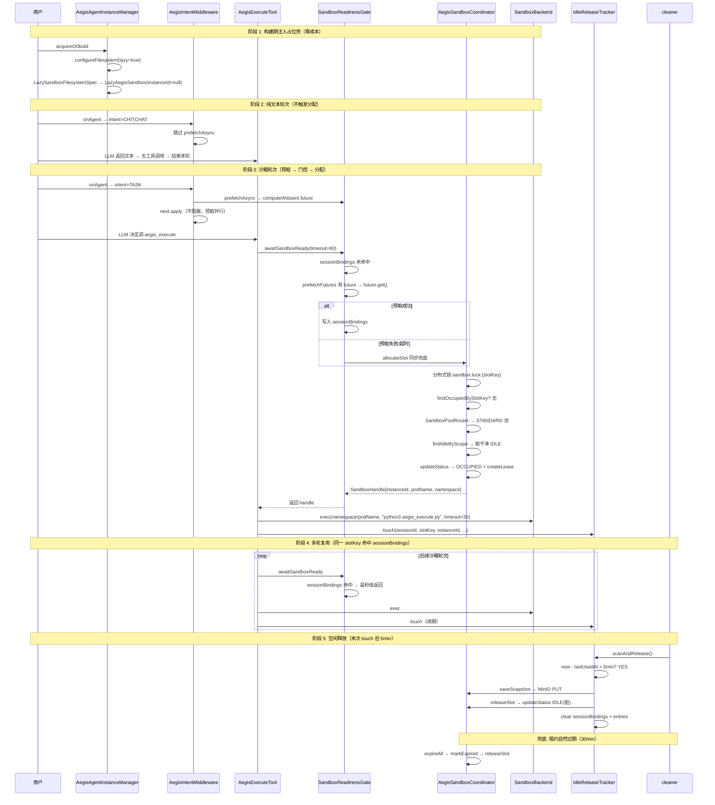

---

## 七、SYSTEM 智能体的 RESIDENT 特殊路径

RESIDENT slotKey 从根本上改变了分配/回收行为。

### 什么时候创建

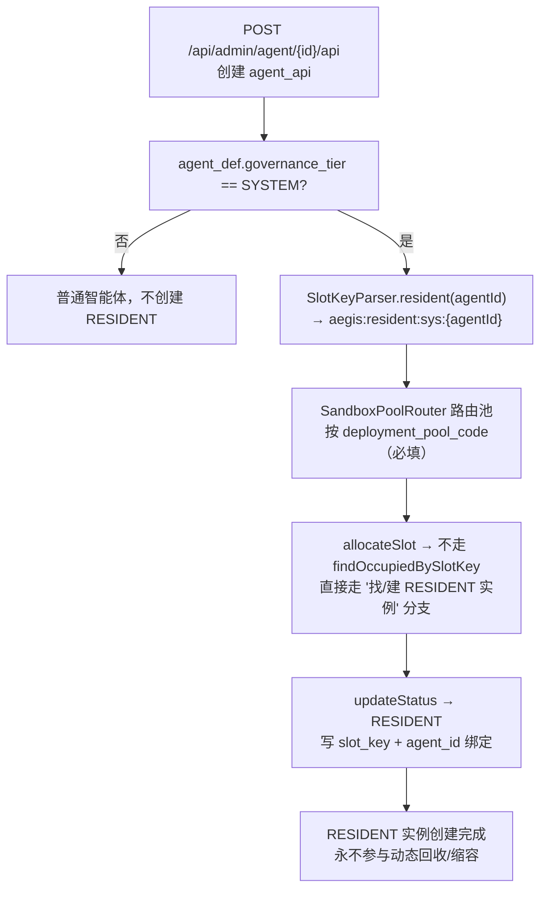

### RESIDENT 的完整生命周期

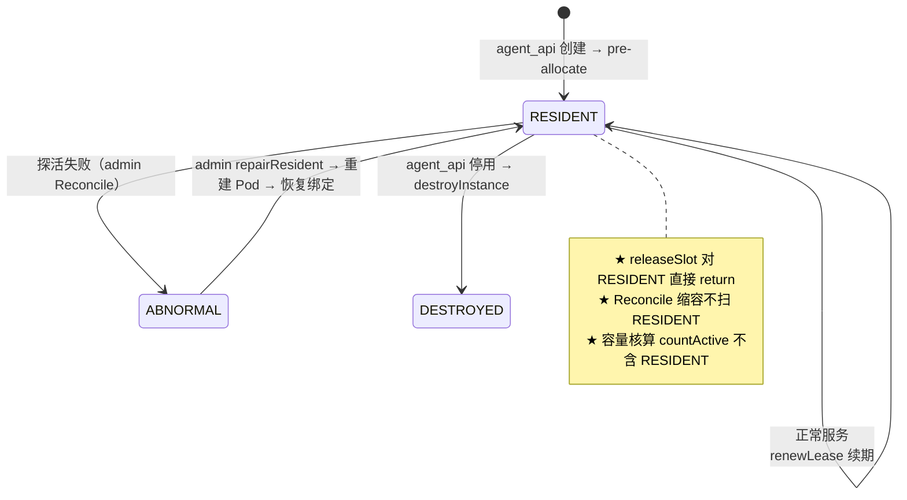

---

## 八、故障处理与兜底

### 分配失败

| 失败场景 | 处理 |
|---|---|
| **池已满** | `SandboxNotReadyException` → 转成 `error` SSE 事件，告诉 LLM "资源暂时不足，请稍后重试" |
| **超时（60s）** | 同上 |
| **分布式锁获取失败** | 重试 2 次后抛 SandboxNotReadyException |
| **探活失败** | 标记 ABNORMAL，尝试池内其他 IDLE 实例；全部不行 → 新建 |

### 运行中 Pod/容器挂了

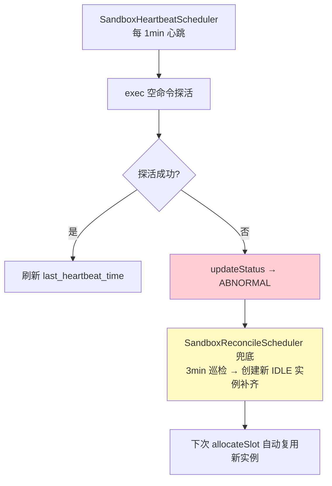

### SSE 中断

用户关闭页面 → `doFinally` 兜底 → `InterruptSignalManager.forceUnregister` → **不主动释放沙箱**。留给 IdleReleaseTracker 周期扫描或租约自然过期处理。理由：用户可能只是刷新页面回来，如果沙箱已经释放，需要重新分配影响体验。

---

## 附录：配置项

| 配置项 | 默认值 | 说明 |
|---|---|---|
| `aegis.runtime.sandbox.lazy-allocation.enabled` | `true` | 总开关；false 关闭惰性，走同步分配 |
| `aegis.runtime.sandbox.idle-release-minutes` | `5` | 空闲释放阈值 |
| `aegis.runtime.agent-pool.clean-interval-minutes` | `1` | cleaner 扫描周期 |
| `aegis.runtime.sandbox.lease-default-expire-minutes` | `30` | 租约自然过期时间 |
| `aegis.runtime.sandbox.backend` | `docker` | Docker / kubernetes / process |

---

## 附录：核心类与职责

| 层 | 类 | 职责 |
|---|---|---|
| **构建期** | `LazySandboxFilesystemSpec` | 继承 AegisSandboxFilesystemSpec，注入 Lazy client，设 `options.lazy=true` |
| **构建期** | `LazyAegisSandboxClient` | `create()` 注入 instanceId=null 占位；`resume()` 占位态直接返回不触发 recreateSandbox |
| **构建期** | `LazyAegisSandbox` | 5 个生命周期方法占位态 no-op |
| **预取** | `AegisIntentMiddleware` | onAgent 识别意图 → TASK/SKILL_CREATE 触发 `prefetchAsync` |
| **门控** | `SandboxReadinessGate` | 三态收敛：sessionBindings 命中 / prefetchFutures future / 同步兜底 allocateSlot |
| **协调** | `AegisSandboxCoordinator` | 分布式锁 + findOccupiedBySlotKey 复用 + SandboxPoolRouter 路由池 + createLease |
| **路由** | `SandboxPoolRouter` | 按 poolCode 或 agent_type 推导目标池 |
| **状态机** | `SandboxStateMachine` | assertCanTransit 守护 14 条转换规则 |
| **回收** | `IdleReleaseTracker` | entries(ConcurrentHashMap) + cleaner 周期 scanAndRelease + saveSnapshot + releaseSlot |
| **租约** | `SandboxLeaseService` | createLease / renewLease / releaseLease(60s buffer) / expireAll |
| **池管理** | `SandboxReconcileScheduler` | admin 端巡检：补齐 min_instances、缩容 max_instances、探活 ABNORMAL |
| **槽位解析** | `SlotKeyParser` | compute / parse / isResidentSlot，USER/AGENT/GLOBAL/RESIDENT 四种格式 |
| **状态枚举** | `SandboxInstanceStatus` | IDLE / OCCUPIED / RESIDENT / ABNORMAL / DESTROYED |
| **隔离范围** | `IsolationScope` | USER / AGENT / GLOBAL |
| **隔离策略** | `IsolationStrategy` | SHARED_PER_SCOPE / DEDICATED_PER_SESSION |
| **池类型** | `SandboxPoolType` | LIGHT / STANDARD / HEAVY / ISOLATED / DEBUG |
